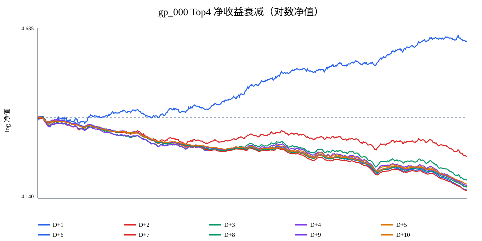
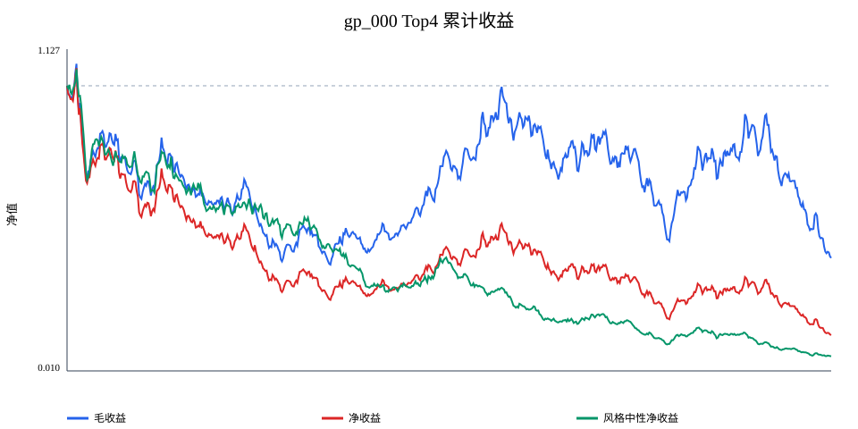

# gp_000 亏损根因排查与复权全链路审计

## 执行摘要

**结论：存在真实的复权工程 bug，但它不是 gp_000 亏损的核心原因。** 统一为点时后复权后，Top4 单笔净收益为 -0.5233%、CAGR 为 -53.86%，仍为负；复权修正只改变单笔 0.0222%。核心原因是正式库仍承载旧的 8% 触达优化目标，而生产验收是 D+2 收盘净收益；对应 D+2 IC=-0.0629，风格中性 CAGR=-66.13%，说明剥离风格后仍无可用纯 alpha。

审计窗口严格限定为 `2022-01-04` 至 `2024-09-04`，所有 D+h 结果均按各自出场日做边界截断。

### 边界与复现契约

| 校验项 | 值 |
| --- | --- |
| 名义训练日 | 649 |
| D+2 完整日 | 647 |
| D+2 最晚 D0 | 2024-09-02 |
| D+2 最晚出场 | 2024-09-04 |
| D+2 边界排除 D0 | 2024-09-03, 2024-09-04 |
| D+2 边界排除事件行 | 592 |
| 正式因子 | gp_000 |
| 正式表达式 | add(add(stock_intra_amp_d1d3_mean, div(stock_vwap_dev_d1, vol_burst_count_20d)), stock_intra_amp_d0) |
| 正式方向 | 1 |
| 训练日历 SHA256 | df8186eafc50efa3e7ae9432e6e6327a333f7050b677f130838a17b03571e381 |
| 事件内容 SHA256 | 29539325be18565ed38c05041d57b2515d94af81d2e583b7cb50b0690fbc1d1d |
| 因子库 SHA256 | 6823a9e7d76caa4adcd21cd82e781d85e70407191aab9ef1835138934fb05391 |

### 输入哈希与生效回测配置

| 输入 | SHA256 |
| --- | --- |
| 事件表 | 300d9542435735c16701d3360ed7f76bedfa98d647903ce4bf384e4d19e38903 |
| 正式因子库 | 6823a9e7d76caa4adcd21cd82e781d85e70407191aab9ef1835138934fb05391 |
| 配置 | b209a5a2302089edf2a1dd0c3201e063c6ead2ff581f1bce63243ff1ee41f137 |
| 行情缓存集合 | c0601a8626de4446703c210e8f5d27debc611dd1bd53291fdef7bba859bfb2c6 |
| 风格行情 | ee5d39723cc08ada28b4cd458ae98b69d60821ff1957d4b7ffd93e839e8b5c7b |
| 行业成员 | aa3f53b0c55e734abc37580a6db1234f6cbb9bcb720f50909ada05d6719b6eba |

| 参数 | 生效值 |
| --- | --- |
| top_k | 4 |
| exit_rule | close |
| enable_realistic_exit | 否 |
| commission_bps | 2.5 |
| transfer_bps | 0.1 |
| stamp_sell_bps | 5 |
| stamp_sell_bps_before_cut | 10 |
| slippage_bps | 10 |

## 第一部分：复权全链路审计

### 四节点口径与点时性

| 节点 | 实现 | 口径 | 点时性 | 未来函数风险 | 结论 |
| --- | --- | --- | --- | --- | --- |
| 数据源层 | 原始 OHLC + 当日 adj_factor；审计重建 raw×adj_factor | 原始价与后复权价并存 | 每个交易日仅使用该日因子 | 未发现训练末统一缩放 | 可重建、可审计 |
| 因子计算层 | 正式表达式只读取 4 个上游截面字段；Helix 内不再复权 | 无直接价格输入 | 表达式无 label/future/lead；上游生成血缘未入库 | 代码内未发现；上游契约风险未闭环 | 需补 as-of/复权血缘元数据 |
| 标签计算层 | event 表持久化 raw D+1 open/D+2 high/close；panel 标签用 raw×adj_factor | event 不复权，panel 后复权 | D+2 仅作为训练结果，边界已截断 | 无越界；存在跨路径口径错配 | 工程 bug |
| 回测引擎层 | canonical panel 回测消费后复权 LabelSet；历史 event 脚本直接消费 raw 标签 | 两条回测路径不统一；本专项统一使用后复权 | 费用按 D0，出场逐 horizon 截断 | 专项未发现 | 工程 bug，需统一入口 |

### 口径一致性校验

| 指标 | 值 | 结论 |
| --- | --- | --- |
| D+2 完整事件数 | 292352 | 仅 647 个 D0 日 |
| 原始价标签与行情缓存一致 | 是 | 一致 |
| event 收益与 raw 价格公式一致 | 是 | 最大舍入误差 5.00e-07 |
| event hit 与 raw 高价重算不一致 | 7 | 阈值/舍入口径差异，需同时修复 |
| raw/HFQ 收益不同样本 | 1425 | 复权错配影响范围 |
| 8% hit 翻转样本 | 62 | 仅计 raw 重算与 HFQ 的真实复权翻转 |
| 持有期含除权事件 | 2626 | 需按 HFQ 计算 |
| Top4 单笔净收益修正量 | 0.000222256 | HFQ 净收益减 raw 净收益 |
| 修正后是否仍亏损 | 是 | 决定复权 bug 是否为核心原因 |
| D0 除权因子 robust \|z\|>3 比例 | 0.0147929 | 非除权对照组 1.8815% |
| D0 除权状态不可观测事件 | 656 | 缺少前一交易日同股 adj_factor；不归入非除权对照 |
| D+2 raw >10% 跳空被 HFQ 消除 | 124 | raw 回测错误计入除权缺口 |

**审计结论：口径不统一，确认是工程 bug。** event 标签保留 raw 价格，而 panel 标签与 canonical 回测使用 `raw×adj_factor`。共有 1425 个 D+2 收益样本因复权而不同，62 个 8% hit 发生真实翻转，另有 7 个 event hit 与 raw 高价公式的阈值/舍入差异。D0 除权样本 robust |z|>3 比例为 1.48%，非除权对照为 1.88%；D+2 有 124 个超过 10% 的 raw 跳空被 HFQ 消除。修正后策略仍亏损，因此该 bug 必须修，但不是负收益的核心解释。

### 除权日专项校验

以下表格覆盖全部除权事件，并按除权发生在 D0、D+1 或 D+2 分层聚合；不是抽样展示。训练窗首个 D0 若缺少前一交易日缓存，明确记为不可观测（共 656 个事件），不归入非除权对照。

| stage | n_events | n_stocks |
| --- | --- | --- |
| D0 | 1300 | 956 |
| D+1 | 1399 | 1028 |
| D+2 | 1425 | 1041 |

| sample | n_events | n_stocks | factor_percentile_median | factor_abs_robust_z_p95 | factor_abs_robust_z_max | factor_robust_tail_rate | prior_event_jump_abs_median | prior_event_jump_abs_p95 |
| --- | --- | --- | --- | --- | --- | --- | --- | --- |
| D0除权 | 1300 | 956 | 0.491141 | 1.94994 | 4.99614 | 0.0147929 | 0.0229587 | 0.0878088 |
| D0非除权 | 290396 | 4901 | 0.501567 | 2.24897 | 6.77385 | 0.0188151 | 0.0242638 | 0.0840021 |

| sample | n_events | n_stocks | return_delta_mean | return_delta_median | return_delta_abs_p95 | return_delta_abs_max | hit_flip_count |
| --- | --- | --- | --- | --- | --- | --- | --- |
| 全样本 | 292352 | 4901 | 0.0153% | 0.0000% | 0.0000% | 57.1870% | 62 |
| D+2除权 | 1425 | 1041 | 3.1459% | 0.2542% | 27.9803% | 57.1870% | 48 |
| D+2非除权 | 290927 | 4901 | 0.0000% | 0.0000% | 0.0000% | 0.0000% | 14 |

| selected_trades | selected_any_ex_right | selected_any_ex_right_stocks | selected_holding_ex_right | raw_book_return_sum_on_holding_ex_right | hfq_book_return_sum_on_holding_ex_right | hfq_minus_raw_trade_mean_on_holding_ex_right | hfq_minus_raw_book_return_sum |
| --- | --- | --- | --- | --- | --- | --- | --- |
| 2588 | 39 | 31 | 27 | -14.8061% | -7.5910% | 0.0213781 | 7.2151% |

| 价格口径 | 成本口径 | CAGR | 夏普 | 单笔收益 | 累计净值 | 最大回撤 | 执行率 | 交易日 |
| --- | --- | --- | --- | --- | --- | --- | --- | --- |
| raw | 毛收益 | -31.8780% | -0.562969 | -0.2137% | 0.373225 | -66.0672% | 1 | 647 |
| raw | 净收益 | -55.1735% | -1.44203 | -0.5456% | 0.127447 | -87.9902% | 1 | 647 |
| HFQ | 毛收益 | -29.8740% | -0.506037 | -0.1914% | 0.40207 | -64.8008% | 1 | 647 |
| HFQ | 净收益 | -53.8571% | -1.38828 | -0.5233% | 0.137278 | -87.0637% | 1 | 647 |

| ex_right_date | stage | n | n_stocks | factor_mean | factor_percentile_median | factor_abs_robust_z_p95 | factor_robust_tail_rate | factor_prior_jump_abs_median | factor_prior_jump_abs_p95 | raw_return_mean | hfq_return_mean | return_delta_mean | return_delta_median | return_delta_abs_p95 | return_delta_abs_max | hit_flip_count | raw_gap_removed_count |
| --- | --- | --- | --- | --- | --- | --- | --- | --- | --- | --- | --- | --- | --- | --- | --- | --- | --- |
| 2022-03-23 | D+1 | 1 | 1 | — | — | — | — | — | — | -1.1858% | -1.1858% | 0.0000% | 0.0000% | 0.0000% | 0.0000% | 0 | 0 |
| 2022-03-29 | D+2 | 1 | 1 | 0.102203 | 0.368635 | 0.337997 | 0 | 0.000338852 | 0.000338852 | -0.2857% | 1.0861% | 1.3719% | 1.3719% | 1.3719% | 1.3719% | 0 | 0 |
| 2022-03-31 | D+1 | 1 | 1 | 0.146061 | 0.642857 | 0.298581 | 0 | 0.0792897 | 0.0792897 | -12.7063% | -12.7063% | 0.0000% | 0.0000% | 0.0000% | 0.0000% | 0 | 0 |
| 2022-03-31 | D+2 | 1 | 1 | 0.225351 | 0.946701 | 1.89583 | 0 | 0.0776189 | 0.0776189 | -7.1774% | -6.9597% | 0.2177% | 0.2177% | 0.2177% | 0.2177% | 0 | 0 |
| 2022-03-31 | D0 | 1 | 1 | 0.103961 | 0.208108 | 0.714288 | 0 | 0.0420998 | 0.0420998 | -3.7567% | -3.7567% | 0.0000% | 0.0000% | 0.0000% | 0.0000% | 0 | 0 |
| 2022-04-01 | D+1 | 1 | 1 | 0.30102 | 0.986486 | 3.18799 | 1 | — | — | -18.4632% | -18.4632% | 0.0000% | 0.0000% | 0.0000% | 0.0000% | 0 | 0 |
| 2022-04-01 | D0 | 1 | 1 | 0.323056 | 0.997333 | 3.62824 | 1 | 0.0220358 | 0.0220358 | -2.4390% | -2.4390% | -0.0000% | -0.0000% | 0.0000% | 0.0000% | 0 | 0 |
| 2022-04-08 | D+1 | 1 | 1 | 0.0874285 | 0.0974212 | 1.13416 | 0 | 0.0472358 | 0.0472358 | -4.3419% | -4.3419% | 0.0000% | 0.0000% | 0.0000% | 0.0000% | 0 | 0 |
| 2022-04-08 | D+2 | 1 | 1 | 0.134664 | 0.476584 | 0.0450084 | 0 | — | — | -5.7634% | -4.0538% | 1.7097% | 1.7097% | 1.7097% | 1.7097% | 0 | 0 |
| 2022-04-13 | D+1 | 2 | 2 | 0.114387 | 0.235821 | 0.911164 | 0 | 0.0190295 | 0.0269212 | -0.0965% | -0.0965% | 0.0000% | 0.0000% | 0.0000% | 0.0000% | 0 | 0 |
| 2022-04-13 | D+2 | 1 | 1 | 0.127823 | 0.377709 | 0.334692 | 0 | 0.00359413 | 0.00359413 | -29.8726% | -0.2014% | 29.6712% | 29.6712% | 29.6712% | 29.6712% | 0 | 1 |
| 2022-04-18 | D+1 | 1 | 1 | 0.1455 | 0.391304 | 0.250366 | 0 | 0.0435533 | 0.0435533 | -0.9505% | -0.9505% | 0.0000% | 0.0000% | 0.0000% | 0.0000% | 0 | 0 |
| 2022-04-18 | D+2 | 1 | 1 | 0.189054 | 0.782235 | 1.01825 | 0 | 0.0700988 | 0.0700988 | -33.5948% | -6.5945% | 27.0003% | 27.0003% | 27.0003% | 27.0003% | 0 | 1 |
| 2022-04-18 | D0 | 1 | 1 | 0.136608 | 0.430168 | 0.223726 | 0 | 0.00889233 | 0.00889233 | -1.7857% | -1.7857% | -0.0000% | -0.0000% | 0.0000% | 0.0000% | 0 | 0 |
| 2022-04-19 | D+1 | 2 | 2 | 0.126908 | 0.324022 | 0.780658 | 0 | 0.0533064 | 0.0890367 | -12.3459% | -12.3459% | -0.0000% | -0.0000% | 0.0000% | 0.0000% | 0 | 0 |
| 2022-04-19 | D+2 | 2 | 2 | 0.166608 | 0.533333 | 0.816604 | 0 | 0.0165769 | 0.0192091 | -1.3731% | -0.9726% | 0.4004% | 0.4004% | 0.5906% | 0.6117% | 0 | 0 |
| 2022-04-19 | D0 | 2 | 2 | 0.191892 | 0.786378 | 1.79764 | 0 | 0.0649839 | 0.0789717 | -10.6097% | -10.6097% | 0.0000% | 0.0000% | 0.0000% | 0.0000% | 0 | 0 |
| 2022-04-21 | D+1 | 1 | 1 | 0.115022 | 0.30791 | 0.507188 | 0 | 0.000769585 | 0.000769585 | -9.5499% | -9.5499% | 0.0000% | 0.0000% | 0.0000% | 0.0000% | 0 | 0 |
| 2022-04-21 | D+2 | 1 | 1 | 0.114252 | 0.281734 | 0.517604 | 0 | 0.0104118 | 0.0104118 | -8.7545% | -3.8181% | 4.9364% | 4.9364% | 4.9364% | 4.9364% | 0 | 0 |
| 2022-04-21 | D0 | 1 | 1 | 0.103929 | 0.0648464 | 1.28832 | 0 | 0.0110926 | 0.0110926 | -13.2159% | -13.2159% | 0.0000% | 0.0000% | 0.0000% | 0.0000% | 0 | 0 |
| 2022-04-22 | D+1 | 1 | 1 | 0.131244 | 0.262799 | 0.583115 | 0 | 0.0446393 | 0.0446393 | -6.7421% | -6.7421% | 0.0000% | 0.0000% | 0.0000% | 0.0000% | 0 | 0 |
| 2022-04-22 | D+2 | 3 | 3 | 0.150396 | 0.563559 | 0.635453 | 0 | 0.0160702 | 0.0160702 | -16.4231% | -5.3936% | 11.0295% | 1.9637% | 26.8304% | 29.5934% | 0 | 1 |
| 2022-04-22 | D0 | 1 | 1 | 0.168177 | 0.60473 | 0.269369 | 0 | 0.0369329 | 0.0369329 | -3.9720% | -3.9720% | -0.0000% | -0.0000% | 0.0000% | 0.0000% | 0 | 0 |
| 2022-04-25 | D0 | 1 | 1 | — | — | — | — | — | — | 17.3519% | 17.3519% | 0.0000% | 0.0000% | 0.0000% | 0.0000% | 0 | 0 |
| 2022-04-26 | D+2 | 1 | 1 | 0.119091 | 0.212838 | 0.77299 | 0 | 0.0545459 | 0.0545459 | -26.0204% | -2.7501% | 23.2703% | 23.2703% | 23.2703% | 23.2703% | 0 | 1 |
| 2022-04-27 | D+2 | 1 | 1 | 0.0981405 | 0.0408922 | 1.66152 | 0 | 0.0286523 | 0.0286523 | -32.5821% | -3.6083% | 28.9738% | 28.9738% | 28.9738% | 28.9738% | 0 | 1 |
| 2022-04-27 | D0 | 1 | 1 | — | — | — | — | — | — | -1.2509% | -1.2509% | 0.0000% | 0.0000% | 0.0000% | 0.0000% | 0 | 0 |
| 2022-04-28 | D+2 | 1 | 1 | 0.132217 | 0.130252 | 1.00334 | 0 | 0.0179036 | 0.0179036 | -2.5556% | -0.6326% | 1.9230% | 1.9230% | 1.9230% | 1.9230% | 0 | 0 |
| 2022-04-29 | D+1 | 2 | 2 | 0.226305 | 0.843525 | 1.64581 | 0 | 0.0272395 | 0.0383838 | 15.1735% | 15.1735% | 0.0000% | 0.0000% | 0.0000% | 0.0000% | 0 | 0 |
| 2022-04-29 | D+2 | 2 | 2 | 0.201508 | 0.629139 | 1.02911 | 0 | 0.0310887 | 0.0473178 | 7.5219% | 8.3099% | 0.7881% | 0.7881% | 0.7935% | 0.7941% | 0 | 0 |
| 2022-04-29 | D0 | 1 | 1 | 0.198749 | 0.778736 | 0.842181 | 0 | 0.0217164 | 0.0217164 | 1.6350% | 1.6350% | 0.0000% | 0.0000% | 0.0000% | 0.0000% | 0 | 0 |
| 2022-05-05 | D+1 | 2 | 2 | 0.160379 | 0.465517 | 0.0783246 | 0 | — | — | 6.3227% | 6.3227% | 0.0000% | 0.0000% | 0.0000% | 0.0000% | 0 | 0 |
| 2022-05-05 | D+2 | 2 | 2 | — | — | — | — | — | — | -1.7682% | 0.5855% | 2.3537% | 2.3537% | 4.3239% | 4.5428% | 0 | 0 |
| 2022-05-05 | D0 | 2 | 2 | 0.183334 | 0.719466 | 0.546433 | 0 | 0.022954 | 0.022954 | 6.1141% | 6.1141% | 0.0000% | 0.0000% | 0.0000% | 0.0000% | 0 | 0 |
| 2022-05-06 | D+1 | 1 | 1 | 0.116288 | 0.162214 | 0.968978 | 0 | 0.0459311 | 0.0459311 | 1.7321% | 1.7321% | 0.0000% | 0.0000% | 0.0000% | 0.0000% | 0 | 0 |
| 2022-05-06 | D+2 | 1 | 1 | 0.167704 | 0.543103 | 0.0973888 | 0 | 0.0319616 | 0.0319616 | 2.9249% | 3.7481% | 0.8232% | 0.8232% | 0.8232% | 0.8232% | 0 | 0 |
| 2022-05-06 | D0 | 3 | 3 | 0.144393 | 0.72695 | 0.993937 | 0 | 0.0247827 | 0.0810401 | 7.0458% | 7.0458% | 0.0000% | 0.0000% | 0.0000% | 0.0000% | 0 | 0 |
| 2022-05-09 | D+1 | 6 | 6 | 0.127994 | 0.501773 | 1.01292 | 0 | 0.026767 | 0.0584853 | -2.0179% | -2.0179% | 0.0000% | 0.0000% | 0.0000% | 0.0000% | 0 | 0 |
| 2022-05-09 | D+2 | 5 | 5 | 0.172015 | 0.658397 | 1.47919 | 0 | 0.0340719 | 0.0679795 | -11.6501% | 1.7747% | 13.4248% | 5.7222% | 33.3614% | 35.8463% | 1 | 2 |
| 2022-05-09 | D0 | 3 | 3 | 0.13521 | 0.408163 | 1.55949 | 0 | 0.0124101 | 0.0344084 | 1.2649% | 1.2649% | 0.0000% | 0.0000% | 0.0000% | 0.0000% | 0 | 0 |
| 2022-05-10 | D+1 | 4 | 4 | 0.118252 | 0.369388 | 0.419483 | 0 | 0.00737 | 0.0115747 | 0.3574% | 0.3574% | 0.0000% | 0.0000% | 0.0000% | 0.0000% | 0 | 0 |
| 2022-05-10 | D+2 | 6 | 6 | 0.11358 | 0.329787 | 0.598465 | 0 | 0.0368388 | 0.0457255 | -4.7960% | 0.7721% | 5.5682% | 4.6785% | 14.2650% | 17.0150% | 0 | 1 |
| 2022-05-10 | D0 | 3 | 3 | 0.123419 | 0.415945 | 0.396432 | 0 | 0.00529504 | 0.00529504 | -1.0047% | -1.0047% | 0.0000% | 0.0000% | 0.0000% | 0.0000% | 0 | 0 |
| 2022-05-11 | D+1 | 4 | 4 | 0.129244 | 0.428076 | 0.907193 | 0 | 0.0124075 | 0.0159445 | -1.7520% | -1.7520% | 0.0000% | 0.0000% | 0.0000% | 0.0000% | 0 | 0 |
| 2022-05-11 | D+2 | 4 | 4 | 0.0944508 | 0.142857 | 1.64001 | 0 | 0.00427251 | 0.050352 | -12.4676% | 0.9450% | 13.4125% | 10.2817% | 27.9425% | 30.6521% | 1 | 2 |
| 2022-05-11 | D0 | 2 | 2 | 0.179517 | 0.748577 | 1.12225 | 0 | 0.0318139 | 0.0363415 | 0.9292% | 0.9292% | 0.0000% | 0.0000% | 0.0000% | 0.0000% | 0 | 0 |
| 2022-05-12 | D+1 | 5 | 5 | 0.110212 | 0.314991 | 1.49618 | 0 | 0.0270462 | 0.0390858 | 1.1691% | 1.1691% | 0.0000% | 0.0000% | 0.0000% | 0.0000% | 0 | 0 |
| 2022-05-12 | D+2 | 5 | 5 | 0.114663 | 0.318891 | 0.966583 | 0 | 0.0215488 | 0.0332662 | -10.7747% | 1.5909% | 12.3656% | 2.3061% | 30.2477% | 31.6792% | 1 | 2 |
| 2022-05-12 | D0 | 4 | 4 | 0.105878 | 0.182628 | 1.1693 | 0 | 0.00802912 | 0.0120429 | 1.3127% | 1.3127% | 0.0000% | 0.0000% | 0.0000% | 0.0000% | 0 | 0 |
| 2022-05-13 | D+1 | 4 | 4 | 0.116021 | 0.363029 | 0.887852 | 0 | 0.0161218 | 0.0228749 | -3.3006% | -3.3006% | 0.0000% | 0.0000% | 0.0000% | 0.0000% | 0 | 0 |
| 2022-05-13 | D+2 | 4 | 4 | 0.10684 | 0.056926 | 1.36308 | 0 | 0.0275819 | 0.0438582 | -2.4116% | -1.2693% | 1.1423% | 0.7080% | 2.7023% | 2.9764% | 0 | 0 |
| 2022-05-13 | D0 | 5 | 5 | 0.0999712 | 0.338739 | 1.43296 | 0 | 0.0158725 | 0.0170344 | -4.0456% | -4.0456% | -0.0000% | 0.0000% | 0.0000% | 0.0000% | 0 | 0 |
| 2022-05-16 | D+1 | 2 | 2 | 0.0924721 | 0.216216 | 0.678872 | 0 | 0.0360716 | 0.0360716 | -2.2191% | -2.2191% | 0.0000% | 0.0000% | 0.0000% | 0.0000% | 0 | 0 |
| 2022-05-16 | D+2 | 2 | 2 | 0.128544 | 0.476615 | 0.0384414 | 0 | 0.054744 | 0.054744 | -2.3903% | -1.9210% | 0.4693% | 0.4693% | 0.7682% | 0.8014% | 0 | 0 |
| 2022-05-16 | D0 | 2 | 2 | 0.13943 | 0.617934 | 0.278286 | 0 | 0.0469578 | 0.0469578 | 1.5219% | 1.5219% | 0.0000% | 0.0000% | 0.0000% | 0.0000% | 0 | 0 |
| 2022-05-17 | D+1 | 3 | 3 | 0.172013 | 0.781676 | 1.50986 | 0 | 0.050783 | 0.0619574 | -4.1437% | -4.1437% | -0.0000% | 0.0000% | 0.0000% | 0.0000% | 0 | 0 |
| 2022-05-17 | D+2 | 5 | 5 | 0.153115 | 0.771171 | 1.77613 | 0 | 0.0363774 | 0.0640988 | -1.5726% | -0.0373% | 1.5353% | 1.1416% | 2.8270% | 3.0158% | 1 | 0 |
| 2022-05-17 | D0 | 3 | 3 | 0.199855 | 0.840757 | 1.92812 | 0 | 0.0278424 | 0.0290061 | 1.2818% | 1.2818% | 0.0000% | 0.0000% | 0.0000% | 0.0000% | 0 | 0 |
| 2022-05-18 | D+1 | 5 | 5 | 0.120015 | 0.433185 | 1.03686 | 0 | 0.0103434 | 0.0306488 | -1.9662% | -1.9662% | -0.0000% | 0.0000% | 0.0000% | 0.0000% | 0 | 0 |
| 2022-05-18 | D+2 | 7 | 7 | 0.140144 | 0.469786 | 1.52171 | 0 | 0.0338167 | 0.0371465 | -8.3321% | -2.2418% | 6.0903% | 2.1076% | 20.1987% | 25.1698% | 0 | 2 |
| 2022-05-18 | D0 | 4 | 4 | 0.0993349 | 0.227848 | 1.18537 | 0 | 0.0234011 | 0.0280633 | 4.5698% | 4.5698% | 0.0000% | 0.0000% | 0.0000% | 0.0000% | 0 | 0 |
| 2022-05-19 | D+1 | 3 | 3 | 0.126086 | 0.159494 | 1.64563 | 0 | 0.0283764 | 0.0312913 | 1.9769% | 1.9769% | 0.0000% | 0.0000% | 0.0000% | 0.0000% | 0 | 0 |
| 2022-05-19 | D+2 | 4 | 4 | 0.137386 | 0.334076 | 2.07644 | 0 | 0.0307341 | 0.0376317 | -8.2120% | 0.4043% | 8.6162% | 2.1398% | 26.0142% | 30.0090% | 0 | 1 |
| 2022-05-19 | D0 | 3 | 3 | 0.130524 | 0.344388 | 0.917336 | 0 | 0.0259753 | 0.0366395 | -0.5474% | -0.5474% | 0.0000% | 0.0000% | 0.0000% | 0.0000% | 0 | 0 |
| 2022-05-20 | D+1 | 6 | 6 | 0.152085 | 0.681122 | 1.89617 | 0 | 0.019717 | 0.0587751 | 2.6851% | 2.6851% | -0.0000% | 0.0000% | 0.0000% | 0.0000% | 0 | 0 |
| 2022-05-20 | D+2 | 6 | 6 | 0.13636 | 0.364557 | 2.10839 | 0 | 0.0160494 | 0.0525491 | 1.2228% | 8.2636% | 7.0408% | 1.0421% | 26.8389% | 33.7950% | 0 | 1 |
| 2022-05-20 | D0 | 6 | 6 | 0.154911 | 0.826972 | 1.77783 | 0 | 0.0202842 | 0.0765628 | -3.2157% | -3.2157% | -0.0000% | -0.0000% | 0.0000% | 0.0000% | 0 | 0 |
| 2022-05-23 | D+1 | 1 | 1 | — | — | — | — | — | — | 9.2014% | 9.2014% | 0.0000% | 0.0000% | 0.0000% | 0.0000% | 0 | 0 |
| 2022-05-23 | D+2 | 1 | 1 | 0.161076 | 0.706633 | 0.656336 | 0 | 0.0204359 | 0.0204359 | -41.5184% | -0.4030% | 41.1154% | 41.1154% | 41.1154% | 41.1154% | 1 | 1 |
| 2022-05-23 | D0 | 2 | 2 | 0.140515 | 0.756158 | 0.741886 | 0 | 0.0366623 | 0.0366623 | 3.4404% | 3.4404% | 0.0000% | 0.0000% | 0.0000% | 0.0000% | 0 | 0 |
| 2022-05-24 | D+1 | 6 | 6 | 0.0958961 | 0.362069 | 1.27573 | 0 | 0.0468017 | 0.0517096 | -0.8456% | -0.8456% | 0.0000% | 0.0000% | 0.0000% | 0.0000% | 0 | 0 |
| 2022-05-24 | D+2 | 4 | 4 | 0.0904987 | 0.152672 | 0.878161 | 0 | — | — | -18.7190% | -2.8102% | 15.9088% | 16.0310% | 30.3357% | 30.4527% | 2 | 2 |
| 2022-05-24 | D0 | 2 | 2 | 0.0964543 | 0.0810811 | 1.24695 | 0 | 0.0365093 | 0.0365093 | 0.9433% | 0.9433% | 0.0000% | 0.0000% | 0.0000% | 0.0000% | 0 | 0 |
| 2022-05-25 | D+1 | 4 | 4 | 0.136345 | 0.405405 | 0.323053 | 0 | 0.0134336 | 0.0148477 | -0.0539% | -0.0539% | 0.0000% | 0.0000% | 0.0000% | 0.0000% | 0 | 0 |
| 2022-05-25 | D+2 | 7 | 7 | 0.107908 | 0.453202 | 0.577216 | 0 | 0.0111616 | 0.0738612 | -9.1552% | 0.7529% | 9.9081% | 2.5698% | 28.1850% | 28.2445% | 0 | 3 |
| 2022-05-25 | D0 | 4 | 4 | 0.120271 | 0.322059 | 0.659724 | 0 | 0.0160746 | 0.0287311 | -7.1349% | -7.1349% | 0.0000% | 0.0000% | 0.0000% | 0.0000% | 0 | 0 |
| 2022-05-26 | D+1 | 8 | 8 | 0.15956 | 0.686765 | 2.17974 | 0 | 0.0294985 | 0.0861387 | -0.3993% | -0.3993% | 0.0000% | 0.0000% | 0.0000% | 0.0000% | 0 | 0 |
| 2022-05-26 | D+2 | 7 | 7 | 0.160107 | 0.525526 | 2.01574 | 0 | 0.011017 | 0.0601914 | -2.8174% | 2.3816% | 5.1989% | 1.1261% | 21.7700% | 29.9505% | 1 | 1 |
| 2022-05-26 | D0 | 6 | 6 | 0.11562 | 0.427114 | 0.919568 | 0 | 0.0347084 | 0.0541166 | 3.8888% | 3.8924% | 0.0036% | 0.0025% | 0.0126% | 0.0128% | 0 | 0 |
| 2022-05-27 | D+1 | 7 | 7 | 0.130764 | 0.527697 | 1.80034 | 0 | 0.0478104 | 0.0673108 | -0.2455% | -0.2509% | -0.0054% | 0.0021% | 0.0426% | 0.0552% | 0 | 0 |
| 2022-05-27 | D+2 | 9 | 9 | 0.154367 | 0.488235 | 1.83567 | 0 | 0.0303207 | 0.0509428 | -9.6994% | -0.3510% | 9.3484% | 2.8041% | 29.0780% | 30.6298% | 1 | 3 |
| 2022-05-27 | D0 | 7 | 7 | 0.125233 | 0.445289 | 0.973115 | 0 | 0.0292675 | 0.0442249 | -1.3224% | -1.3224% | -0.0000% | 0.0000% | 0.0000% | 0.0000% | 0 | 0 |
| 2022-05-30 | D+1 | 63 | 63 | 0.134125 | 0.527356 | 1.27867 | 0 | 0.0266787 | 0.0613733 | 0.2821% | 0.2821% | 0.0000% | 0.0000% | 0.0000% | 0.0000% | 0 | 0 |
| 2022-05-30 | D+2 | 61 | 61 | 0.131747 | 0.562682 | 1.59299 | 0 | 0.0282283 | 0.0601641 | 0.2235% | 0.2703% | 0.0468% | 0.0017% | 0.0553% | 2.1536% | 0 | 0 |
| 2022-05-30 | D0 | 62 | 62 | 0.135659 | 0.555215 | 1.78179 | 0 | 0.023641 | 0.0719007 | -0.3620% | -0.3620% | 0.0000% | 0.0000% | 0.0000% | 0.0000% | 0 | 0 |
| 2022-05-31 | D+1 | 6 | 6 | 0.130938 | 0.503067 | 0.661963 | 0 | 0.0219428 | 0.0503621 | 1.7089% | 1.7089% | 0.0000% | 0.0000% | 0.0000% | 0.0000% | 0 | 0 |
| 2022-05-31 | D+2 | 7 | 7 | 0.120684 | 0.334347 | 1.11126 | 0 | 0.0212478 | 0.0760962 | -8.3188% | 0.9334% | 9.2522% | 2.3560% | 27.8009% | 29.1200% | 0 | 2 |
| 2022-05-31 | D0 | 5 | 5 | 0.114123 | 0.356436 | 1.02967 | 0 | 0.0125372 | 0.0238604 | 3.2551% | 3.2551% | 0.0000% | 0.0000% | 0.0000% | 0.0000% | 0 | 0 |
| 2022-06-01 | D+1 | 7 | 7 | 0.140501 | 0.704208 | 1.21375 | 0 | 0.0275901 | 0.0590581 | 4.0985% | 4.0985% | -0.0000% | 0.0000% | 0.0000% | 0.0000% | 0 | 0 |
| 2022-06-01 | D+2 | 4 | 4 | 0.154713 | 0.765337 | 1.81176 | 0 | 0.0224104 | 0.0657889 | 0.0757% | 0.8466% | 0.7709% | 0.5784% | 1.4073% | 1.5380% | 1 | 0 |
| 2022-06-01 | D0 | 7 | 7 | 0.139414 | 0.766067 | 1.31391 | 0 | 0.0139296 | 0.0200272 | 4.0510% | 4.0510% | -0.0000% | 0.0000% | 0.0000% | 0.0000% | 0 | 0 |
| 2022-06-02 | D+1 | 10 | 10 | 0.123389 | 0.475578 | 1.26957 | 0 | 0.0402894 | 0.0945125 | 1.5273% | 1.5273% | 0.0000% | 0.0000% | 0.0000% | 0.0000% | 0 | 0 |
| 2022-06-02 | D+2 | 10 | 10 | 0.136131 | 0.625 | 1.62852 | 0 | 0.0195261 | 0.101618 | -8.5050% | 0.2069% | 8.7119% | 1.8839% | 34.1268% | 35.7301% | 1 | 2 |
| 2022-06-02 | D0 | 10 | 10 | 0.139945 | 0.408269 | 1.53022 | 0 | 0.0244624 | 0.111091 | 2.0933% | 2.0933% | 0.0000% | 0.0000% | 0.0000% | 0.0000% | 0 | 0 |
| 2022-06-06 | D+1 | 8 | 8 | 0.151844 | 0.496124 | 1.2655 | 0 | 0.00992432 | 0.0989423 | 0.7222% | 0.7222% | 0.0000% | 0.0000% | 0.0000% | 0.0000% | 0 | 0 |
| 2022-06-06 | D+2 | 4 | 4 | 0.111944 | 0.457584 | 0.57242 | 0 | 0.0165915 | 0.0446262 | -8.1247% | 0.2622% | 8.3869% | 1.6263% | 25.0997% | 29.2026% | 1 | 1 |
| 2022-06-06 | D0 | 5 | 5 | 0.103705 | 0.266667 | 0.617385 | 0 | 0.0266004 | 0.0266004 | 0.9692% | 0.9692% | 0.0000% | 0.0000% | 0.0000% | 0.0000% | 0 | 0 |
| 2022-06-07 | D+1 | 5 | 5 | 0.147328 | 0.648485 | 0.802779 | 0 | 0.0228283 | 0.0263007 | -1.7234% | -1.7234% | -0.0000% | 0.0000% | 0.0000% | 0.0000% | 0 | 0 |
| 2022-06-07 | D+2 | 2 | 2 | 0.157598 | 0.715762 | 0.490503 | 0 | 0.00868678 | 0.00868678 | 6.3404% | 6.8039% | 0.4634% | 0.4634% | 0.8005% | 0.8380% | 1 | 0 |
| 2022-06-07 | D0 | 3 | 3 | 0.138853 | 0.626682 | 0.91677 | 0 | 0.026902 | 0.026902 | -0.5906% | -0.5906% | 0.0000% | 0.0000% | 0.0000% | 0.0000% | 0 | 0 |
| 2022-06-08 | D+1 | 14 | 14 | 0.109428 | 0.401345 | 1.01034 | 0 | 0.022966 | 0.0402257 | -2.6790% | -2.6790% | 0.0000% | 0.0000% | 0.0000% | 0.0000% | 0 | 0 |
| 2022-06-08 | D+2 | 23 | 23 | 0.121404 | 0.490909 | 1.19154 | 0 | 0.0188882 | 0.0518196 | -11.2763% | -0.8400% | 10.4362% | 1.9441% | 29.6981% | 33.8819% | 0 | 8 |
| 2022-06-08 | D0 | 6 | 6 | 0.111733 | 0.341787 | 1.28244 | 0 | 0.0115968 | 0.0321085 | 5.7885% | 5.7885% | -0.0000% | 0.0000% | 0.0000% | 0.0000% | 0 | 0 |
| 2022-06-09 | D+1 | 4 | 4 | 0.112539 | 0.26087 | 1.05939 | 0 | 0.0190135 | 0.0285371 | 0.4424% | 0.4424% | 0.0000% | 0.0000% | 0.0000% | 0.0000% | 0 | 0 |
| 2022-06-09 | D+2 | 4 | 4 | 0.0616483 | 0.029148 | 1.5687 | 0 | 0.111491 | 0.111491 | -9.0777% | -1.4703% | 7.6074% | 0.4396% | 25.1350% | 29.4552% | 0 | 1 |
| 2022-06-09 | D0 | 2 | 2 | 0.139299 | 0.598086 | 0.263584 | 0 | 0.0161366 | 0.0161366 | 6.4816% | 6.4816% | 0.0000% | 0.0000% | 0.0000% | 0.0000% | 0 | 0 |
| 2022-06-10 | D+1 | 10 | 10 | 0.152669 | 0.660287 | 1.60121 | 0 | 0.0197278 | 0.0560076 | 3.5222% | 3.5222% | -0.0000% | 0.0000% | 0.0000% | 0.0000% | 0 | 0 |
| 2022-06-10 | D+2 | 8 | 8 | 0.173395 | 0.707729 | 2.46765 | 0 | 0.0277464 | 0.0798012 | -4.1728% | 2.0058% | 6.1787% | 0.4215% | 23.4712% | 23.7331% | 0 | 2 |
| 2022-06-10 | D0 | 11 | 11 | 0.147472 | 0.650463 | 0.989608 | 0 | 0.0259444 | 0.0509902 | 2.9684% | 2.9684% | 0.0000% | 0.0000% | 0.0000% | 0.0000% | 0 | 0 |
| 2022-06-13 | D+1 | 8 | 8 | 0.140067 | 0.646991 | 1.37805 | 0 | 0.0302626 | 0.086294 | -0.6795% | -0.6795% | -0.0000% | 0.0000% | 0.0000% | 0.0000% | 0 | 0 |
| 2022-06-13 | D+2 | 8 | 8 | 0.141697 | 0.595694 | 1.07224 | 0 | 0.0280732 | 0.048427 | 1.7890% | 2.7473% | 0.9584% | 0.8292% | 1.9656% | 2.1969% | 1 | 0 |
| 2022-06-13 | D0 | 6 | 6 | 0.1557 | 0.555056 | 1.40697 | 0 | 0.0244716 | 0.0705776 | 1.0121% | 1.0121% | -0.0000% | 0.0000% | 0.0000% | 0.0000% | 0 | 0 |
| 2022-06-14 | D+1 | 4 | 4 | 0.163094 | 0.730337 | 1.83439 | 0 | 0.0297416 | 0.03248 | -4.3030% | -4.3030% | 0.0000% | 0.0000% | 0.0000% | 0.0000% | 0 | 0 |
| 2022-06-14 | D+2 | 4 | 4 | 0.174505 | 0.534722 | 2.62465 | 0 | 0.018055 | 0.0326964 | -4.1647% | 3.0229% | 7.1876% | 1.7772% | 21.4079% | 24.8205% | 0 | 1 |
| 2022-06-14 | D0 | 5 | 5 | 0.174515 | 0.799287 | 1.83987 | 0 | 0.0153431 | 0.0699874 | -1.9649% | -1.9649% | -0.0000% | -0.0000% | 0.0000% | 0.0000% | 0 | 0 |
| 2022-06-15 | D+1 | 6 | 6 | 0.125528 | 0.460808 | 1.33975 | 0 | 0.0285841 | 0.0927055 | -3.2500% | -3.2500% | 0.0000% | 0.0000% | 0.0000% | 0.0000% | 0 | 0 |
| 2022-06-15 | D+2 | 6 | 6 | 0.139129 | 0.51236 | 1.73009 | 0 | 0.0174595 | 0.0198795 | -6.1730% | -1.8053% | 4.3677% | 0.9091% | 17.1000% | 22.2446% | 1 | 1 |
| 2022-06-15 | D0 | 4 | 4 | 0.15071 | 0.484778 | 2.06601 | 0 | 0.0175088 | 0.0965221 | 7.4117% | 7.4117% | 0.0000% | 0.0000% | 0.0000% | 0.0000% | 0 | 0 |
| 2022-06-16 | D+1 | 9 | 9 | 0.127304 | 0.244731 | 1.52555 | 0 | 0.023035 | 0.0427116 | 4.6228% | 4.6228% | 0.0000% | 0.0000% | 0.0000% | 0.0000% | 0 | 0 |
| 2022-06-16 | D+2 | 11 | 11 | 0.128617 | 0.344418 | 1.32231 | 0 | 0.0319429 | 0.0515089 | -8.0803% | 0.1318% | 8.2121% | 0.9818% | 29.6696% | 30.3357% | 1 | 3 |
| 2022-06-16 | D0 | 7 | 7 | 0.111886 | 0.312352 | 1.37925 | 0 | 0.0453076 | 0.0883704 | 4.6793% | 4.6793% | -0.0000% | 0.0000% | 0.0000% | 0.0000% | 0 | 0 |
| 2022-06-17 | D+1 | 7 | 7 | 0.115185 | 0.31829 | 1.2515 | 0 | 0.0353605 | 0.0780594 | 1.2231% | 1.2231% | 0.0000% | 0.0000% | 0.0000% | 0.0000% | 0 | 0 |
| 2022-06-17 | D+2 | 7 | 7 | 0.150345 | 0.555035 | 1.08657 | 0 | 0.0144975 | 0.0882435 | 0.8986% | 1.9396% | 1.0410% | 1.1125% | 1.8597% | 2.1115% | 0 | 0 |
| 2022-06-17 | D0 | 5 | 5 | 0.135527 | 0.559322 | 0.970131 | 0 | 0.0413622 | 0.11339 | -1.0153% | -1.0153% | -0.0000% | 0.0000% | 0.0000% | 0.0000% | 0 | 0 |
| 2022-06-20 | D+1 | 2 | 2 | 0.110493 | 0.330508 | 1.28744 | 0 | 0.0105755 | 0.0108803 | -2.7543% | -2.7543% | 0.0000% | 0.0000% | 0.0000% | 0.0000% | 0 | 0 |
| 2022-06-20 | D+2 | 3 | 3 | 0.113628 | 0.235154 | 0.947883 | 0 | 0.0218653 | 0.0320951 | -3.4551% | 0.9261% | 4.3812% | 4.4868% | 5.9853% | 6.1517% | 0 | 0 |
| 2022-06-20 | D0 | 2 | 2 | 0.092444 | 0.21509 | 1.48774 | 0 | 0.0180495 | 0.0252966 | -2.2940% | -2.2940% | 0.0000% | 0.0000% | 0.0000% | 0.0000% | 0 | 0 |
| 2022-06-21 | D+1 | 7 | 7 | 0.176179 | 0.815315 | 2.59535 | 0 | 0.0283381 | 0.0766131 | -3.8176% | -3.8176% | -0.0000% | -0.0000% | 0.0000% | 0.0000% | 0 | 0 |
| 2022-06-21 | D+2 | 6 | 6 | 0.16806 | 0.581114 | 3.47948 | 0.166667 | 0.0467286 | 0.0688737 | -5.2582% | -0.1037% | 5.1545% | 0.6659% | 21.5170% | 28.3691% | 1 | 1 |
| 2022-06-21 | D0 | 6 | 6 | 0.154415 | 0.83208 | 1.68476 | 0 | 0.0271848 | 0.0510233 | 3.4222% | 3.4222% | -0.0000% | -0.0000% | 0.0000% | 0.0000% | 0 | 0 |
| 2022-06-22 | D+1 | 1 | 1 | 0.129551 | 0.518797 | 0.0385809 | 0 | 0.020829 | 0.020829 | 15.5860% | 15.5860% | 0.0000% | 0.0000% | 0.0000% | 0.0000% | 0 | 0 |
| 2022-06-22 | D+2 | 4 | 4 | 0.117658 | 0.261261 | 0.762974 | 0 | 0.00572023 | 0.00589007 | -4.5526% | -4.2216% | 0.3309% | 0.2910% | 0.5970% | 0.6490% | 0 | 0 |
| 2022-06-22 | D0 | 2 | 2 | 0.169889 | 0.776382 | 0.911905 | 0 | 0.0403381 | 0.0403381 | 10.2195% | 10.2195% | 0.0000% | 0.0000% | 0.0000% | 0.0000% | 0 | 0 |
| 2022-06-23 | D+1 | 10 | 10 | 0.141116 | 0.577889 | 1.33679 | 0 | 0.0201274 | 0.084411 | 3.0909% | 3.0909% | 0.0000% | 0.0000% | 0.0000% | 0.0000% | 0 | 0 |
| 2022-06-23 | D+2 | 9 | 9 | 0.129365 | 0.481203 | 0.872721 | 0 | 0.0253905 | 0.0777954 | 0.9622% | 4.7263% | 3.7641% | 1.0251% | 17.0250% | 27.3121% | 0 | 1 |
| 2022-06-23 | D0 | 13 | 13 | 0.151294 | 0.61959 | 1.52319 | 0 | 0.0218413 | 0.0418836 | 2.0967% | 2.0967% | 0.0000% | 0.0000% | 0.0000% | 0.0000% | 0 | 0 |
| 2022-06-24 | D+1 | 7 | 7 | 0.114578 | 0.302961 | 1.07345 | 0 | 0.0110225 | 0.0260796 | 4.2666% | 4.2666% | 0.0000% | 0.0000% | 0.0000% | 0.0000% | 0 | 0 |
| 2022-06-24 | D+2 | 7 | 7 | 0.121236 | 0.532663 | 0.942795 | 0 | 0.0140126 | 0.0690688 | 2.3113% | 3.6102% | 1.2989% | 1.1244% | 2.6223% | 2.7060% | 0 | 0 |
| 2022-06-24 | D0 | 3 | 3 | 0.135733 | 0.502193 | 0.5289 | 0 | 0.00673408 | 0.00733962 | 8.7302% | 8.7302% | 0.0000% | 0.0000% | 0.0000% | 0.0000% | 0 | 0 |
| 2022-06-27 | D+1 | 5 | 5 | 0.149122 | 0.763158 | 1.05918 | 0 | 0.0240186 | 0.0296378 | 1.7958% | 1.7958% | 0.0000% | 0.0000% | 0.0000% | 0.0000% | 0 | 0 |
| 2022-06-27 | D+2 | 7 | 7 | 0.150206 | 0.572893 | 1.21753 | 0 | 0.0339595 | 0.100589 | -5.8508% | 2.7862% | 8.6370% | 0.6897% | 29.9389% | 31.4304% | 1 | 1 |
| 2022-06-27 | D0 | 5 | 5 | 0.144694 | 0.629797 | 0.977406 | 0 | 0.010886 | 0.0396809 | -3.6110% | -3.6110% | -0.0000% | 0.0000% | 0.0000% | 0.0000% | 0 | 0 |
| 2022-06-28 | D+1 | 5 | 5 | 0.135905 | 0.480813 | 0.456507 | 0 | 0.0132479 | 0.0388515 | -5.4410% | -5.4410% | 0.0000% | 0.0000% | 0.0000% | 0.0000% | 0 | 0 |
| 2022-06-28 | D+2 | 6 | 6 | 0.143708 | 0.614035 | 0.794975 | 0 | 0.0400284 | 0.0744748 | -2.0844% | 3.4066% | 5.4909% | 0.6497% | 22.5055% | 29.6270% | 0 | 1 |
| 2022-06-28 | D0 | 9 | 9 | 0.139262 | 0.546371 | 0.543354 | 0 | 0.011958 | 0.0196271 | -2.9132% | -2.9132% | 0.0000% | 0.0000% | 0.0000% | 0.0000% | 0 | 0 |
| 2022-06-29 | D+1 | 13 | 13 | 0.118278 | 0.280242 | 1.951 | 0 | 0.00971016 | 0.0657786 | -1.8980% | -1.8980% | -0.0000% | 0.0000% | 0.0000% | 0.0000% | 0 | 0 |
| 2022-06-29 | D+2 | 12 | 12 | 0.124838 | 0.390519 | 1.72797 | 0 | 0.0205655 | 0.0863882 | -4.0425% | -0.5551% | 3.4873% | 0.6053% | 17.1617% | 24.8421% | 1 | 3 |
| 2022-06-29 | D0 | 8 | 8 | 0.155224 | 0.188161 | 4.10216 | 0.142857 | 0.0184887 | 0.044741 | -2.5111% | -2.5111% | 0.0000% | 0.0000% | 0.0000% | 0.0000% | 0 | 0 |
| 2022-06-30 | D+1 | 6 | 6 | 0.128236 | 0.496829 | 2.11607 | 0 | 0.0265431 | 0.0738539 | -1.7570% | -1.7570% | 0.0000% | 0.0000% | 0.0000% | 0.0000% | 0 | 0 |
| 2022-06-30 | D+2 | 10 | 10 | 0.136921 | 0.330645 | 2.43384 | 0.1 | 0.0218275 | 0.0379201 | -9.8590% | -2.3510% | 7.5080% | 0.6366% | 34.3230% | 38.7546% | 1 | 2 |
| 2022-06-30 | D0 | 4 | 4 | 0.153524 | 0.504255 | 3.01032 | 0.25 | 0.0311162 | 0.0750114 | 0.0405% | 0.0405% | 0.0000% | 0.0000% | 0.0000% | 0.0000% | 0 | 0 |
| 2022-07-01 | D+1 | 4 | 4 | 0.158615 | 0.829787 | 1.36571 | 0 | 0.0188983 | 0.0194716 | 0.1205% | 0.1205% | 0.0000% | 0.0000% | 0.0000% | 0.0000% | 0 | 0 |
| 2022-07-01 | D+2 | 4 | 4 | 0.151808 | 0.689218 | 1.63297 | 0 | 0.0421246 | 0.0438014 | -5.8480% | 0.1056% | 5.9536% | 1.2681% | 18.1907% | 21.0399% | 0 | 1 |
| 2022-07-01 | D0 | 3 | 3 | 0.107299 | 0.388286 | 0.988212 | 0 | 0.0559095 | 0.0745388 | 0.9614% | 0.9614% | 0.0000% | 0.0000% | 0.0000% | 0.0000% | 0 | 0 |
| 2022-07-04 | D+1 | 6 | 6 | 0.125142 | 0.402386 | 0.594608 | 0 | 0.037102 | 0.0545738 | -1.1638% | -1.1638% | -0.0000% | 0.0000% | 0.0000% | 0.0000% | 0 | 0 |
| 2022-07-04 | D+2 | 5 | 5 | 0.17472 | 0.706383 | 1.70872 | 0 | 0.033487 | 0.0451276 | -1.1387% | -0.3453% | 0.7935% | 0.7206% | 1.4559% | 1.6054% | 0 | 0 |
| 2022-07-04 | D0 | 5 | 5 | 0.134352 | 0.480349 | 0.996926 | 0 | 0.0175678 | 0.0193156 | -2.8113% | -2.8113% | -0.0000% | 0.0000% | 0.0000% | 0.0000% | 0 | 0 |
| 2022-07-05 | D+1 | 6 | 6 | 0.127295 | 0.40393 | 1.24304 | 0 | 0.0254114 | 0.0566892 | -4.2745% | -4.2745% | -0.0000% | 0.0000% | 0.0000% | 0.0000% | 0 | 0 |
| 2022-07-05 | D+2 | 4 | 4 | 0.11713 | 0.394794 | 0.630636 | 0 | 0.00724665 | 0.0551359 | -4.4894% | 0.4239% | 4.9133% | 1.2411% | 14.5085% | 16.7659% | 0 | 1 |
| 2022-07-05 | D0 | 4 | 4 | 0.123582 | 0.283516 | 1.22616 | 0 | 0.0268961 | 0.0385203 | -1.2272% | -1.2272% | -0.0000% | -0.0000% | 0.0000% | 0.0000% | 0 | 0 |
| 2022-07-06 | D+1 | 8 | 8 | 0.133635 | 0.542857 | 1.65188 | 0 | 0.0244033 | 0.0273269 | -2.7201% | -2.7201% | -0.0000% | 0.0000% | 0.0000% | 0.0000% | 0 | 0 |
| 2022-07-06 | D+2 | 7 | 7 | 0.129572 | 0.494541 | 1.52612 | 0 | 0.0184168 | 0.0532879 | -12.2681% | -0.4236% | 11.8444% | 3.6364% | 27.9205% | 29.3514% | 1 | 3 |
| 2022-07-06 | D0 | 6 | 6 | 0.14468 | 0.530892 | 2.49924 | 0 | 0.0234032 | 0.0590509 | -0.6655% | -0.6655% | -0.0000% | -0.0000% | 0.0000% | 0.0000% | 0 | 0 |
| 2022-07-07 | D+1 | 5 | 5 | 0.124996 | 0.639588 | 0.966658 | 0 | 0.00960609 | 0.0168131 | 2.4236% | 2.4236% | -0.0000% | 0.0000% | 0.0000% | 0.0000% | 0 | 0 |
| 2022-07-07 | D+2 | 4 | 4 | 0.119401 | 0.416484 | 1.14659 | 0 | 0.0219192 | 0.0965172 | -5.5352% | -3.9092% | 1.6259% | 0.8564% | 4.0946% | 4.5615% | 0 | 1 |
| 2022-07-07 | D0 | 3 | 3 | 0.132696 | 0.489387 | 0.470839 | 0 | 0.0220573 | 0.0273165 | -0.1604% | -0.1604% | 0.0000% | 0.0000% | 0.0000% | 0.0000% | 0 | 0 |
| 2022-07-08 | D+1 | 10 | 10 | 0.151241 | 0.514151 | 1.91261 | 0 | 0.0278035 | 0.0478958 | -4.5130% | -4.5130% | -0.0000% | 0.0000% | 0.0000% | 0.0000% | 0 | 0 |
| 2022-07-08 | D+2 | 10 | 10 | 0.125843 | 0.462243 | 1.53625 | 0 | 0.0227875 | 0.0873503 | -5.1158% | -1.0255% | 4.0903% | 1.5278% | 15.5188% | 23.1941% | 0 | 1 |
| 2022-07-08 | D0 | 11 | 11 | 0.127189 | 0.429515 | 0.753452 | 0 | 0.0162516 | 0.0725757 | -2.4349% | -2.4349% | 0.0000% | 0.0000% | 0.0000% | 0.0000% | 0 | 0 |
| 2022-07-11 | D+1 | 5 | 5 | 0.107225 | 0.277533 | 0.878752 | 0 | 0.0280561 | 0.0481391 | -1.5771% | -1.5771% | 0.0000% | 0.0000% | 0.0000% | 0.0000% | 0 | 0 |
| 2022-07-11 | D+2 | 3 | 3 | 0.120027 | 0.417453 | 0.647256 | 0 | 0.0207894 | 0.028806 | -3.7099% | -2.6021% | 1.1078% | 0.6289% | 2.4284% | 2.6284% | 0 | 0 |
| 2022-07-11 | D0 | 2 | 2 | 0.10161 | 0.200272 | 0.92649 | 0 | 0.0161842 | 0.0203792 | 2.4404% | 2.4404% | -0.0000% | -0.0000% | 0.0000% | 0.0000% | 0 | 0 |
| 2022-07-12 | D+1 | 2 | 2 | 0.140111 | 0.513624 | 0.551981 | 0 | 0.0385283 | 0.0524492 | -2.5044% | -2.5044% | 0.0000% | 0.0000% | 0.0000% | 0.0000% | 0 | 0 |
| 2022-07-12 | D+2 | 2 | 2 | 0.124168 | 0.448238 | 0.385274 | 0 | 0.0103748 | 0.0103748 | -10.4300% | -10.1018% | 0.3281% | 0.3281% | 0.4341% | 0.4458% | 0 | 0 |
| 2022-07-12 | D0 | 2 | 2 | 0.156434 | 0.582849 | 0.788843 | 0 | 0.0163235 | 0.0197899 | 1.5121% | 1.5121% | 0.0000% | 0.0000% | 0.0000% | 0.0000% | 0 | 0 |
| 2022-07-13 | D+1 | 2 | 2 | 0.133462 | 0.420058 | 0.442391 | 0 | 0.0157241 | 0.0249158 | 1.8962% | 1.8962% | -0.0000% | -0.0000% | 0.0000% | 0.0000% | 0 | 0 |
| 2022-07-13 | D+2 | 4 | 4 | 0.114043 | 0.344687 | 0.981456 | 0 | 0.0194906 | 0.047718 | -2.1793% | -1.0734% | 1.1059% | 0.3002% | 3.2570% | 3.7577% | 1 | 0 |
| 2022-07-13 | D0 | 4 | 4 | 0.172621 | 0.70137 | 1.27919 | 0 | 0.0545666 | 0.102014 | 3.6373% | 3.6373% | 0.0000% | 0.0000% | 0.0000% | 0.0000% | 0 | 0 |
| 2022-07-14 | D+1 | 1 | 1 | 0.204594 | 0.868493 | 1.43292 | 0 | 0.0537426 | 0.0537426 | -3.7779% | -3.7779% | -0.0000% | -0.0000% | 0.0000% | 0.0000% | 0 | 0 |
| 2022-07-14 | D+2 | 1 | 1 | 0.150851 | 0.569767 | 0.145169 | 0 | 0.0199939 | 0.0199939 | 5.2797% | 6.3124% | 1.0327% | 1.0327% | 1.0327% | 1.0327% | 0 | 0 |
| 2022-07-14 | D0 | 3 | 3 | 0.177234 | 0.738095 | 0.6482 | 0 | 0.0273601 | 0.0273601 | -0.7992% | -0.7992% | 0.0000% | 0.0000% | 0.0000% | 0.0000% | 0 | 0 |
| 2022-07-15 | D+1 | 5 | 5 | 0.112795 | 0.353175 | 1.59538 | 0 | 0.0340519 | 0.0503828 | 1.6312% | 1.6312% | -0.0000% | 0.0000% | 0.0000% | 0.0000% | 0 | 0 |
| 2022-07-15 | D+2 | 5 | 5 | 0.114218 | 0.142466 | 0.966298 | 0 | 0.0118086 | 0.0146438 | -4.6467% | -3.5308% | 1.1159% | 0.5264% | 2.6153% | 2.8995% | 0 | 0 |
| 2022-07-15 | D0 | 2 | 2 | 0.0975909 | 0.143454 | 1.24289 | 0 | 0.0219709 | 0.0234322 | 3.5438% | 3.5438% | 0.0000% | 0.0000% | 0.0000% | 0.0000% | 0 | 0 |
| 2022-07-18 | D+1 | 5 | 5 | 0.137895 | 0.426184 | 0.674399 | 0 | 0.0123869 | 0.0167992 | 1.7633% | 1.7633% | 0.0000% | 0.0000% | 0.0000% | 0.0000% | 0 | 0 |
| 2022-07-18 | D+2 | 4 | 4 | 0.129236 | 0.343915 | 0.626663 | 0 | 0.022188 | 0.0468598 | 1.8234% | 2.4064% | 0.5829% | 0.3677% | 1.4375% | 1.5689% | 0 | 0 |
| 2022-07-18 | D0 | 5 | 5 | 0.135306 | 0.272727 | 0.659247 | 0 | 0.00620054 | 0.015745 | 3.5364% | 3.5364% | -0.0000% | 0.0000% | 0.0000% | 0.0000% | 0 | 0 |
| 2022-07-19 | D+1 | 4 | 4 | 0.162479 | 0.58961 | 1.29797 | 0 | 0.0676493 | 0.06926 | -1.4500% | -1.4500% | 0.0000% | 0.0000% | 0.0000% | 0.0000% | 0 | 0 |
| 2022-07-19 | D+2 | 2 | 2 | 0.230129 | 0.881616 | 2.55635 | 0 | 0.0296216 | 0.0338119 | -2.5568% | -1.8821% | 0.6747% | 0.6747% | 0.9530% | 0.9840% | 0 | 0 |
| 2022-07-19 | D0 | 3 | 3 | 0.188333 | 0.636259 | 2.40056 | 0 | 0.0258676 | 0.0491361 | 6.4705% | 6.4705% | 0.0000% | 0.0000% | 0.0000% | 0.0000% | 0 | 0 |
| 2022-07-21 | D+1 | 6 | 6 | 0.150447 | 0.643016 | 0.988292 | 0 | 0.0287788 | 0.0919094 | 2.4265% | 2.4265% | -0.0000% | -0.0000% | 0.0000% | 0.0000% | 0 | 0 |
| 2022-07-21 | D+2 | 5 | 5 | 0.145166 | 0.369515 | 2.64694 | 0 | 0.0114746 | 0.0179473 | 0.7742% | 6.2687% | 5.4945% | 0.3954% | 19.1877% | 23.1173% | 0 | 1 |
| 2022-07-21 | D0 | 4 | 4 | 0.178167 | 0.726277 | 2.2979 | 0 | 0.0227547 | 0.0601147 | -0.4015% | -0.4015% | -0.0000% | 0.0000% | 0.0000% | 0.0000% | 0 | 0 |
| 2022-07-22 | D+1 | 3 | 3 | 0.15488 | 0.59854 | 0.815801 | 0 | 0.0481652 | 0.0697696 | 0.3061% | 0.3061% | -0.0000% | 0.0000% | 0.0000% | 0.0000% | 0 | 0 |
| 2022-07-22 | D+2 | 2 | 2 | 0.101377 | 0.267184 | 1.30184 | 0 | 0.00745758 | 0.00906728 | -3.4287% | -2.9548% | 0.4739% | 0.4739% | 0.7032% | 0.7287% | 0 | 0 |
| 2022-07-22 | D0 | 3 | 3 | 0.122298 | 0.350365 | 0.779886 | 0 | 0.0463929 | 0.0561838 | 0.2583% | 0.2583% | 0.0000% | 0.0000% | 0.0000% | 0.0000% | 0 | 0 |
| 2022-07-25 | D+1 | 2 | 2 | 0.11512 | 0.332117 | 0.454261 | 0 | 0.0277776 | 0.0391164 | 3.6294% | 3.6294% | 0.0000% | 0.0000% | 0.0000% | 0.0000% | 0 | 0 |
| 2022-07-25 | D+2 | 2 | 2 | 0.142897 | 0.565693 | 0.425608 | 0 | 0.0313971 | 0.0355865 | -1.1611% | -0.6151% | 0.5460% | 0.5460% | 0.7452% | 0.7673% | 0 | 0 |
| 2022-07-25 | D0 | 2 | 2 | 0.132439 | 0.586011 | 0.706471 | 0 | 0.0216289 | 0.0372162 | 1.6522% | 1.6522% | 0.0000% | 0.0000% | 0.0000% | 0.0000% | 0 | 0 |
| 2022-07-27 | D+1 | 1 | 1 | 0.230235 | 0.953168 | 1.79849 | 0 | 0.0420974 | 0.0420974 | 3.1627% | 3.1627% | 0.0000% | 0.0000% | 0.0000% | 0.0000% | 0 | 0 |
| 2022-07-27 | D+2 | 1 | 1 | 0.188138 | 0.873346 | 1.41597 | 0 | 0.0866058 | 0.0866058 | 6.4242% | 7.3685% | 0.9443% | 0.9443% | 0.9443% | 0.9443% | 0 | 0 |
| 2022-07-27 | D0 | 1 | 1 | 0.190952 | 0.826087 | 1.10603 | 0 | 0.0392827 | 0.0392827 | -8.9897% | -8.9897% | 0.0000% | 0.0000% | 0.0000% | 0.0000% | 0 | 0 |
| 2022-07-28 | D0 | 2 | 2 | 0.0811263 | 0.170157 | 0.899293 | 0 | 0.0107459 | 0.0135892 | 1.3697% | 1.3697% | 0.0000% | 0.0000% | 0.0000% | 0.0000% | 0 | 0 |
| 2022-07-29 | D+1 | 2 | 2 | 0.0894093 | 0.246946 | 0.951726 | 0 | 0.0252986 | 0.0403914 | -0.2789% | -0.2789% | -0.0000% | -0.0000% | 0.0000% | 0.0000% | 0 | 0 |
| 2022-07-29 | D+2 | 1 | 1 | 0.114961 | 0.359268 | 0.357272 | 0 | 0.0491584 | 0.0491584 | -1.5075% | -0.1575% | 1.3500% | 1.3500% | 1.3500% | 1.3500% | 0 | 0 |
| 2022-07-29 | D0 | 7 | 7 | 0.0745742 | 0.28335 | 1.07899 | 0 | 0.0156073 | 0.0308542 | -2.4162% | -2.4162% | 0.0000% | 0.0000% | 0.0000% | 0.0000% | 0 | 0 |
| 2022-08-01 | D+1 | 1 | 1 | 0.0890061 | 0.426485 | 0.185736 | 0 | 0.00504133 | 0.00504133 | -5.3333% | -5.3333% | 0.0000% | 0.0000% | 0.0000% | 0.0000% | 0 | 0 |
| 2022-08-01 | D+2 | 1 | 1 | 0.0839648 | 0.191972 | 0.755346 | 0 | 0.0877248 | 0.0877248 | -0.4437% | 0.8865% | 1.3302% | 1.3302% | 1.3302% | 1.3302% | 0 | 0 |
| 2022-08-03 | D+2 | 3 | 3 | 0.0945638 | 0.400939 | 0.958471 | 0 | 0.0386599 | 0.0677647 | -5.5727% | -4.2356% | 1.3371% | 1.1574% | 2.0539% | 2.1535% | 0 | 0 |
| 2022-08-03 | D0 | 3 | 3 | 0.106348 | 0.311834 | 0.913481 | 0 | 0.0149746 | 0.0255801 | 2.5649% | 2.5649% | -0.0000% | 0.0000% | 0.0000% | 0.0000% | 0 | 0 |
| 2022-08-04 | D+1 | 1 | 1 | 0.0954631 | 0.208955 | 0.719833 | 0 | 0.0363336 | 0.0363336 | 2.8803% | 2.8803% | 0.0000% | 0.0000% | 0.0000% | 0.0000% | 0 | 0 |
| 2022-08-05 | D+1 | 1 | 1 | 0.125273 | 0.557196 | 0.159638 | 0 | 0.00536478 | 0.00536478 | 12.7346% | 12.7346% | 0.0000% | 0.0000% | 0.0000% | 0.0000% | 0 | 0 |
| 2022-08-05 | D+2 | 2 | 2 | 0.119908 | 0.422175 | 0.166499 | 0 | 0.0427049 | 0.0427049 | 1.5983% | 1.8080% | 0.2097% | 0.2097% | 0.2108% | 0.2109% | 0 | 0 |
| 2022-08-05 | D0 | 2 | 2 | 0.136476 | 0.660671 | 0.51115 | 0 | 0.011203 | 0.011203 | 1.4556% | 1.4556% | 0.0000% | 0.0000% | 0.0000% | 0.0000% | 0 | 0 |
| 2022-08-08 | D+2 | 1 | 1 | 0.111556 | 0.452645 | 0.122726 | 0 | 0.0129264 | 0.0129264 | -30.9388% | -3.0266% | 27.9122% | 27.9122% | 27.9122% | 27.9122% | 0 | 1 |
| 2022-08-09 | D+2 | 1 | 1 | — | — | — | — | — | — | -3.0303% | -2.2600% | 0.7703% | 0.7703% | 0.7703% | 0.7703% | 0 | 0 |
| 2022-08-10 | D+1 | 1 | 1 | — | — | — | — | — | — | 1.7123% | 1.7123% | 0.0000% | 0.0000% | 0.0000% | 0.0000% | 0 | 0 |
| 2022-08-10 | D+2 | 1 | 1 | 0.145594 | 0.389027 | 0.272253 | 0 | 0.0284547 | 0.0284547 | 0.1483% | 0.9919% | 0.8437% | 0.8437% | 0.8437% | 0.8437% | 0 | 0 |
| 2022-08-10 | D0 | 2 | 2 | 0.129543 | 0.637306 | 0.397214 | 0 | 0.0160507 | 0.0160507 | 0.2300% | 0.2300% | 0.0000% | 0.0000% | 0.0000% | 0.0000% | 0 | 0 |
| 2022-08-12 | D+1 | 1 | 1 | — | — | — | — | — | — | 1.5385% | 1.5385% | 0.0000% | 0.0000% | 0.0000% | 0.0000% | 0 | 0 |
| 2022-08-15 | D0 | 1 | 1 | 0.0569914 | 0.0882779 | 1.146 | 0 | 0.0101337 | 0.0101337 | -1.3681% | -1.3681% | 0.0000% | 0.0000% | 0.0000% | 0.0000% | 0 | 0 |
| 2022-08-16 | D+1 | 4 | 4 | 0.0581858 | 0.164978 | 1.57119 | 0 | 0.0554826 | 0.0609677 | 6.8088% | 6.8088% | 0.0000% | 0.0000% | 0.0000% | 0.0000% | 0 | 0 |
| 2022-08-16 | D+2 | 2 | 2 | 0.124964 | 0.50431 | 0.000472889 | 0 | — | — | 0.0414% | 1.1225% | 1.0811% | 1.0811% | 1.2494% | 1.2681% | 0 | 0 |
| 2022-08-16 | D0 | 4 | 4 | 0.0802925 | 0.368074 | 1.17219 | 0 | 0.013944 | 0.0468011 | 2.4993% | 2.4993% | 0.0000% | 0.0000% | 0.0000% | 0.0000% | 0 | 0 |
| 2022-08-18 | D+1 | 2 | 2 | 0.115885 | 0.568022 | 0.168819 | 0 | — | — | 8.2634% | 8.2634% | 0.0000% | 0.0000% | 0.0000% | 0.0000% | 0 | 0 |
| 2022-08-18 | D+2 | 3 | 3 | 0.0749467 | 0.283641 | 0.441364 | 0 | 0.0294752 | 0.0294752 | 7.8844% | 8.2474% | 0.3630% | 0.4309% | 0.4814% | 0.4870% | 0 | 0 |
| 2022-08-18 | D0 | 2 | 2 | 0.113795 | 0.462932 | 0.130979 | 0 | 0.00208963 | 0.00208963 | 0.7217% | 0.7217% | -0.0000% | -0.0000% | 0.0000% | 0.0000% | 0 | 0 |
| 2022-08-19 | D+1 | 5 | 5 | 0.103671 | 0.3229 | 1.19361 | 0 | 0.0131164 | 0.0245921 | -2.3537% | -2.3537% | 0.0000% | 0.0000% | 0.0000% | 0.0000% | 0 | 0 |
| 2022-08-19 | D+2 | 4 | 4 | 0.104569 | 0.43338 | 0.886939 | 0 | 0.023678 | 0.0720366 | -4.1302% | -2.5500% | 1.5802% | 0.5163% | 4.4755% | 5.1410% | 0 | 1 |
| 2022-08-19 | D0 | 5 | 5 | 0.143381 | 0.604938 | 1.83428 | 0 | 0.00952116 | 0.01066 | 1.2192% | 1.2192% | -0.0000% | 0.0000% | 0.0000% | 0.0000% | 0 | 0 |
| 2022-08-22 | D+1 | 1 | 1 | 0.106872 | 0.315697 | 0.412808 | 0 | — | — | -0.9286% | -0.9286% | 0.0000% | 0.0000% | 0.0000% | 0.0000% | 0 | 0 |
| 2022-08-23 | D+1 | 1 | 1 | 0.14382 | 0.581498 | 0.191998 | 0 | 0.00153838 | 0.00153838 | -1.5278% | -1.5278% | 0.0000% | 0.0000% | 0.0000% | 0.0000% | 0 | 0 |
| 2022-08-25 | D+1 | 1 | 1 | 0.0853647 | 0.0448549 | 1.42178 | 0 | 0.0426424 | 0.0426424 | -1.1725% | -1.1725% | -0.0000% | -0.0000% | 0.0000% | 0.0000% | 0 | 0 |
| 2022-08-25 | D0 | 1 | 1 | 0.165203 | 0.790989 | 0.975151 | 0 | 0.0798382 | 0.0798382 | -4.7904% | -4.7904% | 0.0000% | 0.0000% | 0.0000% | 0.0000% | 0 | 0 |
| 2022-08-29 | D+1 | 1 | 1 | — | — | — | — | — | — | 4.5926% | 4.5926% | 0.0000% | 0.0000% | 0.0000% | 0.0000% | 0 | 0 |
| 2022-08-29 | D+2 | 1 | 1 | — | — | — | — | — | — | 4.6256% | 5.0104% | 0.3848% | 0.3848% | 0.3848% | 0.3848% | 0 | 0 |
| 2022-08-29 | D0 | 2 | 2 | — | — | — | — | — | — | -0.6144% | -0.6144% | 0.0000% | 0.0000% | 0.0000% | 0.0000% | 0 | 0 |
| 2022-08-30 | D+1 | 1 | 1 | 0.157658 | 0.734977 | 0.767046 | 0 | 0.0376471 | 0.0376471 | -2.9101% | -2.9101% | 0.0000% | 0.0000% | 0.0000% | 0.0000% | 0 | 0 |
| 2022-08-30 | D+2 | 1 | 1 | 0.195305 | 0.931818 | 1.69792 | 0 | 0.0637582 | 0.0637582 | -4.5807% | -4.3320% | 0.2486% | 0.2486% | 0.2486% | 0.2486% | 0 | 0 |
| 2022-08-30 | D0 | 1 | 1 | 0.117702 | 0.30581 | 0.486797 | 0 | 0.0399565 | 0.0399565 | 6.5611% | 6.5611% | 0.0000% | 0.0000% | 0.0000% | 0.0000% | 0 | 0 |
| 2022-08-31 | D+2 | 1 | 1 | 0.0899584 | 0.177196 | 0.736633 | 0 | 0.00961272 | 0.00961272 | -2.7668% | -2.5721% | 0.1947% | 0.1947% | 0.1947% | 0.1947% | 0 | 0 |
| 2022-09-15 | D+2 | 1 | 1 | 0.0725157 | 0.101648 | 1.11571 | 0 | — | — | -31.4477% | -4.0386% | 27.4091% | 27.4091% | 27.4091% | 27.4091% | 0 | 1 |
| 2022-09-21 | D+2 | 1 | 1 | 0.146172 | 0.690402 | 0.547357 | 0 | 0.0205541 | 0.0205541 | -4.7034% | -4.1697% | 0.5337% | 0.5337% | 0.5337% | 0.5337% | 0 | 0 |
| 2022-09-27 | D+1 | 1 | 1 | — | — | — | — | — | — | -1.3894% | -1.3894% | 0.0000% | 0.0000% | 0.0000% | 0.0000% | 0 | 0 |
| 2022-09-27 | D+2 | 2 | 2 | 0.161136 | 0.700535 | 0.602857 | 0 | 0.0153894 | 0.0153894 | -8.0140% | -6.4063% | 1.6077% | 1.6077% | 2.2957% | 2.3721% | 0 | 0 |
| 2022-10-13 | D+1 | 1 | 1 | 0.0731497 | 0.0192308 | 1.91147 | 0 | 0.0351911 | 0.0351911 | 1.4953% | 1.4953% | 0.0000% | 0.0000% | 0.0000% | 0.0000% | 0 | 0 |
| 2022-10-18 | D+1 | 1 | 1 | — | — | — | — | — | — | -1.3720% | -1.3720% | 0.0000% | 0.0000% | 0.0000% | 0.0000% | 0 | 0 |
| 2022-10-18 | D+2 | 1 | 1 | 0.136879 | 0.541401 | 0.106792 | 0 | — | — | -1.4758% | 0.0119% | 1.4877% | 1.4877% | 1.4877% | 1.4877% | 0 | 0 |
| 2022-10-18 | D0 | 1 | 1 | — | — | — | — | — | — | -0.8317% | -0.8317% | 0.0000% | 0.0000% | 0.0000% | 0.0000% | 0 | 0 |
| 2022-10-19 | D+1 | 1 | 1 | 0.0879376 | 0.200903 | 0.751086 | 0 | 0.0500683 | 0.0500683 | 1.0000% | 1.0000% | 0.0000% | 0.0000% | 0.0000% | 0.0000% | 0 | 0 |
| 2022-10-19 | D+2 | 1 | 1 | 0.138006 | 0.627803 | 0.401366 | 0 | 0.0406444 | 0.0406444 | -1.4675% | -0.5542% | 0.9133% | 0.9133% | 0.9133% | 0.9133% | 0 | 0 |
| 2022-10-20 | D+1 | 1 | 1 | 0.25717 | 0.994334 | 2.93628 | 0 | — | — | -3.9949% | -3.9949% | 0.0000% | 0.0000% | 0.0000% | 0.0000% | 0 | 0 |
| 2022-10-28 | D+1 | 1 | 1 | 0.201943 | 0.912676 | 1.5055 | 0 | 0.00496334 | 0.00496334 | 8.9389% | 8.9389% | 0.0000% | 0.0000% | 0.0000% | 0.0000% | 0 | 0 |
| 2022-10-28 | D+2 | 1 | 1 | 0.19698 | 0.885196 | 1.28364 | 0 | 0.00302635 | 0.00302635 | -14.4724% | 19.7492% | 34.2216% | 34.2216% | 34.2216% | 34.2216% | 1 | 0 |
| 2022-10-28 | D0 | 1 | 1 | 0.227676 | 0.964912 | 2.22438 | 0 | 0.0257324 | 0.0257324 | -0.4944% | -0.4944% | 0.0000% | 0.0000% | 0.0000% | 0.0000% | 0 | 0 |
| 2022-11-04 | D+1 | 1 | 1 | 0.230203 | 0.96063 | 2.54092 | 0 | 0.0270327 | 0.0270327 | 10.7760% | 10.7760% | -0.0000% | -0.0000% | 0.0000% | 0.0000% | 0 | 0 |
| 2022-11-04 | D+2 | 1 | 1 | 0.203171 | 0.879552 | 1.28665 | 0 | 0.040684 | 0.040684 | 8.9974% | 10.4072% | 1.4099% | 1.4099% | 1.4099% | 1.4099% | 0 | 0 |
| 2022-11-09 | D+1 | 1 | 1 | 0.0736781 | 0.141649 | 0.947672 | 0 | 0.0120103 | 0.0120103 | -0.2882% | -0.2882% | -0.0000% | -0.0000% | 0.0000% | 0.0000% | 0 | 0 |
| 2022-11-09 | D+2 | 1 | 1 | 0.0856884 | 0.238924 | 0.68361 | 0 | 0.00906124 | 0.00906124 | -3.6313% | -1.6864% | 1.9448% | 1.9448% | 1.9448% | 1.9448% | 0 | 0 |
| 2022-11-09 | D0 | 1 | 1 | 0.0413443 | 0.00238663 | 1.90504 | 0 | 0.0323338 | 0.0323338 | 0.8721% | 0.8721% | 0.0000% | 0.0000% | 0.0000% | 0.0000% | 0 | 0 |
| 2022-11-18 | D+1 | 1 | 1 | 0.0756073 | 0.107955 | 0.943951 | 0 | 0.028996 | 0.028996 | -2.5455% | -2.5455% | -0.0000% | -0.0000% | 0.0000% | 0.0000% | 0 | 0 |
| 2022-11-18 | D+2 | 2 | 2 | 0.084978 | 0.165301 | 1.39424 | 0 | 0.0336846 | 0.0406854 | -2.2599% | -1.3763% | 0.8837% | 0.8837% | 1.0922% | 1.1154% | 0 | 0 |
| 2022-11-18 | D0 | 1 | 1 | 0.110942 | 0.315942 | 0.440924 | 0 | 0.0353343 | 0.0353343 | -1.2422% | -1.2422% | 0.0000% | 0.0000% | 0.0000% | 0.0000% | 0 | 0 |
| 2022-11-29 | D+1 | 1 | 1 | 0.0731857 | 0.0669145 | 1.39798 | 0 | 0.0523707 | 0.0523707 | -2.4989% | -2.4989% | -0.0000% | -0.0000% | 0.0000% | 0.0000% | 0 | 0 |
| 2022-11-29 | D+2 | 1 | 1 | 0.125556 | 0.507042 | 0.00484408 | 0 | 0.0344244 | 0.0344244 | -5.9170% | -2.5771% | 3.3399% | 3.3399% | 3.3399% | 3.3399% | 0 | 0 |
| 2022-12-29 | D0 | 1 | 1 | 0.056727 | 0.0934844 | 1.07252 | 0 | 0.000110563 | 0.000110563 | 4.3178% | 4.3178% | 0.0000% | 0.0000% | 0.0000% | 0.0000% | 0 | 0 |
| 2023-01-11 | D+2 | 1 | 1 | 0.0788823 | 0.371795 | 0.318087 | 0 | 0.00736586 | 0.00736586 | -1.5719% | -1.3553% | 0.2165% | 0.2165% | 0.2165% | 0.2165% | 0 | 0 |
| 2023-01-16 | D+1 | 1 | 1 | — | — | — | — | — | — | -2.5877% | -2.5877% | 0.0000% | 0.0000% | 0.0000% | 0.0000% | 0 | 0 |
| 2023-01-16 | D0 | 1 | 1 | — | — | — | — | — | — | 2.4706% | 2.4706% | 0.0000% | 0.0000% | 0.0000% | 0.0000% | 0 | 0 |
| 2023-03-14 | D+1 | 1 | 1 | 0.105069 | 0.295337 | 0.550873 | 0 | 0.0511119 | 0.0511119 | 3.9344% | 3.9344% | 0.0000% | 0.0000% | 0.0000% | 0.0000% | 0 | 0 |
| 2023-03-14 | D+2 | 1 | 1 | 0.0539568 | 0.0178571 | 1.4809 | 0 | 0.00589146 | 0.00589146 | -53.5294% | -10.7682% | 42.7612% | 42.7612% | 42.7612% | 42.7612% | 0 | 0 |
| 2023-03-30 | D+1 | 1 | 1 | 0.179424 | 0.911084 | 2.20286 | 0 | 0.103658 | 0.103658 | 16.1455% | 16.1455% | 0.0000% | 0.0000% | 0.0000% | 0.0000% | 0 | 0 |
| 2023-03-30 | D+2 | 1 | 1 | 0.283082 | 0.967347 | 2.88673 | 0 | 0.0597563 | 0.0597563 | -0.0286% | 1.4088% | 1.4374% | 1.4374% | 1.4374% | 1.4374% | 0 | 0 |
| 2023-03-30 | D0 | 3 | 3 | 0.112223 | 0.631214 | 2.18914 | 0 | 0.0229871 | 0.0273902 | 12.2793% | 12.2793% | 0.0000% | 0.0000% | 0.0000% | 0.0000% | 0 | 0 |
| 2023-04-03 | D+2 | 1 | 1 | — | — | — | — | — | — | 0.6224% | 1.6775% | 1.0551% | 1.0551% | 1.0551% | 1.0551% | 0 | 0 |
| 2023-04-07 | D+2 | 2 | 2 | 0.0992957 | 0.452991 | 0.330302 | 0 | 0.0166969 | 0.0177417 | -22.2334% | 2.8471% | 25.0805% | 25.0805% | 43.9353% | 46.0303% | 0 | 1 |
| 2023-04-10 | D+1 | 1 | 1 | — | — | — | — | — | — | -1.7151% | -1.7151% | 0.0000% | 0.0000% | 0.0000% | 0.0000% | 0 | 0 |
| 2023-04-10 | D+2 | 1 | 1 | 0.198 | 0.898374 | 1.68812 | 0 | 0.0922125 | 0.0922125 | -2.3217% | -1.9936% | 0.3281% | 0.3281% | 0.3281% | 0.3281% | 0 | 0 |
| 2023-04-11 | D+2 | 1 | 1 | 0.133602 | 0.704648 | 0.607359 | 0 | 0.0601838 | 0.0601838 | -2.0576% | -1.3620% | 0.6956% | 0.6956% | 0.6956% | 0.6956% | 0 | 0 |
| 2023-04-17 | D+1 | 1 | 1 | 0.097589 | 0.380414 | 0.308775 | 0 | 0.00877731 | 0.00877731 | -2.1732% | -2.1732% | 0.0000% | 0.0000% | 0.0000% | 0.0000% | 0 | 0 |
| 2023-04-17 | D+2 | 2 | 2 | 0.161234 | 0.668335 | 2.46029 | 0 | 0.0590914 | 0.0785127 | -4.7486% | -3.5811% | 1.1675% | 1.1675% | 1.1681% | 1.1682% | 0 | 0 |
| 2023-04-17 | D0 | 2 | 2 | 0.115883 | 0.553957 | 0.272132 | 0 | 0.0613579 | 0.106124 | -2.2923% | -2.2923% | -0.0000% | -0.0000% | 0.0000% | 0.0000% | 0 | 0 |
| 2023-04-19 | D+1 | 2 | 2 | 0.138749 | 0.691176 | 2.15846 | 0 | 0.0139451 | 0.0207464 | 2.7096% | 2.7096% | 0.0000% | 0.0000% | 0.0000% | 0.0000% | 0 | 0 |
| 2023-04-19 | D+2 | 2 | 2 | 0.152694 | 0.723741 | 1.59434 | 0 | 0.0681098 | 0.0998995 | -0.9291% | 0.3065% | 1.2356% | 1.2356% | 2.2268% | 2.3369% | 0 | 0 |
| 2023-04-19 | D0 | 1 | 1 | 0.179297 | 0.876945 | 1.67413 | 0 | 0.00526464 | 0.00526464 | 12.6126% | 12.6126% | 0.0000% | 0.0000% | 0.0000% | 0.0000% | 0 | 0 |
| 2023-04-20 | D+1 | 1 | 1 | 0.193074 | 0.908062 | 1.96105 | 0 | 0.00809905 | 0.00809905 | -8.7925% | -8.7925% | -0.0000% | -0.0000% | 0.0000% | 0.0000% | 0 | 0 |
| 2023-04-20 | D+2 | 2 | 2 | 0.117849 | 0.487968 | 2.22394 | 0 | 0.0345271 | 0.0631443 | -20.7921% | -1.3988% | 19.3933% | 19.3933% | 33.4497% | 35.0116% | 0 | 1 |
| 2023-04-20 | D0 | 1 | 1 | 0.20077 | 0.951841 | 2.29022 | 0 | 0.00769572 | 0.00769572 | -12.2581% | -12.2581% | 0.0000% | 0.0000% | 0.0000% | 0.0000% | 0 | 0 |
| 2023-04-21 | D+1 | 2 | 2 | 0.0896298 | 0.470255 | 0.0875689 | 0 | 0.0425079 | 0.0425079 | -1.8413% | -1.8413% | 0.0000% | 0.0000% | 0.0000% | 0.0000% | 0 | 0 |
| 2023-04-21 | D+2 | 4 | 4 | 0.108901 | 0.656294 | 0.673613 | 0 | 0.010949 | 0.0435965 | -11.4050% | -4.0829% | 7.3221% | 1.8372% | 21.5234% | 24.8661% | 0 | 1 |
| 2023-04-21 | D0 | 4 | 4 | 0.105314 | 0.495105 | 0.964048 | 0 | 0.0173553 | 0.0238599 | -1.6791% | -1.6791% | -0.0000% | -0.0000% | 0.0000% | 0.0000% | 0 | 0 |
| 2023-04-24 | D+2 | 1 | 1 | — | — | — | — | — | — | -3.7335% | -2.1662% | 1.5673% | 1.5673% | 1.5673% | 1.5673% | 0 | 0 |
| 2023-04-25 | D+1 | 1 | 1 | 0.160304 | 0.574074 | 0.242651 | 0 | 0.0159275 | 0.0159275 | -17.0130% | -17.0130% | 0.0000% | 0.0000% | 0.0000% | 0.0000% | 0 | 0 |
| 2023-04-25 | D+2 | 1 | 1 | 0.176232 | 0.847552 | 1.23917 | 0 | 0.0182476 | 0.0182476 | -5.6505% | -5.1204% | 0.5300% | 0.5300% | 0.5300% | 0.5300% | 0 | 0 |
| 2023-04-25 | D0 | 1 | 1 | 0.195061 | 0.778656 | 0.708411 | 0 | 0.0347571 | 0.0347571 | -15.0774% | -15.0774% | 0.0000% | 0.0000% | 0.0000% | 0.0000% | 0 | 0 |
| 2023-04-26 | D+1 | 1 | 1 | 0.141256 | 0.367589 | 0.343315 | 0 | 0.0152601 | 0.0152601 | -10.0372% | -10.0372% | -0.0000% | -0.0000% | 0.0000% | 0.0000% | 0 | 0 |
| 2023-04-26 | D+2 | 1 | 1 | 0.125996 | 0.277778 | 0.547354 | 0 | 0.0735642 | 0.0735642 | -9.4031% | -8.8427% | 0.5604% | 0.5604% | 0.5604% | 0.5604% | 0 | 0 |
| 2023-04-26 | D0 | 2 | 2 | 0.208907 | 0.866432 | 1.2876 | 0 | 0.0676509 | 0.0676509 | 2.7891% | 2.7891% | -0.0000% | -0.0000% | 0.0000% | 0.0000% | 0 | 0 |
| 2023-04-27 | D+1 | 3 | 3 | 0.111765 | 0.377856 | 0.556593 | 0 | 0.023797 | 0.042132 | -0.5676% | -0.5676% | -0.0000% | 0.0000% | 0.0000% | 0.0000% | 0 | 0 |
| 2023-04-28 | D+1 | 1 | 1 | 0.130044 | 0.273859 | 0.525258 | 0 | 0.0403696 | 0.0403696 | -4.4583% | -4.4583% | -0.0000% | -0.0000% | 0.0000% | 0.0000% | 0 | 0 |
| 2023-04-28 | D+2 | 7 | 7 | 0.115038 | 0.455185 | 0.912437 | 0 | 0.0310396 | 0.0565788 | 0.3328% | 1.7240% | 1.3911% | 1.2226% | 2.9113% | 3.2581% | 0 | 0 |
| 2023-04-28 | D0 | 1 | 1 | 0.0958302 | 0.128 | 0.837731 | 0 | 0.0342136 | 0.0342136 | -5.9746% | -5.9746% | 0.0000% | 0.0000% | 0.0000% | 0.0000% | 0 | 0 |
| 2023-05-04 | D0 | 1 | 1 | — | — | — | — | — | — | 1.3761% | 1.3761% | 0.0000% | 0.0000% | 0.0000% | 0.0000% | 0 | 0 |
| 2023-05-05 | D+1 | 6 | 6 | 0.0986171 | 0.381579 | 1.20545 | 0 | 0.0081077 | 0.0416406 | -1.1368% | -1.1368% | 0.0000% | 0.0000% | 0.0000% | 0.0000% | 0 | 0 |
| 2023-05-05 | D+2 | 1 | 1 | 0.0887872 | 0.1 | 0.933023 | 0 | 0.0553761 | 0.0553761 | 0.4178% | 1.1627% | 0.7450% | 0.7450% | 0.7450% | 0.7450% | 0 | 0 |
| 2023-05-05 | D0 | 3 | 3 | 0.0964955 | 0.412467 | 0.328631 | 0 | 0.0289563 | 0.0459162 | -1.5113% | -1.5113% | -0.0000% | 0.0000% | 0.0000% | 0.0000% | 0 | 0 |
| 2023-05-08 | D+1 | 3 | 3 | 0.114306 | 0.0994695 | 2.38567 | 0 | 0.00256956 | 0.0748819 | -4.4962% | -4.4962% | 0.0000% | 0.0000% | 0.0000% | 0.0000% | 0 | 0 |
| 2023-05-08 | D+2 | 1 | 1 | 0.0554667 | 0.0540936 | 1.17387 | 0 | 0.0115953 | 0.0115953 | -8.9286% | 0.2046% | 9.1332% | 9.1332% | 9.1332% | 9.1332% | 0 | 0 |
| 2023-05-08 | D0 | 2 | 2 | 0.131454 | 0.510475 | 1.71285 | 0 | 0.0266325 | 0.0285115 | -3.8953% | -3.8953% | 0.0000% | 0.0000% | 0.0000% | 0.0000% | 0 | 0 |
| 2023-05-09 | D+1 | 3 | 3 | 0.0870122 | 0.334497 | 0.893333 | 0 | 0.0175819 | 0.0186349 | -1.3229% | -1.3229% | 0.0000% | 0.0000% | 0.0000% | 0.0000% | 0 | 0 |
| 2023-05-09 | D+2 | 3 | 3 | 0.104594 | 0.46817 | 0.643384 | 0 | 0.0135296 | 0.0215763 | -5.2596% | -4.4086% | 0.8510% | 0.6880% | 1.1968% | 1.2534% | 0 | 0 |
| 2023-05-09 | D0 | 1 | 1 | 0.0454275 | 0.00892857 | 1.45187 | 0 | 0.0140883 | 0.0140883 | 3.8880% | 3.8880% | 0.0000% | 0.0000% | 0.0000% | 0.0000% | 0 | 0 |
| 2023-05-10 | D+1 | 5 | 5 | 0.106208 | 0.383036 | 0.456307 | 0 | 0.025186 | 0.0414682 | -1.0032% | -1.0032% | 0.0000% | 0.0000% | 0.0000% | 0.0000% | 0 | 0 |
| 2023-05-10 | D+2 | 5 | 5 | 0.090615 | 0.402235 | 0.626139 | 0 | 0.0170489 | 0.0372529 | -11.0245% | -4.4585% | 6.5660% | 2.0232% | 19.1076% | 22.7137% | 0 | 2 |
| 2023-05-10 | D0 | 3 | 3 | 0.0658827 | 0.106695 | 0.983567 | 0 | 0.0499069 | 0.0499069 | 3.8570% | 3.8570% | 0.0000% | 0.0000% | 0.0000% | 0.0000% | 0 | 0 |
| 2023-05-11 | D+1 | 3 | 3 | 0.152959 | 0.631799 | 1.28221 | 0 | 0.02483 | 0.0395089 | -1.5448% | -1.5448% | 0.0000% | 0.0000% | 0.0000% | 0.0000% | 0 | 0 |
| 2023-05-11 | D+2 | 4 | 4 | 0.136649 | 0.483929 | 1.63843 | 0 | 0.0369393 | 0.0594953 | 2.6829% | 3.7107% | 1.0278% | 0.4441% | 2.6862% | 3.0421% | 0 | 0 |
| 2023-05-11 | D0 | 2 | 2 | 0.109634 | 0.447977 | 0.731005 | 0 | 0.043325 | 0.0513964 | -2.4277% | -2.4277% | 0.0000% | 0.0000% | 0.0000% | 0.0000% | 0 | 0 |
| 2023-05-12 | D+1 | 3 | 3 | 0.262862 | 0.978805 | 2.46413 | 0 | 0.015609 | 0.015609 | -0.1838% | -0.1838% | -0.0000% | 0.0000% | 0.0000% | 0.0000% | 0 | 0 |
| 2023-05-12 | D+2 | 2 | 2 | 0.192697 | 0.693515 | 2.56084 | 0 | 0.0360598 | 0.0457761 | -1.8339% | -1.3816% | 0.4523% | 0.4523% | 0.5460% | 0.5564% | 0 | 0 |
| 2023-05-12 | D0 | 2 | 2 | — | — | — | — | — | — | 0.5190% | 0.5190% | 0.0000% | 0.0000% | 0.0000% | 0.0000% | 0 | 0 |
| 2023-05-15 | D+1 | 2 | 2 | 0.114737 | 0.464139 | 0.84977 | 0 | 0.00992766 | 0.015462 | -1.7250% | -1.7250% | -0.0000% | -0.0000% | 0.0000% | 0.0000% | 0 | 0 |
| 2023-05-15 | D+2 | 2 | 2 | 0.108588 | 0.445087 | 0.676119 | 0 | 0.0113465 | 0.0121359 | -0.8493% | 1.1404% | 1.9898% | 1.9898% | 2.9113% | 3.0137% | 0 | 0 |
| 2023-05-15 | D0 | 1 | 1 | 0.149645 | 0.621387 | 0.369991 | 0 | 0.00919323 | 0.00919323 | -10.4805% | -10.4805% | 0.0000% | 0.0000% | 0.0000% | 0.0000% | 0 | 0 |
| 2023-05-16 | D+1 | 3 | 3 | 0.164545 | 0.731214 | 1.33468 | 0 | 0.0290317 | 0.0405033 | -1.5705% | -1.5705% | 0.0000% | 0.0000% | 0.0000% | 0.0000% | 0 | 0 |
| 2023-05-16 | D+2 | 4 | 4 | 0.137582 | 0.677254 | 1.11053 | 0 | 0.03487 | 0.040582 | -18.1988% | -3.4987% | 14.7001% | 13.9414% | 30.0819% | 30.7008% | 0 | 2 |
| 2023-05-16 | D0 | 4 | 4 | 0.163591 | 0.769802 | 1.19656 | 0 | 0.0147927 | 0.100756 | 1.9738% | 1.9738% | -0.0000% | -0.0000% | 0.0000% | 0.0000% | 0 | 0 |
| 2023-05-17 | D+1 | 4 | 4 | 0.145976 | 0.685644 | 1.4147 | 0 | 0.0075744 | 0.0243647 | 6.7460% | 6.7460% | -0.0000% | -0.0000% | 0.0000% | 0.0000% | 0 | 0 |
| 2023-05-17 | D+2 | 5 | 5 | 0.143423 | 0.690751 | 1.04875 | 0 | 0.0197941 | 0.0382805 | -1.9444% | -0.2648% | 1.6796% | 1.5723% | 3.6919% | 4.1151% | 0 | 0 |
| 2023-05-17 | D0 | 3 | 3 | 0.105225 | 0.304029 | 0.581014 | 0 | 0.0475057 | 0.0656724 | 5.2089% | 5.2089% | 0.0000% | 0.0000% | 0.0000% | 0.0000% | 0 | 0 |
| 2023-05-18 | D+1 | 2 | 2 | 0.175978 | 0.758242 | 1.21649 | 0 | 0.0186763 | 0.0186763 | 1.7829% | 1.7829% | 0.0000% | 0.0000% | 0.0000% | 0.0000% | 0 | 0 |
| 2023-05-18 | D+2 | 1 | 1 | 0.0793639 | 0.188119 | 0.735904 | 0 | 0.0264546 | 0.0264546 | -3.4954% | -0.4418% | 3.0536% | 3.0536% | 3.0536% | 3.0536% | 0 | 0 |
| 2023-05-18 | D0 | 2 | 2 | 0.121808 | 0.498413 | 0.694475 | 0 | 0.0222115 | 0.0354846 | 7.1669% | 7.1669% | 0.0000% | 0.0000% | 0.0000% | 0.0000% | 0 | 0 |
| 2023-05-19 | D+1 | 3 | 3 | 0.127294 | 0.320635 | 1.29814 | 0 | 0.0265814 | 0.117923 | -1.5550% | -1.5550% | -0.0000% | 0.0000% | 0.0000% | 0.0000% | 0 | 0 |
| 2023-05-19 | D+2 | 6 | 6 | 0.140612 | 0.230769 | 3.35301 | 0.2 | 0.0356262 | 0.159919 | -6.9665% | 0.5850% | 7.5515% | 2.4272% | 25.8392% | 32.0474% | 1 | 1 |
| 2023-05-19 | D0 | 3 | 3 | 0.114017 | 0.330827 | 1.17976 | 0 | 0.0224287 | 0.0261847 | -0.8585% | -0.8585% | 0.0000% | 0.0000% | 0.0000% | 0.0000% | 0 | 0 |
| 2023-05-22 | D+1 | 1 | 1 | 0.0956738 | 0.255639 | 0.551595 | 0 | 0.0331325 | 0.0331325 | -3.7512% | -3.7512% | -0.0000% | -0.0000% | 0.0000% | 0.0000% | 0 | 0 |
| 2023-05-22 | D+2 | 1 | 1 | 0.128806 | 0.526984 | 0.0658193 | 0 | 0.0126303 | 0.0126303 | -1.6564% | -1.2004% | 0.4561% | 0.4561% | 0.4561% | 0.4561% | 0 | 0 |
| 2023-05-22 | D0 | 1 | 1 | 0.065153 | 0.0478088 | 1.09801 | 0 | 0.0305208 | 0.0305208 | -2.5721% | -2.5721% | 0.0000% | 0.0000% | 0.0000% | 0.0000% | 0 | 0 |
| 2023-05-23 | D+2 | 2 | 2 | 0.0551588 | 0.0263158 | 1.31305 | 0 | 0.0338082 | 0.0338082 | 1.4824% | 3.1300% | 1.6476% | 1.6476% | 2.0867% | 2.1355% | 0 | 0 |
| 2023-05-23 | D0 | 1 | 1 | 0.187022 | 0.818966 | 1.18886 | 0 | 0.0610027 | 0.0610027 | 3.3474% | 3.3474% | 0.0000% | 0.0000% | 0.0000% | 0.0000% | 0 | 0 |
| 2023-05-24 | D+1 | 2 | 2 | 0.102352 | 0.331897 | 1.36817 | 0 | 0.0403561 | 0.0630491 | -3.8237% | -3.8237% | 0.0000% | 0.0000% | 0.0000% | 0.0000% | 0 | 0 |
| 2023-05-24 | D+2 | 2 | 2 | 0.0852381 | 0.185259 | 0.976611 | 0 | 0.0102997 | 0.0184903 | -6.0578% | -4.1797% | 1.8780% | 1.8780% | 2.9256% | 3.0420% | 0 | 0 |
| 2023-05-24 | D0 | 4 | 4 | 0.105515 | 0.371377 | 0.954378 | 0 | 0.00575861 | 0.00860511 | 1.5550% | 1.5550% | 0.0000% | 0.0000% | 0.0000% | 0.0000% | 0 | 0 |
| 2023-05-25 | D+1 | 3 | 3 | 0.132336 | 0.721014 | 1.1753 | 0 | 0.0229581 | 0.0886421 | 3.8184% | 3.8184% | 0.0000% | 0.0000% | 0.0000% | 0.0000% | 0 | 0 |
| 2023-05-25 | D+2 | 2 | 2 | 0.158884 | 0.674569 | 0.977614 | 0 | 0.0397928 | 0.0413414 | 1.9627% | 2.2093% | 0.2466% | 0.2466% | 0.3019% | 0.3080% | 0 | 0 |
| 2023-05-25 | D0 | 1 | 1 | 0.13845 | 0.502222 | 0 | 0 | 0.0450889 | 0.0450889 | 5.1818% | 5.1818% | 0.0000% | 0.0000% | 0.0000% | 0.0000% | 0 | 0 |
| 2023-05-26 | D+1 | 6 | 6 | 0.144336 | 0.486667 | 0.775101 | 0 | 0.0353438 | 0.0614483 | 1.0577% | 1.0577% | 0.0000% | 0.0000% | 0.0000% | 0.0000% | 0 | 0 |
| 2023-05-26 | D+2 | 5 | 5 | 0.209042 | 0.847826 | 2.18162 | 0 | 0.0449776 | 0.0780062 | -9.3439% | 6.0190% | 15.3629% | 2.2572% | 40.0992% | 42.4906% | 1 | 1 |
| 2023-05-26 | D0 | 5 | 5 | 0.196846 | 0.674569 | 1.80572 | 0 | 0.0525109 | 0.0745073 | 2.5975% | 2.5975% | 0.0000% | 0.0000% | 0.0000% | 0.0000% | 0 | 0 |
| 2023-05-29 | D0 | 3 | 3 | 0.138159 | 0.612782 | 1.51272 | 0 | 0.0150003 | 0.0384825 | 6.3017% | 6.3017% | 0.0000% | 0.0000% | 0.0000% | 0.0000% | 0 | 0 |
| 2023-05-30 | D+1 | 3 | 3 | 0.107597 | 0.289474 | 0.617231 | 0 | 0.0161181 | 0.0320665 | 0.6059% | 0.6059% | 0.0000% | 0.0000% | 0.0000% | 0.0000% | 0 | 0 |
| 2023-05-30 | D+2 | 2 | 2 | 0.106882 | 0.258621 | 0.732077 | 0 | 0.0248279 | 0.0431069 | 2.5302% | 2.9888% | 0.4585% | 0.4585% | 0.4722% | 0.4737% | 1 | 0 |
| 2023-05-30 | D0 | 3 | 3 | 0.0828567 | 0.176271 | 1.11766 | 0 | 0.0336351 | 0.0500072 | -1.7141% | -1.7171% | -0.0030% | -0.0041% | 0.0201% | 0.0206% | 0 | 0 |
| 2023-05-31 | D+1 | 7 | 7 | 0.148795 | 0.544068 | 1.57106 | 0 | 0.0188506 | 0.0470065 | -0.6883% | -0.6874% | 0.0009% | -0.0000% | 0.0352% | 0.0381% | 0 | 0 |
| 2023-05-31 | D+2 | 7 | 7 | 0.148831 | 0.654135 | 1.91103 | 0 | 0.0458492 | 0.0598946 | -11.2731% | 0.5496% | 11.8227% | 2.1032% | 32.3850% | 35.0105% | 2 | 2 |
| 2023-05-31 | D0 | 7 | 7 | 0.154335 | 0.607143 | 1.75072 | 0 | 0.0489455 | 0.134964 | -3.2638% | -3.2638% | -0.0000% | 0.0000% | 0.0000% | 0.0000% | 0 | 0 |
| 2023-06-01 | D+1 | 177 | 177 | 0.147686 | 0.529221 | 2.07169 | 0.00671141 | 0.0256242 | 0.106257 | 0.3207% | 0.3440% | 0.0232% | 0.0000% | 0.0000% | 2.9200% | 1 | 0 |
| 2023-06-01 | D+2 | 170 | 170 | 0.13247 | 0.427119 | 1.9988 | 0.00662252 | 0.0275852 | 0.0920242 | 0.1488% | 0.1603% | 0.0115% | 0.0009% | 0.0635% | 0.5703% | 0 | 0 |
| 2023-06-01 | D0 | 171 | 171 | 0.140748 | 0.450331 | 1.60124 | 0 | 0.0317885 | 0.0850087 | -0.0414% | 0.1549% | 0.1964% | 0.0000% | 0.0000% | 32.1737% | 1 | 0 |
| 2023-06-02 | D+1 | 7 | 7 | 0.127687 | 0.460265 | 0.785686 | 0 | 0.0259725 | 0.0822071 | 3.7480% | 3.7480% | 0.0000% | 0.0000% | 0.0000% | 0.0000% | 0 | 0 |
| 2023-06-02 | D+2 | 6 | 6 | 0.138717 | 0.652597 | 1.1773 | 0 | 0.025393 | 0.051133 | -1.8807% | -0.7661% | 1.1146% | 0.7332% | 2.5397% | 2.9200% | 1 | 0 |
| 2023-06-02 | D0 | 8 | 8 | 0.151694 | 0.641304 | 1.52259 | 0 | 0.0405631 | 0.093654 | -0.1155% | -0.1155% | -0.0000% | 0.0000% | 0.0000% | 0.0000% | 0 | 0 |
| 2023-06-05 | D+1 | 5 | 5 | 0.16965 | 0.695652 | 1.53909 | 0 | 0.0342068 | 0.0442141 | 4.7384% | 4.7384% | -0.0000% | 0.0000% | 0.0000% | 0.0000% | 0 | 0 |
| 2023-06-05 | D+2 | 4 | 4 | 0.165911 | 0.630795 | 0.883005 | 0 | 0.020158 | 0.0677207 | -5.1229% | 3.6484% | 8.7713% | 1.1300% | 27.5731% | 32.1737% | 1 | 0 |
| 2023-06-05 | D0 | 4 | 4 | 0.15049 | 0.597122 | 1.48251 | 0 | 0.0227768 | 0.0681411 | -0.3025% | -0.3025% | -0.0000% | 0.0000% | 0.0000% | 0.0000% | 0 | 0 |
| 2023-06-06 | D+1 | 6 | 6 | 0.148376 | 0.649281 | 1.05873 | 0 | 0.0513824 | 0.0843746 | 3.9041% | 3.9041% | 0.0000% | 0.0000% | 0.0000% | 0.0000% | 0 | 0 |
| 2023-06-06 | D+2 | 8 | 8 | 0.155694 | 0.786232 | 1.8527 | 0 | 0.0464343 | 0.0720857 | -9.9892% | -0.9079% | 9.0812% | 0.5963% | 31.4632% | 32.5883% | 0 | 3 |
| 2023-06-06 | D0 | 8 | 8 | 0.146419 | 0.507299 | 1.44631 | 0 | 0.0218348 | 0.0417191 | 2.8207% | 2.8207% | -0.0000% | -0.0000% | 0.0000% | 0.0000% | 0 | 0 |
| 2023-06-07 | D+1 | 5 | 5 | 0.155763 | 0.538321 | 1.92933 | 0 | 0.0339889 | 0.0941971 | 1.3883% | 1.3883% | -0.0000% | 0.0000% | 0.0000% | 0.0000% | 0 | 0 |
| 2023-06-07 | D+2 | 5 | 5 | 0.117549 | 0.440647 | 0.723871 | 0 | 0.0397038 | 0.0898913 | -5.1990% | 0.1846% | 5.3837% | 0.7877% | 18.8886% | 23.1352% | 0 | 1 |
| 2023-06-07 | D0 | 5 | 5 | 0.145705 | 0.731801 | 1.13096 | 0 | 0.0237839 | 0.0742672 | 0.0835% | 0.0835% | 0.0000% | 0.0000% | 0.0000% | 0.0000% | 0 | 0 |
| 2023-06-08 | D+1 | 7 | 7 | 0.168228 | 0.693487 | 2.02488 | 0 | 0.0305078 | 0.0435771 | -1.8253% | -1.8253% | -0.0000% | 0.0000% | 0.0000% | 0.0000% | 0 | 0 |
| 2023-06-08 | D+2 | 8 | 8 | 0.163293 | 0.554745 | 2.42531 | 0 | 0.0229408 | 0.0683032 | -8.0747% | 0.3842% | 8.4589% | 0.8024% | 30.9636% | 32.6880% | 1 | 1 |
| 2023-06-08 | D0 | 8 | 8 | 0.160725 | 0.663669 | 1.52017 | 0 | 0.0220485 | 0.0492408 | 4.0436% | 4.0436% | 0.0000% | 0.0000% | 0.0000% | 0.0000% | 0 | 0 |
| 2023-06-09 | D+1 | 9 | 9 | 0.121581 | 0.343525 | 1.17892 | 0 | 0.0271967 | 0.0359611 | 2.6767% | 2.6767% | -0.0000% | 0.0000% | 0.0000% | 0.0000% | 0 | 0 |
| 2023-06-09 | D+2 | 6 | 6 | 0.150961 | 0.532567 | 1.13194 | 0 | 0.0464818 | 0.0598496 | -17.6292% | -1.6734% | 15.9558% | 16.2139% | 30.7060% | 30.8561% | 1 | 3 |
| 2023-06-09 | D0 | 8 | 8 | 0.152311 | 0.511029 | 1.09322 | 0 | 0.0208108 | 0.054266 | 3.7221% | 3.7221% | 0.0000% | 0.0000% | 0.0000% | 0.0000% | 0 | 0 |
| 2023-06-12 | D+1 | 5 | 5 | 0.150284 | 0.481618 | 2.0821 | 0 | 0.0231567 | 0.052074 | -1.6682% | -1.6682% | 0.0000% | 0.0000% | 0.0000% | 0.0000% | 0 | 0 |
| 2023-06-12 | D+2 | 4 | 4 | 0.186398 | 0.697842 | 2.04754 | 0 | 0.0531975 | 0.0792919 | -1.4173% | -0.7181% | 0.6992% | 0.7112% | 1.0455% | 1.0771% | 0 | 0 |
| 2023-06-12 | D0 | 6 | 6 | 0.153263 | 0.407407 | 1.58172 | 0 | 0.0249817 | 0.0506927 | -1.9832% | -1.9832% | 0.0000% | 0.0000% | 0.0000% | 0.0000% | 0 | 0 |
| 2023-06-13 | D+1 | 2 | 2 | 0.134752 | 0.478114 | 1.2152 | 0 | 0.0200231 | 0.0310215 | -4.2049% | -4.2049% | 0.0000% | 0.0000% | 0.0000% | 0.0000% | 0 | 0 |
| 2023-06-13 | D+2 | 1 | 1 | 0.183594 | 0.764706 | 0.750728 | 0 | 0.0574841 | 0.0574841 | -1.3176% | -0.9626% | 0.3550% | 0.3550% | 0.3550% | 0.3550% | 0 | 0 |
| 2023-06-13 | D0 | 3 | 3 | 0.138215 | 0.664495 | 0.861635 | 0 | 0.0246507 | 0.0858636 | 0.0732% | 0.0732% | 0.0000% | 0.0000% | 0.0000% | 0.0000% | 0 | 0 |
| 2023-06-14 | D+1 | 2 | 2 | 0.168124 | 0.788274 | 0.90428 | 0 | 0.0381342 | 0.0381342 | 6.3883% | 6.3883% | 0.0000% | 0.0000% | 0.0000% | 0.0000% | 0 | 0 |
| 2023-06-14 | D+2 | 1 | 1 | 0.206259 | 0.915825 | 1.34523 | 0 | 0.0648106 | 0.0648106 | 2.8625% | 2.9986% | 0.1361% | 0.1361% | 0.1361% | 0.1361% | 0 | 0 |
| 2023-06-14 | D0 | 4 | 4 | 0.134775 | 0.689266 | 0.833231 | 0 | 0.0190711 | 0.0533098 | 7.7148% | 7.7148% | -0.0000% | 0.0000% | 0.0000% | 0.0000% | 0 | 0 |
| 2023-06-15 | D+1 | 6 | 6 | 0.0975249 | 0.186441 | 1.3974 | 0 | 0.0368461 | 0.0436476 | 0.4820% | 0.4820% | -0.0000% | 0.0000% | 0.0000% | 0.0000% | 0 | 0 |
| 2023-06-15 | D+2 | 4 | 4 | 0.104277 | 0.276873 | 0.90152 | 0 | 0.0126641 | 0.0195418 | -4.6760% | 1.1956% | 5.8717% | 1.2507% | 17.8246% | 20.6898% | 0 | 1 |
| 2023-06-15 | D0 | 6 | 6 | 0.126266 | 0.498721 | 1.04273 | 0 | 0.00823008 | 0.00944349 | -0.4073% | -0.4073% | -0.0000% | 0.0000% | 0.0000% | 0.0000% | 0 | 0 |
| 2023-06-16 | D+1 | 14 | 14 | 0.144688 | 0.592072 | 2.53298 | 0 | 0.0198867 | 0.0592628 | 2.7613% | 2.7613% | 0.0000% | 0.0000% | 0.0000% | 0.0000% | 0 | 0 |
| 2023-06-16 | D+2 | 13 | 13 | 0.115981 | 0.381356 | 1.0643 | 0 | 0.026419 | 0.0622151 | -3.8115% | 1.2626% | 5.0740% | 0.4014% | 29.7206% | 32.3077% | 2 | 2 |
| 2023-06-16 | D0 | 14 | 14 | 0.123407 | 0.425234 | 1.47397 | 0 | 0.0397477 | 0.0700243 | -0.3208% | -0.3208% | 0.0000% | 0.0000% | 0.0000% | 0.0000% | 0 | 0 |
| 2023-06-19 | D+1 | 5 | 5 | 0.143751 | 0.635514 | 1.35778 | 0 | 0.0417451 | 0.0713895 | -2.9167% | -2.9167% | -0.0000% | -0.0000% | 0.0000% | 0.0000% | 0 | 0 |
| 2023-06-19 | D+2 | 5 | 5 | 0.143496 | 0.491049 | 2.66481 | 0 | 0.0239011 | 0.10452 | 1.4018% | 1.8460% | 0.4442% | 0.4086% | 0.6830% | 0.7054% | 0 | 0 |
| 2023-06-19 | D0 | 5 | 5 | 0.142682 | 0.504323 | 1.71492 | 0 | 0.0428151 | 0.047488 | -1.0812% | -1.0812% | 0.0000% | 0.0000% | 0.0000% | 0.0000% | 0 | 0 |
| 2023-06-20 | D+1 | 5 | 5 | 0.0813031 | 0.144092 | 1.35619 | 0 | 0.0240304 | 0.040071 | -0.1949% | -0.1949% | 0.0000% | 0.0000% | 0.0000% | 0.0000% | 0 | 0 |
| 2023-06-20 | D+2 | 5 | 5 | 0.0898637 | 0.228972 | 1.11344 | 0 | 0.0378308 | 0.0443335 | 1.4654% | 2.3053% | 0.8399% | 0.8402% | 1.2571% | 1.3162% | 1 | 0 |
| 2023-06-20 | D0 | 4 | 4 | 0.120679 | 0.387784 | 0.714946 | 0 | 0.0488258 | 0.0706455 | -4.3957% | -4.3957% | -0.0000% | 0.0000% | 0.0000% | 0.0000% | 0 | 0 |
| 2023-06-21 | D+1 | 9 | 9 | 0.149026 | 0.420455 | 2.29296 | 0 | 0.0281864 | 0.091705 | -7.5744% | -7.5744% | 0.0000% | 0.0000% | 0.0000% | 0.0000% | 0 | 0 |
| 2023-06-21 | D+2 | 9 | 9 | 0.183687 | 0.580692 | 3.73185 | 0.25 | 0.0138598 | 0.0785268 | -14.0521% | -3.8963% | 10.1558% | 1.1113% | 32.7489% | 35.9901% | 1 | 3 |
| 2023-06-21 | D0 | 7 | 7 | 0.163668 | 0.637224 | 3.0083 | 0.142857 | 0.0413469 | 0.0922646 | -3.3378% | -3.3378% | -0.0000% | 0.0000% | 0.0000% | 0.0000% | 0 | 0 |
| 2023-06-26 | D+1 | 3 | 3 | 0.148307 | 0.596215 | 1.16122 | 0 | 0.0112553 | 0.079574 | 2.1235% | 2.1235% | 0.0000% | 0.0000% | 0.0000% | 0.0000% | 0 | 0 |
| 2023-06-26 | D+2 | 2 | 2 | 0.198235 | 0.68892 | 2.85206 | 0 | 0.0324387 | 0.0611348 | -27.1938% | -5.9064% | 21.2874% | 21.2874% | 40.3868% | 42.5089% | 0 | 1 |
| 2023-06-27 | D+1 | 2 | 2 | 0.244379 | 0.958904 | 1.94664 | 0 | 0.0451061 | 0.0451061 | 3.6009% | 3.6009% | -0.0000% | -0.0000% | 0.0000% | 0.0000% | 0 | 0 |
| 2023-06-27 | D+2 | 2 | 2 | 0.199273 | 0.85489 | 1.37004 | 0 | 0.00854112 | 0.00854112 | 3.1654% | 3.6472% | 0.4818% | 0.4818% | 0.7458% | 0.7752% | 0 | 0 |
| 2023-06-27 | D0 | 3 | 3 | 0.270368 | 0.989796 | 2.75219 | 0 | 0.0259887 | 0.0259887 | 1.6616% | 1.6616% | -0.0000% | 0.0000% | 0.0000% | 0.0000% | 0 | 0 |
| 2023-06-28 | D+1 | 1 | 1 | 0.204877 | 0.870748 | 1.39709 | 0 | 0.0195933 | 0.0195933 | 6.4054% | 6.4054% | 0.0000% | 0.0000% | 0.0000% | 0.0000% | 0 | 0 |
| 2023-06-28 | D+2 | 3 | 3 | 0.151582 | 0.619863 | 0.840497 | 0 | 0.03441 | 0.0389724 | -4.7872% | -4.1634% | 0.6238% | 0.6655% | 0.9339% | 0.9637% | 0 | 0 |
| 2023-06-28 | D0 | 2 | 2 | 0.137305 | 0.454044 | 1.47058 | 0 | 0.0453349 | 0.0847473 | 5.1589% | 5.1589% | 0.0000% | 0.0000% | 0.0000% | 0.0000% | 0 | 0 |
| 2023-06-29 | D+1 | 6 | 6 | 0.14846 | 0.702206 | 1.0773 | 0 | 0.0325836 | 0.0667016 | 7.8269% | 7.8269% | -0.0000% | 0.0000% | 0.0000% | 0.0000% | 0 | 0 |
| 2023-06-29 | D+2 | 7 | 7 | 0.166779 | 0.702381 | 2.11698 | 0 | 0.0187322 | 0.0418414 | 1.7445% | 2.4892% | 0.7447% | 0.3880% | 1.5319% | 1.5994% | 0 | 0 |
| 2023-06-29 | D0 | 5 | 5 | 0.180111 | 0.618881 | 3.11899 | 0.2 | 0.0162661 | 0.126159 | 0.8810% | 0.8810% | 0.0000% | 0.0000% | 0.0000% | 0.0000% | 0 | 0 |
| 2023-06-30 | D+1 | 3 | 3 | 0.215171 | 0.909091 | 3.12576 | 0.333333 | 0.0148384 | 0.0571356 | 0.9184% | 0.9184% | 0.0000% | 0.0000% | 0.0000% | 0.0000% | 0 | 0 |
| 2023-06-30 | D+2 | 3 | 3 | 0.168048 | 0.433824 | 1.81102 | 0 | 0.011652 | 0.0148205 | -8.2278% | 10.9316% | 19.1594% | 0.2056% | 51.4889% | 57.1870% | 1 | 0 |
| 2023-06-30 | D0 | 3 | 3 | 0.178582 | 0.31457 | 4.62005 | 0.333333 | 0.0339541 | 0.0492278 | 0.1124% | 0.1124% | -0.0000% | 0.0000% | 0.0000% | 0.0000% | 0 | 0 |
| 2023-07-03 | D+1 | 1 | 1 | 0.245222 | 0.943709 | 2.52907 | 0 | 0.0471831 | 0.0471831 | -6.7416% | -6.7416% | 0.0000% | 0.0000% | 0.0000% | 0.0000% | 0 | 0 |
| 2023-07-03 | D+2 | 1 | 1 | 0.198039 | 0.807692 | 1.11365 | 0 | 0.0953993 | 0.0953993 | 0.4082% | 0.7652% | 0.3570% | 0.3570% | 0.3570% | 0.3570% | 0 | 0 |
| 2023-07-03 | D0 | 1 | 1 | 0.188522 | 0.877612 | 1.32257 | 0 | 0.0567002 | 0.0567002 | -6.8425% | -6.8425% | -0.0000% | -0.0000% | 0.0000% | 0.0000% | 0 | 0 |
| 2023-07-04 | D+2 | 2 | 2 | 0.141585 | 0.612583 | 0.47833 | 0 | 0.0523285 | 0.0760666 | 0.8875% | 1.1635% | 0.2760% | 0.2760% | 0.4659% | 0.4870% | 0 | 0 |
| 2023-07-04 | D0 | 1 | 1 | 0.134092 | 0.621359 | 0.37534 | 0 | 0.000953943 | 0.000953943 | -1.0747% | -1.0747% | 0.0000% | 0.0000% | 0.0000% | 0.0000% | 0 | 0 |
| 2023-07-05 | D+1 | 5 | 5 | 0.151065 | 0.686084 | 1.95659 | 0 | 0.0351066 | 0.0490888 | 4.6045% | 4.6045% | 0.0000% | 0.0000% | 0.0000% | 0.0000% | 0 | 0 |
| 2023-07-05 | D+2 | 5 | 5 | 0.16042 | 0.728358 | 2.26045 | 0 | 0.0112099 | 0.0642897 | -6.9493% | -0.6649% | 6.2844% | 0.8264% | 23.7430% | 29.4420% | 0 | 1 |
| 2023-07-05 | D0 | 4 | 4 | 0.114437 | 0.361022 | 1.24818 | 0 | 0.0166235 | 0.0204967 | -0.4215% | -0.4215% | 0.0000% | 0.0000% | 0.0000% | 0.0000% | 0 | 0 |
| 2023-07-06 | D+1 | 3 | 3 | 0.100203 | 0.380192 | 0.666571 | 0 | 0.0346045 | 0.0531245 | 0.5496% | 0.5496% | 0.0000% | 0.0000% | 0.0000% | 0.0000% | 0 | 0 |
| 2023-07-06 | D+2 | 4 | 4 | 0.0963984 | 0.0970874 | 1.50115 | 0 | 0.0431379 | 0.0846808 | -2.4905% | -1.0247% | 1.4658% | 1.0834% | 3.1966% | 3.5550% | 0 | 0 |
| 2023-07-06 | D0 | 2 | 2 | 0.108257 | 0.435018 | 0.714869 | 0 | 0.0118134 | 0.0190624 | -2.2986% | -2.2986% | 0.0000% | 0.0000% | 0.0000% | 0.0000% | 0 | 0 |
| 2023-07-07 | D+1 | 8 | 8 | 0.127138 | 0.700361 | 1.05966 | 0 | 0.0218876 | 0.0598701 | -2.0049% | -2.0049% | 0.0000% | 0.0000% | 0.0000% | 0.0000% | 0 | 0 |
| 2023-07-07 | D+2 | 7 | 7 | 0.136485 | 0.744409 | 1.27971 | 0 | 0.0393109 | 0.0573333 | -4.9150% | -1.0366% | 3.8783% | 0.5901% | 16.7517% | 23.3698% | 0 | 1 |
| 2023-07-07 | D0 | 5 | 5 | 0.103613 | 0.451613 | 1.32701 | 0 | 0.0294016 | 0.0403116 | 0.3238% | 0.3238% | 0.0000% | 0.0000% | 0.0000% | 0.0000% | 0 | 0 |
| 2023-07-10 | D+1 | 2 | 2 | 0.123746 | 0.493952 | 1.21659 | 0 | 0.0153154 | 0.0174663 | -2.7154% | -2.7154% | 0.0000% | 0.0000% | 0.0000% | 0.0000% | 0 | 0 |
| 2023-07-10 | D+2 | 3 | 3 | 0.126284 | 0.389892 | 1.46209 | 0 | 0.0163923 | 0.019652 | -2.6372% | -0.9880% | 1.6492% | 1.4072% | 2.5215% | 2.6454% | 1 | 0 |
| 2023-07-10 | D0 | 2 | 2 | 0.109485 | 0.424603 | 0.998638 | 0 | 0.0142607 | 0.0168159 | -5.2250% | -5.2250% | 0.0000% | 0.0000% | 0.0000% | 0.0000% | 0 | 0 |
| 2023-07-11 | D+1 | 2 | 2 | 0.0858448 | 0.291667 | 0.925733 | 0 | 0.0286929 | 0.0448534 | 1.4424% | 1.4424% | -0.0000% | -0.0000% | 0.0000% | 0.0000% | 0 | 0 |
| 2023-07-11 | D+2 | 2 | 2 | 0.103801 | 0.397177 | 1.13636 | 0 | 0.00724919 | 0.0121083 | 1.7481% | 1.9305% | 0.1823% | 0.1823% | 0.2686% | 0.2781% | 0 | 0 |
| 2023-07-11 | D0 | 2 | 2 | 0.110826 | 0.416667 | 1.0971 | 0 | 0.0289536 | 0.0514367 | -2.7304% | -2.7304% | -0.0000% | -0.0000% | 0.0000% | 0.0000% | 0 | 0 |
| 2023-07-12 | D+1 | 2 | 2 | 0.085143 | 0.289583 | 1.1698 | 0 | 0.0161234 | 0.01772 | -2.1444% | -2.1444% | 0.0000% | 0.0000% | 0.0000% | 0.0000% | 0 | 0 |
| 2023-07-12 | D+2 | 2 | 2 | 0.101266 | 0.404762 | 0.823471 | 0 | 0.0139052 | 0.0234788 | -0.2155% | 0.1881% | 0.4036% | 0.4036% | 0.6697% | 0.6993% | 0 | 0 |
| 2023-07-12 | D0 | 2 | 2 | 0.091519 | 0.290456 | 1.1804 | 0 | 0.00637594 | 0.00647683 | -1.6424% | -1.6424% | 0.0000% | 0.0000% | 0.0000% | 0.0000% | 0 | 0 |
| 2023-07-13 | D+1 | 3 | 3 | 0.112154 | 0.43361 | 0.399834 | 0 | 0.0415129 | 0.0427693 | 3.3678% | 3.3678% | 0.0000% | 0.0000% | 0.0000% | 0.0000% | 0 | 0 |
| 2023-07-13 | D+2 | 3 | 3 | 0.153666 | 0.710417 | 0.933669 | 0 | 0.0345569 | 0.0428942 | -8.7793% | 1.9616% | 10.7410% | 0.9445% | 27.9245% | 30.9222% | 0 | 1 |
| 2023-07-13 | D0 | 4 | 4 | 0.120028 | 0.384937 | 0.583604 | 0 | 0.0109158 | 0.0262273 | -1.7898% | -1.7898% | -0.0000% | 0.0000% | 0.0000% | 0.0000% | 0 | 0 |
| 2023-07-14 | D+1 | 1 | 1 | 0.0620021 | 0.0502092 | 1.2797 | 0 | 0.00826717 | 0.00826717 | -0.3448% | -0.3448% | -0.0000% | -0.0000% | 0.0000% | 0.0000% | 0 | 0 |
| 2023-07-14 | D+2 | 1 | 1 | 0.0702693 | 0.0705394 | 0.912669 | 0 | 0.00848246 | 0.00848246 | -0.6826% | 1.0247% | 1.7072% | 1.7072% | 1.7072% | 1.7072% | 0 | 0 |
| 2023-07-14 | D0 | 1 | 1 | 0.0573223 | 0.0408163 | 1.24523 | 0 | 0.00467985 | 0.00467985 | -0.3460% | -0.3460% | 0.0000% | 0.0000% | 0.0000% | 0.0000% | 0 | 0 |
| 2023-07-17 | D0 | 1 | 1 | 0.0969681 | 0.285124 | 0.51881 | 0 | 0.0220147 | 0.0220147 | -2.5559% | -2.5559% | 0.0000% | 0.0000% | 0.0000% | 0.0000% | 0 | 0 |
| 2023-07-18 | D+1 | 4 | 4 | 0.120858 | 0.471074 | 0.442542 | 0 | 0.00897531 | 0.0139751 | 2.2110% | 2.2110% | 0.0000% | 0.0000% | 0.0000% | 0.0000% | 0 | 0 |
| 2023-07-18 | D+2 | 4 | 4 | 0.123106 | 0.526531 | 0.320176 | 0 | 0.0216798 | 0.0331486 | 0.1651% | 0.9864% | 0.8212% | 0.8911% | 1.0427% | 1.0644% | 0 | 0 |
| 2023-07-18 | D0 | 2 | 2 | 0.137306 | 0.55 | 1.10898 | 0 | 0.0558569 | 0.0615662 | -2.5704% | -2.5704% | 0.0000% | 0.0000% | 0.0000% | 0.0000% | 0 | 0 |
| 2023-07-19 | D+1 | 1 | 1 | 0.212805 | 0.922727 | 1.7935 | 0 | 0.0449581 | 0.0449581 | -2.2720% | -2.2720% | -0.0000% | -0.0000% | 0.0000% | 0.0000% | 0 | 0 |
| 2023-07-19 | D+2 | 1 | 1 | 0.167846 | 0.764463 | 0.925632 | 0 | 0.00479312 | 0.00479312 | -8.9112% | -8.4635% | 0.4477% | 0.4477% | 0.4477% | 0.4477% | 0 | 0 |
| 2023-07-19 | D0 | 2 | 2 | 0.115949 | 0.454392 | 2.00754 | 0 | 0.0138008 | 0.0138008 | -4.7609% | -4.7609% | -0.0000% | -0.0000% | 0.0000% | 0.0000% | 0 | 0 |
| 2023-07-21 | D+1 | 1 | 1 | 0.176287 | 0.794118 | 0.88046 | 0 | 0.0291064 | 0.0291064 | -7.0848% | -7.0848% | 0.0000% | 0.0000% | 0.0000% | 0.0000% | 0 | 0 |
| 2023-07-21 | D+2 | 1 | 1 | 0.205394 | 0.912162 | 2.1728 | 0 | 0.0719261 | 0.0719261 | -6.6441% | -4.3785% | 2.2657% | 2.2657% | 2.2657% | 2.2657% | 0 | 0 |
| 2023-07-21 | D0 | 1 | 1 | 0.157199 | 0.67907 | 0.436425 | 0 | 0.0190883 | 0.0190883 | 7.9755% | 7.9755% | 0.0000% | 0.0000% | 0.0000% | 0.0000% | 0 | 0 |
| 2023-07-27 | D+1 | 1 | 1 | 0.165619 | 0.746269 | 0.732467 | 0 | 0.0104823 | 0.0104823 | -8.8191% | -8.8191% | -0.0000% | -0.0000% | 0.0000% | 0.0000% | 0 | 0 |
| 2023-07-27 | D+2 | 1 | 1 | 0.155137 | 0.779817 | 0.972262 | 0 | 0.0612892 | 0.0612892 | -9.0452% | -6.9833% | 2.0619% | 2.0619% | 2.0619% | 2.0619% | 0 | 0 |
| 2023-07-27 | D0 | 1 | 1 | 0.111308 | 0.461538 | 0.175374 | 0 | 0.0543109 | 0.0543109 | -5.0279% | -5.0279% | 0.0000% | 0.0000% | 0.0000% | 0.0000% | 0 | 0 |
| 2023-07-28 | D+1 | 1 | 1 | 0.12829 | 0.557692 | 0.138066 | 0 | 0.011293 | 0.011293 | 0.1345% | 0.1345% | 0.0000% | 0.0000% | 0.0000% | 0.0000% | 0 | 0 |
| 2023-07-28 | D+2 | 2 | 2 | 0.125191 | 0.517413 | 0.271262 | 0 | 0.00870674 | 0.0118021 | -0.0829% | 1.3258% | 1.4087% | 1.4087% | 2.2611% | 2.3558% | 0 | 0 |
| 2023-07-31 | D+1 | 1 | 1 | 0.147399 | 0.687225 | 0.610778 | 0 | 0.0113203 | 0.0113203 | 2.5048% | 2.5048% | 0.0000% | 0.0000% | 0.0000% | 0.0000% | 0 | 0 |
| 2023-07-31 | D+2 | 1 | 1 | 0.158719 | 0.769231 | 0.699699 | 0 | — | — | -1.6698% | -1.1092% | 0.5606% | 0.5606% | 0.5606% | 0.5606% | 0 | 0 |
| 2023-07-31 | D0 | 1 | 1 | 0.111384 | 0.537092 | 0.118448 | 0 | 0.0360151 | 0.0360151 | 4.4231% | 4.4231% | 0.0000% | 0.0000% | 0.0000% | 0.0000% | 0 | 0 |
| 2023-08-02 | D+1 | 1 | 1 | — | — | — | — | — | — | -1.2856% | -1.2856% | 0.0000% | 0.0000% | 0.0000% | 0.0000% | 0 | 0 |
| 2023-08-02 | D+2 | 1 | 1 | — | — | — | — | — | — | -1.5668% | -1.3713% | 0.1955% | 0.1955% | 0.1955% | 0.1955% | 0 | 0 |
| 2023-08-02 | D0 | 1 | 1 | — | — | — | — | — | — | -0.7505% | -0.7505% | 0.0000% | 0.0000% | 0.0000% | 0.0000% | 0 | 0 |
| 2023-08-03 | D+1 | 1 | 1 | 0.0591711 | 0.122024 | 0.906728 | 0 | 0.02775 | 0.02775 | 3.9301% | 3.9301% | 0.0000% | 0.0000% | 0.0000% | 0.0000% | 0 | 0 |
| 2023-08-03 | D+2 | 1 | 1 | 0.0932264 | 0.269388 | 0.545545 | 0 | 0.0158464 | 0.0158464 | 0.2345% | 1.2713% | 1.0369% | 1.0369% | 1.0369% | 1.0369% | 0 | 0 |
| 2023-08-04 | D+1 | 4 | 4 | 0.115235 | 0.528205 | 1.27673 | 0 | 0.0161069 | 0.0166258 | -5.1354% | -5.1354% | 0.0000% | 0.0000% | 0.0000% | 0.0000% | 0 | 0 |
| 2023-08-04 | D+2 | 4 | 4 | 0.114307 | 0.428571 | 1.13424 | 0 | 0.0230601 | 0.0285217 | -2.1046% | -0.0609% | 2.0438% | 2.2794% | 2.4251% | 2.4469% | 1 | 0 |
| 2023-08-04 | D0 | 3 | 3 | 0.108782 | 0.577017 | 0.630541 | 0 | 0.0441553 | 0.0526285 | -4.3195% | -4.3195% | -0.0000% | -0.0000% | 0.0000% | 0.0000% | 0 | 0 |
| 2023-08-09 | D+1 | 1 | 1 | 0.228292 | 0.929204 | 2.16993 | 0 | 0.063551 | 0.063551 | 11.1259% | 11.1259% | 0.0000% | 0.0000% | 0.0000% | 0.0000% | 0 | 0 |
| 2023-08-09 | D+2 | 1 | 1 | 0.164741 | 0.830579 | 0.932795 | 0 | 0.0024499 | 0.0024499 | -8.0227% | -7.2869% | 0.7358% | 0.7358% | 0.7358% | 0.7358% | 0 | 0 |
| 2023-08-09 | D0 | 1 | 1 | 0.152796 | 0.663462 | 0.532125 | 0 | 0.0754965 | 0.0754965 | -0.0888% | -0.0888% | 0.0000% | 0.0000% | 0.0000% | 0.0000% | 0 | 0 |
| 2023-08-10 | D+1 | 1 | 1 | 0.104686 | 0.360577 | 0.288878 | 0 | 0.029299 | 0.029299 | -1.9355% | -1.9355% | -0.0000% | -0.0000% | 0.0000% | 0.0000% | 0 | 0 |
| 2023-08-10 | D+2 | 1 | 1 | 0.133985 | 0.632743 | 0.339827 | 0 | 0.0234043 | 0.0234043 | -0.4167% | 0.2052% | 0.6219% | 0.6219% | 0.6219% | 0.6219% | 0 | 0 |
| 2023-08-10 | D0 | 1 | 1 | 0.10968 | 0.48731 | 0.0385961 | 0 | 0.00499392 | 0.00499392 | -4.6809% | -4.6809% | -0.0000% | -0.0000% | 0.0000% | 0.0000% | 0 | 0 |
| 2023-08-11 | D+1 | 1 | 1 | 0.0855558 | 0.304569 | 0.436558 | 0 | 0.0305453 | 0.0305453 | -3.0635% | -3.0635% | 0.0000% | 0.0000% | 0.0000% | 0.0000% | 0 | 0 |
| 2023-08-11 | D+2 | 1 | 1 | 0.116101 | 0.480769 | 0.0940817 | 0 | 0.0192981 | 0.0192981 | -3.2751% | -2.7050% | 0.5701% | 0.5701% | 0.5701% | 0.5701% | 0 | 0 |
| 2023-08-11 | D0 | 2 | 2 | 0.0783418 | 0.214646 | 0.878403 | 0 | 0.00731585 | 0.0120157 | 1.7587% | 1.7587% | -0.0000% | -0.0000% | 0.0000% | 0.0000% | 0 | 0 |
| 2023-08-15 | D+1 | 1 | 1 | 0.0827993 | 0.207254 | 0.76096 | 0 | 0.0125105 | 0.0125105 | -5.1579% | -5.1579% | 0.0000% | 0.0000% | 0.0000% | 0.0000% | 0 | 0 |
| 2023-08-18 | D+1 | 2 | 2 | 0.250885 | 0.960674 | 1.79347 | 0 | 0.0376727 | 0.0376727 | -9.7354% | -9.7354% | 0.0000% | 0.0000% | 0.0000% | 0.0000% | 0 | 0 |
| 2023-08-18 | D+2 | 1 | 1 | 0.213212 | 0.862275 | 1.32565 | 0 | 0.0378875 | 0.0378875 | -1.9231% | -1.7269% | 0.1962% | 0.1962% | 0.1962% | 0.1962% | 0 | 0 |
| 2023-08-18 | D0 | 2 | 2 | 0.216567 | 0.88 | 1.49737 | 0 | 0.0343179 | 0.0343179 | 0.8841% | 0.8841% | 0.0000% | 0.0000% | 0.0000% | 0.0000% | 0 | 0 |
| 2023-09-21 | D+2 | 1 | 1 | 0.160934 | 0.78866 | 1.02237 | 0 | 0.0454061 | 0.0454061 | -0.2922% | 0.0069% | 0.2991% | 0.2991% | 0.2991% | 0.2991% | 0 | 0 |
| 2023-09-27 | D+2 | 1 | 1 | — | — | — | — | — | — | -1.2987% | -0.6410% | 0.6577% | 0.6577% | 0.6577% | 0.6577% | 0 | 0 |
| 2023-10-11 | D+1 | 1 | 1 | 0.108155 | 0.384615 | 0.288822 | 0 | 0.0142679 | 0.0142679 | 7.0175% | 7.0175% | 0.0000% | 0.0000% | 0.0000% | 0.0000% | 0 | 0 |
| 2023-10-11 | D+2 | 1 | 1 | 0.093887 | 0.316062 | 0.35887 | 0 | 0.0760696 | 0.0760696 | -3.4579% | -2.6077% | 0.8502% | 0.8502% | 0.8502% | 0.8502% | 0 | 0 |
| 2023-10-12 | D+1 | 1 | 1 | 0.0623116 | 0.0858369 | 1.12107 | 0 | 0.0223419 | 0.0223419 | 3.2485% | 3.2485% | 0.0000% | 0.0000% | 0.0000% | 0.0000% | 0 | 0 |
| 2023-10-12 | D+2 | 1 | 1 | 0.0846535 | 0.225962 | 0.706532 | 0 | 0.0229211 | 0.0229211 | -1.3010% | -1.0098% | 0.2911% | 0.2911% | 0.2911% | 0.2911% | 0 | 0 |
| 2023-10-13 | D+1 | 1 | 1 | — | — | — | — | — | — | -4.1476% | -4.1476% | 0.0000% | 0.0000% | 0.0000% | 0.0000% | 0 | 0 |
| 2023-10-18 | D+1 | 1 | 1 | 0.268617 | 0.979079 | 2.56617 | 0 | 0.0645174 | 0.0645174 | 24.7120% | 24.7120% | 0.0000% | 0.0000% | 0.0000% | 0.0000% | 0 | 0 |
| 2023-10-18 | D+2 | 1 | 1 | 0.204099 | 0.869565 | 1.32007 | 0 | — | — | 26.3134% | 26.7176% | 0.4042% | 0.4042% | 0.4042% | 0.4042% | 0 | 0 |
| 2023-10-31 | D+1 | 1 | 1 | — | — | — | — | — | — | -0.0388% | -0.0388% | 0.0000% | 0.0000% | 0.0000% | 0.0000% | 0 | 0 |
| 2023-11-08 | D+1 | 1 | 1 | 0.160842 | 0.783708 | 1.11348 | 0 | 0.00620371 | 0.00620371 | -7.1368% | -7.1368% | 0.0000% | 0.0000% | 0.0000% | 0.0000% | 0 | 0 |
| 2023-11-08 | D+2 | 1 | 1 | 0.154638 | 0.802899 | 1.0892 | 0 | 0.0206183 | 0.0206183 | -3.8397% | -3.4299% | 0.4098% | 0.4098% | 0.4098% | 0.4098% | 0 | 0 |
| 2023-11-08 | D0 | 1 | 1 | 0.121776 | 0.565598 | 0.15873 | 0 | 0.0390659 | 0.0390659 | -5.7029% | -5.7029% | -0.0000% | -0.0000% | 0.0000% | 0.0000% | 0 | 0 |
| 2023-11-13 | D+2 | 1 | 1 | 0.0427109 | 0.0245232 | 1.46407 | 0 | 0.00818333 | 0.00818333 | -1.6867% | 0.2393% | 1.9261% | 1.9261% | 1.9261% | 1.9261% | 0 | 0 |
| 2023-11-20 | D+2 | 1 | 1 | 0.0546618 | 0.219331 | 0.595281 | 0 | 0.0253406 | 0.0253406 | -1.8439% | -1.5475% | 0.2964% | 0.2964% | 0.2964% | 0.2964% | 0 | 0 |
| 2023-11-27 | D+1 | 1 | 1 | 0.131983 | 0.515789 | 0.0185081 | 0 | — | — | -5.1786% | -5.1786% | -0.0000% | -0.0000% | 0.0000% | 0.0000% | 0 | 0 |
| 2023-11-27 | D+2 | 1 | 1 | — | — | — | — | — | — | -8.0460% | -6.4953% | 1.5507% | 1.5507% | 1.5507% | 1.5507% | 0 | 0 |
| 2023-11-27 | D0 | 2 | 2 | 0.0954672 | 0.387013 | 1.013 | 0 | 0.022291 | 0.0386055 | 2.7150% | 2.7150% | 0.0000% | 0.0000% | 0.0000% | 0.0000% | 0 | 0 |
| 2023-11-28 | D+1 | 1 | 1 | 0.0540055 | 0.0727273 | 1.05731 | 0 | 0.116705 | 0.116705 | 1.5738% | 1.5738% | 0.0000% | 0.0000% | 0.0000% | 0.0000% | 0 | 0 |
| 2023-12-07 | D+2 | 1 | 1 | 0.274488 | 0.993421 | 3.37379 | 1 | 0.0764552 | 0.0764552 | -17.3529% | -16.9802% | 0.3727% | 0.3727% | 0.3727% | 0.3727% | 0 | 0 |
| 2023-12-07 | D0 | 1 | 1 | 0.117383 | 0.464883 | 0.0579674 | 0 | 0.157105 | 0.157105 | 4.5868% | 4.5868% | 0.0000% | 0.0000% | 0.0000% | 0.0000% | 0 | 0 |
| 2024-01-02 | D0 | 1 | 1 | 0.0648152 | 0.0871369 | 1.12632 | 0 | 0.0232951 | 0.0232951 | -4.5107% | -4.5107% | 0.0000% | 0.0000% | 0.0000% | 0.0000% | 0 | 0 |
| 2024-01-08 | D0 | 1 | 1 | — | — | — | — | — | — | -2.3739% | -2.3739% | 0.0000% | 0.0000% | 0.0000% | 0.0000% | 0 | 0 |
| 2024-01-24 | D+1 | 1 | 1 | 0.120796 | 0.171569 | 0.817079 | 0 | 0.0084383 | 0.0084383 | 2.4691% | 2.4691% | 0.0000% | 0.0000% | 0.0000% | 0.0000% | 0 | 0 |
| 2024-01-24 | D+2 | 1 | 1 | 0.129234 | 0.238579 | 0.674491 | 0 | 0.0413985 | 0.0413985 | -0.4808% | 5.1610% | 5.6417% | 5.6417% | 5.6417% | 5.6417% | 0 | 0 |
| 2024-01-24 | D0 | 1 | 1 | 0.112161 | 0.165854 | 0.874241 | 0 | 0.00863467 | 0.00863467 | 1.6990% | 1.6990% | 0.0000% | 0.0000% | 0.0000% | 0.0000% | 0 | 0 |
| 2024-01-31 | D+1 | 1 | 1 | — | — | — | — | — | — | 0.5997% | 0.5997% | 0.0000% | 0.0000% | 0.0000% | 0.0000% | 0 | 0 |
| 2024-01-31 | D+2 | 1 | 1 | — | — | — | — | — | — | -2.6471% | -0.5290% | 2.1181% | 2.1181% | 2.1181% | 2.1181% | 0 | 0 |
| 2024-01-31 | D0 | 1 | 1 | — | — | — | — | — | — | -2.7211% | -2.7211% | 0.0000% | 0.0000% | 0.0000% | 0.0000% | 0 | 0 |
| 2024-02-23 | D+2 | 1 | 1 | 0.0893605 | 0.126016 | 0.897814 | 0 | 0.00611322 | 0.00611322 | -4.5190% | 0.5868% | 5.1057% | 5.1057% | 5.1057% | 5.1057% | 0 | 0 |
| 2024-04-10 | D+2 | 1 | 1 | 0.0975917 | 0.258621 | 0.675481 | 0 | 0.0362824 | 0.0362824 | -3.8562% | -1.6444% | 2.2118% | 2.2118% | 2.2118% | 2.2118% | 0 | 0 |
| 2024-04-17 | D+1 | 2 | 2 | 0.0724 | 0.0534979 | 1.47742 | 0 | 0.0507573 | 0.0507573 | 4.0608% | 4.0608% | 0.0000% | 0.0000% | 0.0000% | 0.0000% | 0 | 0 |
| 2024-04-17 | D0 | 2 | 2 | 0.274987 | 0.984615 | 2.74976 | 0 | 0.202587 | 0.202587 | 4.5046% | 4.5046% | -0.0000% | -0.0000% | 0.0000% | 0.0000% | 0 | 0 |
| 2024-04-19 | D+2 | 1 | 1 | 0.0986521 | 0.163077 | 1.09454 | 0 | 0.0135364 | 0.0135364 | -25.4772% | 5.4858% | 30.9630% | 30.9630% | 30.9630% | 30.9630% | 1 | 1 |
| 2024-04-23 | D+1 | 1 | 1 | — | — | — | — | — | — | 3.0593% | 3.0593% | -0.0000% | -0.0000% | 0.0000% | 0.0000% | 0 | 0 |
| 2024-04-23 | D0 | 1 | 1 | — | — | — | — | — | — | 2.3166% | 2.3166% | 0.0000% | 0.0000% | 0.0000% | 0.0000% | 0 | 0 |
| 2024-04-24 | D+1 | 2 | 2 | 0.0927451 | 0.22082 | 0.67526 | 0 | 0.0325698 | 0.0325698 | -3.7057% | -3.7057% | -0.0000% | -0.0000% | 0.0000% | 0.0000% | 0 | 0 |
| 2024-04-24 | D+2 | 1 | 1 | — | — | — | — | — | — | 0.8454% | 3.5377% | 2.6924% | 2.6924% | 2.6924% | 2.6924% | 0 | 0 |
| 2024-04-24 | D0 | 1 | 1 | — | — | — | — | — | — | 6.2438% | 6.2438% | 0.0000% | 0.0000% | 0.0000% | 0.0000% | 0 | 0 |
| 2024-04-25 | D+2 | 2 | 2 | 0.102403 | 0.298107 | 0.438893 | 0 | 0.0296373 | 0.0485667 | 2.1861% | 2.5911% | 0.4050% | 0.4050% | 0.4685% | 0.4755% | 0 | 0 |
| 2024-04-26 | D+1 | 1 | 1 | — | — | — | — | — | — | 7.6988% | 7.6988% | 0.0000% | 0.0000% | 0.0000% | 0.0000% | 0 | 0 |
| 2024-04-26 | D+2 | 1 | 1 | — | — | — | — | — | — | -16.1667% | 9.1029% | 25.2696% | 25.2696% | 25.2696% | 25.2696% | 1 | 1 |
| 2024-04-26 | D0 | 1 | 1 | — | — | — | — | — | — | 2.3100% | 2.3100% | 0.0000% | 0.0000% | 0.0000% | 0.0000% | 0 | 0 |
| 2024-04-29 | D+2 | 1 | 1 | 0.0999174 | 0.348 | 0.323591 | 0 | 0.0135071 | 0.0135071 | -29.7005% | -1.3604% | 28.3401% | 28.3401% | 28.3401% | 28.3401% | 0 | 1 |
| 2024-04-29 | D0 | 1 | 1 | — | — | — | — | — | — | 3.8907% | 3.8907% | 0.0000% | 0.0000% | 0.0000% | 0.0000% | 0 | 0 |
| 2024-04-30 | D+1 | 2 | 2 | 0.0591084 | 0.0780399 | 1.14161 | 0 | — | — | 0.7257% | 0.7257% | -0.0000% | -0.0000% | 0.0000% | 0.0000% | 0 | 0 |
| 2024-05-06 | D+1 | 2 | 2 | 0.145711 | 0.507059 | 3.17863 | 0.5 | 0.0260446 | 0.04784 | 16.5967% | 16.5967% | -0.0000% | -0.0000% | 0.0000% | 0.0000% | 0 | 0 |
| 2024-05-06 | D+2 | 2 | 2 | 0.171755 | 0.789474 | 3.63914 | 0.5 | 0.00895021 | 0.0136055 | 6.5839% | 8.2802% | 1.6963% | 1.6963% | 1.9370% | 1.9638% | 0 | 0 |
| 2024-05-06 | D0 | 2 | 2 | — | — | — | — | — | — | 0.6529% | 0.6529% | 0.0000% | 0.0000% | 0.0000% | 0.0000% | 0 | 0 |
| 2024-05-07 | D+1 | 1 | 1 | — | — | — | — | — | — | -1.5625% | -1.5625% | 0.0000% | 0.0000% | 0.0000% | 0.0000% | 0 | 0 |
| 2024-05-07 | D0 | 2 | 2 | — | — | — | — | — | — | 1.0540% | 1.0540% | 0.0000% | 0.0000% | 0.0000% | 0.0000% | 0 | 0 |
| 2024-05-08 | D+1 | 2 | 2 | 0.0756052 | 0.401747 | 0.57875 | 0 | — | — | -3.8712% | -3.8712% | -0.0000% | -0.0000% | 0.0000% | 0.0000% | 0 | 0 |
| 2024-05-08 | D+2 | 2 | 2 | 0.101694 | 0.465723 | 1.47413 | 0 | 0.0382195 | 0.0382195 | -20.6135% | -1.3484% | 19.2651% | 19.2651% | 35.6594% | 37.4809% | 0 | 1 |
| 2024-05-08 | D0 | 2 | 2 | 0.0804184 | 0.425424 | 0.44911 | 0 | 0.049255 | 0.0897631 | 1.6954% | 1.6954% | 0.0000% | 0.0000% | 0.0000% | 0.0000% | 0 | 0 |
| 2024-05-09 | D+1 | 1 | 1 | — | — | — | — | — | — | 1.4570% | 1.4570% | 0.0000% | 0.0000% | 0.0000% | 0.0000% | 0 | 0 |
| 2024-05-09 | D+2 | 2 | 2 | 0.0472357 | 0.0731441 | 1.02431 | 0 | 0.00510596 | 0.00510596 | -0.6025% | 2.5855% | 3.1880% | 3.1880% | 3.4610% | 3.4913% | 0 | 0 |
| 2024-05-09 | D0 | 3 | 3 | — | — | — | — | — | — | -1.4491% | -1.4491% | 0.0000% | 0.0000% | 0.0000% | 0.0000% | 0 | 0 |
| 2024-05-10 | D+1 | 7 | 7 | 0.0858879 | 0.52161 | 0.732407 | 0 | 0.00435597 | 0.0123276 | -4.3054% | -4.3054% | -0.0000% | 0.0000% | 0.0000% | 0.0000% | 0 | 0 |
| 2024-05-10 | D+2 | 8 | 8 | 0.0775725 | 0.447458 | 1.01761 | 0 | 0.0104664 | 0.0119058 | 0.1650% | 1.6493% | 1.4842% | 1.3970% | 2.5499% | 2.5533% | 0 | 0 |
| 2024-05-10 | D0 | 9 | 9 | 0.0927322 | 0.475275 | 1.37782 | 0 | 0.0206737 | 0.0610326 | 0.6965% | 0.6965% | -0.0000% | 0.0000% | 0.0000% | 0.0000% | 0 | 0 |
| 2024-05-13 | D+1 | 2 | 2 | 0.110905 | 0.693681 | 0.698595 | 0 | 0.0482571 | 0.0482571 | -4.1568% | -4.1568% | 0.0000% | 0.0000% | 0.0000% | 0.0000% | 0 | 0 |
| 2024-05-13 | D+2 | 1 | 1 | 0.0626481 | 0.225037 | 0.63635 | 0 | 0.105274 | 0.105274 | -1.4940% | -1.0206% | 0.4734% | 0.4734% | 0.4734% | 0.4734% | 0 | 0 |
| 2024-05-13 | D0 | 1 | 1 | — | — | — | — | — | — | -8.4118% | -8.4118% | 0.0000% | 0.0000% | 0.0000% | 0.0000% | 0 | 0 |
| 2024-05-14 | D+1 | 2 | 2 | — | — | — | — | — | — | -0.7420% | -0.7420% | -0.0000% | -0.0000% | 0.0000% | 0.0000% | 0 | 0 |
| 2024-05-14 | D+2 | 5 | 5 | 0.0651385 | 0.146291 | 1.03353 | 0 | 0.0106288 | 0.04103 | -2.6085% | 0.1527% | 2.7612% | 2.0359% | 5.0357% | 5.1998% | 0 | 0 |
| 2024-05-14 | D0 | 3 | 3 | 0.0844463 | 0.396465 | 1.07617 | 0 | 0.0129019 | 0.0179644 | -2.4754% | -2.4754% | 0.0000% | 0.0000% | 0.0000% | 0.0000% | 0 | 0 |
| 2024-05-15 | D+1 | 6 | 6 | 0.0635453 | 0.140572 | 1.08591 | 0 | 0.0238338 | 0.0518528 | -1.0539% | -1.0539% | 0.0000% | 0.0000% | 0.0000% | 0.0000% | 0 | 0 |
| 2024-05-15 | D+2 | 3 | 3 | 0.0529156 | 0.0520607 | 1.27545 | 0 | 0.00220799 | 0.00298987 | -0.7291% | 2.3143% | 3.0434% | 2.9318% | 4.5719% | 4.7541% | 0 | 0 |
| 2024-05-15 | D0 | 5 | 5 | 0.0634287 | 0.203216 | 0.917118 | 0 | 0.0168797 | 0.0306161 | 1.2598% | 1.2598% | -0.0000% | 0.0000% | 0.0000% | 0.0000% | 0 | 0 |
| 2024-05-16 | D+1 | 9 | 9 | 0.0915179 | 0.570175 | 1.8947 | 0 | 0.00751476 | 0.0527792 | -0.0886% | -0.0886% | 0.0000% | 0.0000% | 0.0000% | 0.0000% | 0 | 0 |
| 2024-05-16 | D+2 | 11 | 11 | 0.0988619 | 0.585859 | 2.76378 | 0.0909091 | 0.0131253 | 0.0688824 | -5.0556% | 0.0037% | 5.0592% | 2.4412% | 17.2386% | 28.8413% | 0 | 2 |
| 2024-05-16 | D0 | 7 | 7 | 0.0973784 | 0.619835 | 1.25616 | 0 | 0.019538 | 0.0577913 | 5.8676% | 5.8676% | 0.0000% | 0.0000% | 0.0000% | 0.0000% | 0 | 0 |
| 2024-05-17 | D+1 | 8 | 8 | 0.0944256 | 0.469421 | 1.49747 | 0 | 0.0132917 | 0.043233 | 5.9414% | 5.9414% | -0.0000% | 0.0000% | 0.0000% | 0.0000% | 0 | 0 |
| 2024-05-17 | D+2 | 11 | 11 | 0.0849581 | 0.303363 | 2.16794 | 0 | 0.0155501 | 0.0578839 | -7.9776% | 0.3209% | 8.2985% | 1.8859% | 38.0665% | 48.6170% | 0 | 2 |
| 2024-05-17 | D0 | 6 | 6 | 0.106241 | 0.456835 | 1.1641 | 0 | 0.0190156 | 0.0547729 | -1.2256% | -1.2256% | 0.0000% | 0.0000% | 0.0000% | 0.0000% | 0 | 0 |
| 2024-05-20 | D+1 | 5 | 5 | 0.0850434 | 0.359712 | 0.601665 | 0 | 0.00491959 | 0.0131127 | 0.5763% | 0.5763% | 0.0000% | 0.0000% | 0.0000% | 0.0000% | 0 | 0 |
| 2024-05-20 | D+2 | 6 | 6 | 0.0782654 | 0.385124 | 0.622806 | 0 | 0.0129229 | 0.0179606 | -3.3829% | -0.3796% | 3.0033% | 3.1882% | 3.5899% | 3.6101% | 0 | 0 |
| 2024-05-20 | D0 | 1 | 1 | 0.0753031 | 0.0954064 | 1.02317 | 0 | 0.0348005 | 0.0348005 | 4.2105% | 4.2105% | -0.0000% | -0.0000% | 0.0000% | 0.0000% | 0 | 0 |
| 2024-05-21 | D+1 | 7 | 7 | 0.104121 | 0.303887 | 0.885086 | 0 | 0.00851644 | 0.0266209 | 0.0876% | 0.0876% | 0.0000% | 0.0000% | 0.0000% | 0.0000% | 0 | 0 |
| 2024-05-21 | D+2 | 6 | 6 | 0.125312 | 0.617506 | 0.907864 | 0 | 0.0314652 | 0.0715063 | -8.5643% | -1.5395% | 7.0247% | 2.8368% | 23.2682% | 28.9733% | 0 | 1 |
| 2024-05-21 | D0 | 4 | 4 | 0.14189 | 0.753906 | 1.03201 | 0 | 0.0291106 | 0.0599739 | -3.0031% | -3.0031% | 0.0000% | 0.0000% | 0.0000% | 0.0000% | 0 | 0 |
| 2024-05-22 | D+1 | 5 | 5 | 0.0836193 | 0.152344 | 1.39765 | 0 | 0.0332301 | 0.0608239 | -3.1769% | -3.1769% | -0.0000% | 0.0000% | 0.0000% | 0.0000% | 0 | 0 |
| 2024-05-22 | D+2 | 5 | 5 | 0.117847 | 0.399293 | 0.848031 | 0 | 0.0185866 | 0.0371068 | -7.2894% | -0.1132% | 7.1762% | 1.3950% | 23.7457% | 28.8223% | 0 | 1 |
| 2024-05-22 | D0 | 3 | 3 | 0.0972217 | 0.232068 | 1.04746 | 0 | 0.0167567 | 0.0246626 | -6.3258% | -6.3258% | 0.0000% | 0.0000% | 0.0000% | 0.0000% | 0 | 0 |
| 2024-05-23 | D+1 | 3 | 3 | 0.0905314 | 0.14346 | 1.17011 | 0 | 0.036515 | 0.0449328 | -5.2439% | -5.2439% | 0.0000% | 0.0000% | 0.0000% | 0.0000% | 0 | 0 |
| 2024-05-23 | D+2 | 3 | 3 | 0.111809 | 0.488281 | 0.547428 | 0 | 0.0365913 | 0.064488 | -5.1925% | -4.3485% | 0.8440% | 0.5075% | 1.7044% | 1.8374% | 0 | 0 |
| 2024-05-23 | D0 | 3 | 3 | 0.118026 | 0.530172 | 0.985411 | 0 | 0.0168152 | 0.0544814 | -2.4875% | -2.4875% | -0.0000% | 0.0000% | 0.0000% | 0.0000% | 0 | 0 |
| 2024-05-24 | D+1 | 6 | 6 | 0.156694 | 0.545259 | 3.20142 | 0.166667 | 0.0271846 | 0.0567868 | -5.4745% | -5.4745% | -0.0000% | 0.0000% | 0.0000% | 0.0000% | 0 | 0 |
| 2024-05-24 | D+2 | 5 | 5 | 0.17994 | 0.57173 | 3.73836 | 0.25 | 0.05883 | 0.0891156 | -10.6078% | -5.9314% | 4.6764% | 0.7657% | 16.6206% | 20.4940% | 0 | 0 |
| 2024-05-24 | D0 | 6 | 6 | 0.16313 | 0.720085 | 2.79101 | 0.166667 | 0.00865302 | 0.027934 | -3.0471% | -3.0471% | -0.0000% | -0.0000% | 0.0000% | 0.0000% | 0 | 0 |
| 2024-05-27 | D+1 | 3 | 3 | 0.122348 | 0.463675 | 0.686176 | 0 | 0.0132731 | 0.0132731 | -2.2022% | -2.2022% | 0.0000% | 0.0000% | 0.0000% | 0.0000% | 0 | 0 |
| 2024-05-27 | D+2 | 3 | 3 | 0.182621 | 0.780172 | 2.20469 | 0 | 0.0655992 | 0.101337 | -23.1327% | -3.5920% | 19.5407% | 27.2636% | 28.3320% | 28.4507% | 0 | 2 |
| 2024-05-27 | D0 | 5 | 5 | 0.161656 | 0.788991 | 2.10317 | 0 | 0.013921 | 0.0181648 | 2.8532% | 2.8532% | 0.0000% | 0.0000% | 0.0000% | 0.0000% | 0 | 0 |
| 2024-05-28 | D+1 | 4 | 4 | 0.182457 | 0.558104 | 3.31717 | 0.5 | 0.0193174 | 0.0313296 | 8.8528% | 8.8528% | -0.0000% | -0.0000% | 0.0000% | 0.0000% | 0 | 0 |
| 2024-05-28 | D+2 | 3 | 3 | 0.184434 | 0.696581 | 3.63799 | 0.333333 | 0.0206441 | 0.0212166 | -1.8381% | 5.3802% | 7.2183% | 1.3747% | 17.5451% | 19.3419% | 1 | 0 |
| 2024-05-28 | D0 | 1 | 1 | 0.346256 | 0.992 | 3.93226 | 1 | 0.0423503 | 0.0423503 | 35.8974% | 35.8974% | 0.0000% | 0.0000% | 0.0000% | 0.0000% | 0 | 0 |
| 2024-05-29 | D+1 | 5 | 5 | 0.103656 | 0.248 | 1.08611 | 0 | 0.0159032 | 0.0365922 | 2.0126% | 2.0126% | 0.0000% | 0.0000% | 0.0000% | 0.0000% | 0 | 0 |
| 2024-05-29 | D+2 | 6 | 6 | 0.0980743 | 0.376147 | 0.424367 | 0 | 0.0107876 | 0.0409218 | -9.3119% | 0.9836% | 10.2955% | 1.1474% | 29.0440% | 29.1250% | 0 | 2 |
| 2024-05-29 | D0 | 5 | 5 | 0.119917 | 0.434272 | 0.666518 | 0 | 0.017986 | 0.0273364 | 1.8061% | 1.8061% | 0.0000% | 0.0000% | 0.0000% | 0.0000% | 0 | 0 |
| 2024-05-30 | D+1 | 9 | 9 | 0.128903 | 0.319249 | 1.7159 | 0 | 0.0248348 | 0.081967 | -3.0216% | -3.0216% | -0.0000% | 0.0000% | 0.0000% | 0.0000% | 0 | 0 |
| 2024-05-30 | D+2 | 9 | 9 | 0.131659 | 0.438 | 1.27869 | 0 | 0.0443245 | 0.141943 | -3.0272% | -1.9059% | 1.1212% | 0.6565% | 2.9401% | 3.6424% | 0 | 0 |
| 2024-05-30 | D0 | 10 | 10 | 0.14182 | 0.652273 | 1.2247 | 0 | 0.0240075 | 0.0775371 | -0.9564% | -0.9564% | 0.0000% | 0.0000% | 0.0000% | 0.0000% | 0 | 0 |
| 2024-05-31 | D+1 | 6 | 6 | 0.156072 | 0.718182 | 2.21967 | 0 | 0.0360244 | 0.0939668 | -1.5922% | -1.5922% | -0.0000% | 0.0000% | 0.0000% | 0.0000% | 0 | 0 |
| 2024-05-31 | D+2 | 8 | 8 | 0.17474 | 0.544601 | 2.95203 | 0.166667 | 0.039998 | 0.11003 | -5.7551% | -0.6406% | 5.1145% | 1.6646% | 21.1230% | 30.6696% | 1 | 1 |
| 2024-05-31 | D0 | 5 | 5 | 0.112155 | 0.276442 | 1.30157 | 0 | 0.0162926 | 0.0630409 | -2.7050% | -2.7050% | 0.0000% | 0.0000% | 0.0000% | 0.0000% | 0 | 0 |
| 2024-06-03 | D+1 | 1 | 1 | — | — | — | — | — | — | -1.5919% | -1.5919% | -0.0000% | -0.0000% | 0.0000% | 0.0000% | 0 | 0 |
| 2024-06-03 | D+2 | 2 | 2 | 0.086663 | 0.145455 | 0.919967 | 0 | 0.0113096 | 0.0113096 | -22.0633% | -7.8492% | 14.2140% | 14.2140% | 26.7118% | 28.1005% | 0 | 1 |
| 2024-06-03 | D0 | 1 | 1 | — | — | — | — | — | — | 0.8274% | 0.8274% | 0.0000% | 0.0000% | 0.0000% | 0.0000% | 0 | 0 |
| 2024-06-04 | D+1 | 2 | 2 | 0.0793232 | 0.140957 | 1.49962 | 0 | 0.0210335 | 0.024967 | -0.0672% | -0.0672% | 0.0000% | 0.0000% | 0.0000% | 0.0000% | 0 | 0 |
| 2024-06-04 | D+2 | 3 | 3 | 0.100357 | 0.288462 | 0.913841 | 0 | 0.00737746 | 0.0096711 | -2.8417% | -2.0698% | 0.7720% | 0.6128% | 1.3440% | 1.4252% | 0 | 0 |
| 2024-06-04 | D0 | 2 | 2 | 0.0875423 | 0.201031 | 1.10825 | 0 | 0.00821909 | 0.00852429 | -1.5849% | -1.5849% | -0.0000% | -0.0000% | 0.0000% | 0.0000% | 0 | 0 |
| 2024-06-05 | D+1 | 3 | 3 | 0.0788135 | 0.134021 | 0.983938 | 0 | 0.0142723 | 0.0151285 | -3.7183% | -3.7183% | -0.0000% | 0.0000% | 0.0000% | 0.0000% | 0 | 0 |
| 2024-06-05 | D+2 | 5 | 5 | 0.0930859 | 0.180851 | 0.872321 | 0 | 0.00465667 | 0.00862785 | -3.9700% | -1.8592% | 2.1108% | 1.0495% | 5.7261% | 6.6985% | 0 | 1 |
| 2024-06-05 | D0 | 2 | 2 | 0.0697258 | 0.0647059 | 1.24826 | 0 | 0.0115507 | 0.0115507 | 4.4142% | 4.4142% | 0.0000% | 0.0000% | 0.0000% | 0.0000% | 0 | 0 |
| 2024-06-06 | D+1 | 2 | 2 | 0.101087 | 0.255882 | 0.817636 | 0 | 0.0133656 | 0.0133656 | -3.9625% | -3.9625% | -0.0000% | -0.0000% | 0.0000% | 0.0000% | 0 | 0 |
| 2024-06-06 | D+2 | 5 | 5 | 0.0875709 | 0.185567 | 1.01947 | 0 | 0.0282009 | 0.0312858 | -18.5215% | -5.6785% | 12.8430% | 7.5641% | 27.5538% | 27.5983% | 0 | 2 |
| 2024-06-06 | D0 | 2 | 2 | 0.101688 | 0.23494 | 1.16092 | 0 | 0.0381773 | 0.0381773 | 1.4047% | 1.4047% | 0.0000% | 0.0000% | 0.0000% | 0.0000% | 0 | 0 |
| 2024-06-07 | D+1 | 6 | 6 | 0.1455 | 0.253012 | 2.1043 | 0 | 0.0421826 | 0.0529413 | 3.5383% | 3.5383% | 0.0000% | 0.0000% | 0.0000% | 0.0000% | 0 | 0 |
| 2024-06-07 | D+2 | 4 | 4 | 0.18138 | 0.870588 | 3.18293 | 0.25 | 0.0208389 | 0.0391363 | -10.5546% | 1.1961% | 11.7506% | 9.5511% | 26.1767% | 27.6592% | 1 | 1 |
| 2024-06-07 | D0 | 4 | 4 | 0.201635 | 0.964286 | 2.86417 | 0 | 0.0284754 | 0.0448144 | 0.0074% | 0.0074% | 0.0000% | 0.0000% | 0.0000% | 0.0000% | 0 | 0 |
| 2024-06-11 | D+2 | 1 | 1 | 0.0893022 | 0.126506 | 0.964403 | 0 | 0.0285661 | 0.0285661 | -27.6892% | 7.1236% | 34.8127% | 34.8127% | 34.8127% | 34.8127% | 1 | 1 |
| 2024-06-12 | D+1 | 1 | 1 | 0.164739 | 0.693333 | 0.510756 | 0 | 0.0334174 | 0.0334174 | -3.3605% | -3.3605% | 0.0000% | 0.0000% | 0.0000% | 0.0000% | 0 | 0 |
| 2024-06-12 | D+2 | 1 | 1 | 0.131321 | 0.410714 | 0.179986 | 0 | 0.0411067 | 0.0411067 | 5.0173% | 5.5088% | 0.4915% | 0.4915% | 0.4915% | 0.4915% | 0 | 0 |
| 2024-06-12 | D0 | 2 | 2 | 0.108234 | 0.364641 | 0.369429 | 0 | 0.0565048 | 0.0565048 | -1.7720% | -1.7720% | 0.0000% | 0.0000% | 0.0000% | 0.0000% | 0 | 0 |
| 2024-06-13 | D+1 | 3 | 3 | 0.11239 | 0.414365 | 0.595122 | 0 | 0.026824 | 0.0270476 | 2.6291% | 2.6291% | 0.0000% | 0.0000% | 0.0000% | 0.0000% | 0 | 0 |
| 2024-06-13 | D+2 | 2 | 2 | 0.116944 | 0.336667 | 0.539599 | 0 | 0.00462666 | 0.00519192 | -2.9727% | -1.9335% | 1.0392% | 1.0392% | 1.4782% | 1.5270% | 0 | 0 |
| 2024-06-13 | D0 | 4 | 4 | 0.113992 | 0.297468 | 0.764674 | 0 | 0.0191041 | 0.0460712 | 3.3107% | 3.3107% | 0.0000% | 0.0000% | 0.0000% | 0.0000% | 0 | 0 |
| 2024-06-14 | D+1 | 10 | 10 | 0.112559 | 0.329114 | 1.00107 | 0 | 0.0201002 | 0.0575691 | -0.2618% | -0.2618% | 0.0000% | 0.0000% | 0.0000% | 0.0000% | 0 | 0 |
| 2024-06-14 | D+2 | 11 | 11 | 0.12284 | 0.441989 | 1.23556 | 0 | 0.0354335 | 0.0968976 | -8.0233% | -1.1396% | 6.8837% | 1.4136% | 31.1309% | 32.7401% | 0 | 2 |
| 2024-06-14 | D0 | 8 | 8 | 0.0968188 | 0.283237 | 0.996457 | 0 | 0.0181977 | 0.0342547 | 2.2173% | 2.2173% | 0.0000% | 0.0000% | 0.0000% | 0.0000% | 0 | 0 |
| 2024-06-17 | D+1 | 2 | 2 | 0.0944026 | 0.251445 | 0.853119 | 0 | 0.0212762 | 0.0334483 | 3.2173% | 3.2173% | 0.0000% | 0.0000% | 0.0000% | 0.0000% | 0 | 0 |
| 2024-06-17 | D+2 | 1 | 1 | 0.0758028 | 0.056962 | 1.26543 | 0 | 0.0247178 | 0.0247178 | -2.4111% | -1.6107% | 0.8004% | 0.8004% | 0.8004% | 0.8004% | 0 | 0 |
| 2024-06-17 | D0 | 2 | 2 | 0.0902635 | 0.223529 | 0.822998 | 0 | 0.00413905 | 0.00545844 | 1.3147% | 1.3147% | 0.0000% | 0.0000% | 0.0000% | 0.0000% | 0 | 0 |
| 2024-06-18 | D+1 | 2 | 2 | 0.0863265 | 0.161765 | 0.775125 | 0 | 0.0513752 | 0.0689129 | 0.4471% | 0.4471% | 0.0000% | 0.0000% | 0.0000% | 0.0000% | 0 | 0 |
| 2024-06-18 | D+2 | 2 | 2 | 0.137702 | 0.598266 | 0.697519 | 0 | 0.0226866 | 0.0296973 | -1.2277% | 0.6349% | 1.8626% | 1.8626% | 3.0364% | 3.1668% | 0 | 0 |
| 2024-06-18 | D0 | 2 | 2 | 0.0939837 | 0.205357 | 0.663454 | 0 | 0.00549975 | 0.00763047 | -0.4762% | -0.4762% | -0.0000% | -0.0000% | 0.0000% | 0.0000% | 0 | 0 |
| 2024-06-19 | D+1 | 4 | 4 | 0.12959 | 0.574405 | 0.676304 | 0 | 0.03515 | 0.0478129 | -4.5563% | -4.5563% | 0.0000% | 0.0000% | 0.0000% | 0.0000% | 0 | 0 |
| 2024-06-19 | D+2 | 3 | 3 | 0.137944 | 0.494118 | 1.67585 | 0 | 0.021185 | 0.0291584 | -2.7218% | -2.0388% | 0.6830% | 0.2330% | 1.4715% | 1.6091% | 0 | 0 |
| 2024-06-19 | D0 | 4 | 4 | 0.117451 | 0.544271 | 1.20919 | 0 | 0.0246998 | 0.0399302 | -2.0651% | -2.0651% | -0.0000% | -0.0000% | 0.0000% | 0.0000% | 0 | 0 |
| 2024-06-20 | D+1 | 6 | 6 | 0.112766 | 0.442708 | 1.5453 | 0 | 0.0276844 | 0.0502565 | -0.9921% | -0.9921% | 0.0000% | 0.0000% | 0.0000% | 0.0000% | 0 | 0 |
| 2024-06-20 | D+2 | 5 | 5 | 0.131564 | 0.535714 | 1.31775 | 0 | 0.0325036 | 0.0923884 | -3.1509% | -2.0699% | 1.0810% | 1.3283% | 1.6812% | 1.7161% | 0 | 0 |
| 2024-06-20 | D0 | 6 | 6 | 0.102395 | 0.355191 | 1.27439 | 0 | 0.0188712 | 0.0529441 | -0.4386% | -0.4386% | -0.0000% | 0.0000% | 0.0000% | 0.0000% | 0 | 0 |
| 2024-06-21 | D+1 | 8 | 8 | 0.133195 | 0.677596 | 2.01857 | 0 | 0.0116623 | 0.0334403 | -0.7843% | -0.7843% | 0.0000% | 0.0000% | 0.0000% | 0.0000% | 0 | 0 |
| 2024-06-21 | D+2 | 7 | 7 | 0.115493 | 0.578125 | 2.08959 | 0 | 0.035441 | 0.0701251 | -2.2143% | -0.9474% | 1.2669% | 0.7732% | 3.7651% | 4.5096% | 0 | 0 |
| 2024-06-21 | D0 | 9 | 9 | 0.115698 | 0.436709 | 1.53451 | 0 | 0.0209975 | 0.045954 | -0.8366% | -0.8368% | -0.0002% | 0.0013% | 0.0248% | 0.0310% | 0 | 0 |
| 2024-06-24 | D+1 | 2 | 2 | 0.329994 | 0.993671 | 3.73969 | 1 | 0.016909 | 0.016909 | -5.6473% | -5.6289% | 0.0184% | 0.0184% | 0.0350% | 0.0368% | 0 | 0 |
| 2024-06-24 | D+2 | 1 | 1 | — | — | — | — | — | — | -31.1713% | -3.1738% | 27.9975% | 27.9975% | 27.9975% | 27.9975% | 0 | 1 |
| 2024-06-24 | D0 | 3 | 3 | 0.201289 | 0.59 | 3.61329 | 0.5 | 0.0174894 | 0.0182926 | 3.3464% | 3.3139% | -0.0325% | -0.0482% | 0.0492% | 0.0493% | 0 | 0 |
| 2024-06-25 | D+1 | 192 | 192 | 0.140008 | 0.486667 | 2.55292 | 0.0381679 | 0.0242165 | 0.106067 | 1.2323% | 1.2415% | 0.0092% | 0.0000% | 0.0407% | 1.8339% | 0 | 0 |
| 2024-06-25 | D+2 | 194 | 194 | 0.132132 | 0.493671 | 2.42975 | 0.0225564 | 0.0244636 | 0.0985912 | -2.1329% | -2.1199% | 0.0130% | 0.0022% | 0.0385% | 1.6879% | 0 | 0 |
| 2024-06-25 | D0 | 184 | 184 | 0.152827 | 0.510274 | 2.32514 | 0.00806452 | 0.0214026 | 0.0947226 | -0.1105% | -0.0964% | 0.0141% | 0.0000% | 0.0000% | 2.3702% | 0 | 0 |
| 2024-06-26 | D+1 | 187 | 187 | 0.153315 | 0.503425 | 2.28829 | 0.0078125 | 0.0214936 | 0.0894108 | -0.3042% | -0.2903% | 0.0139% | 0.0000% | 0.0000% | 2.3702% | 0 | 0 |
| 2024-06-26 | D+2 | 195 | 195 | 0.141337 | 0.493333 | 2.90039 | 0.0451128 | 0.0232169 | 0.10099 | 1.1543% | 1.1629% | 0.0087% | 0.0005% | 0.0460% | 1.8339% | 0 | 0 |
| 2024-06-26 | D0 | 179 | 179 | 0.153202 | 0.517123 | 2.34463 | 0.0390625 | 0.0203574 | 0.090937 | -1.5017% | -1.3269% | 0.1748% | 0.0000% | 0.0000% | 31.1115% | 0 | 1 |
| 2024-06-27 | D+1 | 3 | 3 | 0.181418 | 0.684932 | 1.49167 | 0 | 0.0716759 | 0.123942 | 0.0097% | 0.0097% | 0.0000% | 0.0000% | 0.0000% | 0.0000% | 0 | 0 |
| 2024-06-27 | D+2 | 2 | 2 | 0.158147 | 0.636986 | 0.316747 | 0 | 0.0411372 | 0.0411372 | -0.5253% | 0.7750% | 1.3003% | 1.3003% | 2.2632% | 2.3702% | 0 | 0 |
| 2024-06-27 | D0 | 2 | 2 | 0.156223 | 0.510274 | 1.48728 | 0 | 0.0301113 | 0.052787 | -1.9157% | -1.9157% | -0.0000% | -0.0000% | 0.0000% | 0.0000% | 0 | 0 |
| 2024-06-28 | D+1 | 2 | 2 | 0.192891 | 0.582192 | 2.60529 | 0 | 0.063953 | 0.0976204 | 1.8362% | 1.8362% | -0.0000% | -0.0000% | 0.0000% | 0.0000% | 0 | 0 |
| 2024-06-28 | D+2 | 2 | 2 | 0.124242 | 0.308219 | 0.454009 | 0 | 0.00745944 | 0.00745944 | -14.0246% | 1.6171% | 15.6417% | 15.6417% | 29.5645% | 31.1115% | 0 | 1 |
| 2024-06-28 | D0 | 2 | 2 | 0.185587 | 0.764901 | 1.39284 | 0 | 0.0900026 | 0.096877 | -0.5982% | -0.5982% | 0.0000% | 0.0000% | 0.0000% | 0.0000% | 0 | 0 |
| 2024-07-01 | D+1 | 1 | 1 | — | — | — | — | — | — | 1.5894% | 1.5894% | 0.0000% | 0.0000% | 0.0000% | 0.0000% | 0 | 0 |
| 2024-07-01 | D0 | 1 | 1 | — | — | — | — | — | — | -3.3722% | -3.3722% | -0.0000% | -0.0000% | 0.0000% | 0.0000% | 0 | 0 |
| 2024-07-02 | D+2 | 1 | 1 | 0.163484 | 0.668874 | 0.522523 | 0 | 0.0404157 | 0.0404157 | -5.7971% | -5.6752% | 0.1219% | 0.1219% | 0.1219% | 0.1219% | 0 | 0 |
| 2024-07-04 | D+1 | 3 | 3 | 0.114828 | 0.487654 | 0.0471999 | 0 | — | — | -2.4828% | -2.4828% | 0.0000% | 0.0000% | 0.0000% | 0.0000% | 0 | 0 |
| 2024-07-04 | D+2 | 2 | 2 | — | — | — | — | — | — | -5.7980% | -5.2898% | 0.5082% | 0.5082% | 0.6754% | 0.6940% | 0 | 0 |
| 2024-07-04 | D0 | 3 | 3 | 0.077455 | 0.146875 | 1.16691 | 0 | 0.0308493 | 0.033446 | 0.1701% | 0.1701% | 0.0000% | 0.0000% | 0.0000% | 0.0000% | 0 | 0 |
| 2024-07-05 | D+1 | 4 | 4 | 0.138019 | 0.48125 | 2.06971 | 0 | 0.0187714 | 0.0827944 | -3.6106% | -3.6106% | -0.0000% | -0.0000% | 0.0000% | 0.0000% | 0 | 0 |
| 2024-07-05 | D+2 | 4 | 4 | 0.106794 | 0.398148 | 0.659206 | 0 | 0.0165861 | 0.0368194 | -14.1071% | -7.0357% | 7.0714% | 2.7093% | 20.0952% | 22.7339% | 0 | 2 |
| 2024-07-05 | D0 | 4 | 4 | 0.122729 | 0.372727 | 1.01036 | 0 | 0.0135505 | 0.0486714 | 1.6409% | 1.6409% | -0.0000% | -0.0000% | 0.0000% | 0.0000% | 0 | 0 |
| 2024-07-09 | D+1 | 2 | 2 | 0.0705185 | 0.0615385 | 1.02761 | 0 | 0.00912163 | 0.00912163 | -6.9742% | -6.9742% | 0.0000% | 0.0000% | 0.0000% | 0.0000% | 0 | 0 |
| 2024-07-09 | D+2 | 1 | 1 | — | — | — | — | — | — | -16.1220% | -14.1310% | 1.9910% | 1.9910% | 1.9910% | 1.9910% | 0 | 0 |
| 2024-07-09 | D0 | 1 | 1 | — | — | — | — | — | — | -1.2535% | -1.2535% | -0.0000% | -0.0000% | 0.0000% | 0.0000% | 0 | 0 |
| 2024-07-10 | D+1 | 4 | 4 | 0.0833064 | 0.0566038 | 1.56551 | 0 | 0.05125 | 0.076601 | 1.4615% | 1.4615% | 0.0000% | 0.0000% | 0.0000% | 0.0000% | 0 | 0 |
| 2024-07-10 | D+2 | 3 | 3 | 0.107035 | 0.0846154 | 0.864475 | 0 | 0.0221207 | 0.0240586 | -2.4091% | -1.0979% | 1.3111% | 1.3473% | 1.4396% | 1.4498% | 0 | 0 |
| 2024-07-10 | D0 | 4 | 4 | 0.0999812 | 0.187879 | 0.925209 | 0 | 0.0213991 | 0.0221054 | 1.7989% | 1.7989% | -0.0000% | -0.0000% | 0.0000% | 0.0000% | 0 | 0 |
| 2024-07-11 | D+1 | 3 | 3 | 0.0859244 | 0.106061 | 1.52501 | 0 | 0.017278 | 0.0205235 | -0.1581% | -0.1581% | 0.0000% | 0.0000% | 0.0000% | 0.0000% | 0 | 0 |
| 2024-07-11 | D+2 | 3 | 3 | 0.103202 | 0.210692 | 1.06085 | 0 | 0.0259339 | 0.0305557 | 0.4411% | 1.2151% | 0.7741% | 0.7426% | 0.8635% | 0.8769% | 0 | 0 |
| 2024-07-11 | D0 | 4 | 4 | 0.116045 | 0.484211 | 0.954056 | 0 | 0.0207421 | 0.0642993 | -1.3931% | -1.3931% | 0.0000% | 0.0000% | 0.0000% | 0.0000% | 0 | 0 |
| 2024-07-12 | D+1 | 1 | 1 | 0.114144 | 0.505263 | 0.00698946 | 0 | 0.0129965 | 0.0129965 | -4.9363% | -4.9363% | -0.0000% | -0.0000% | 0.0000% | 0.0000% | 0 | 0 |
| 2024-07-12 | D+2 | 2 | 2 | 0.0687801 | 0.0181818 | 1.63912 | 0 | 0.00459252 | 0.00459252 | -3.8985% | -1.3851% | 2.5134% | 2.5134% | 3.4651% | 3.5708% | 0 | 0 |
| 2024-07-15 | D+1 | 1 | 1 | — | — | — | — | — | — | -1.2448% | -1.2448% | 0.0000% | 0.0000% | 0.0000% | 0.0000% | 0 | 0 |
| 2024-07-15 | D+2 | 2 | 2 | 0.145505 | 0.778947 | 0.871492 | 0 | 0.0160253 | 0.0160253 | -5.3928% | -4.2785% | 1.1142% | 1.1142% | 1.9369% | 2.0283% | 0 | 0 |
| 2024-07-15 | D0 | 1 | 1 | — | — | — | — | — | — | -0.3507% | -0.3507% | 0.0000% | 0.0000% | 0.0000% | 0.0000% | 0 | 0 |
| 2024-07-16 | D+2 | 1 | 1 | — | — | — | — | — | — | -1.3855% | -0.7213% | 0.6642% | 0.6642% | 0.6642% | 0.6642% | 0 | 0 |
| 2024-07-17 | D+2 | 2 | 2 | 0.0727449 | 0.199095 | 0.717035 | 0 | 0.0278619 | 0.0278619 | -2.0773% | -1.3941% | 0.6833% | 0.6833% | 0.6872% | 0.6877% | 0 | 0 |
| 2024-07-17 | D0 | 2 | 2 | 0.0507257 | 0.0536585 | 1.4728 | 0 | 0.0234179 | 0.0234179 | -0.3939% | -0.3939% | 0.0000% | 0.0000% | 0.0000% | 0.0000% | 0 | 0 |
| 2024-07-18 | D+1 | 2 | 2 | 0.084221 | 0.282927 | 0.91891 | 0 | 0.0270849 | 0.0294276 | 6.4923% | 6.4923% | -0.0000% | -0.0000% | 0.0000% | 0.0000% | 0 | 0 |
| 2024-07-18 | D+2 | 1 | 1 | 0.100191 | 0.437158 | 0.172639 | 0 | 0.0210716 | 0.0210716 | -22.4813% | 0.7065% | 23.1879% | 23.1879% | 23.1879% | 23.1879% | 0 | 1 |
| 2024-07-18 | D0 | 2 | 2 | 0.15139 | 0.607623 | 2.69249 | 0 | 0.0758783 | 0.13633 | 2.2735% | 2.2735% | 0.0000% | 0.0000% | 0.0000% | 0.0000% | 0 | 0 |
| 2024-07-19 | D+1 | 5 | 5 | 0.112125 | 0.434978 | 1.16456 | 0 | 0.0391013 | 0.045416 | -0.6193% | -0.6193% | 0.0000% | 0.0000% | 0.0000% | 0.0000% | 0 | 0 |
| 2024-07-19 | D+2 | 4 | 4 | 0.119728 | 0.760976 | 1.03475 | 0 | 0.0194723 | 0.0484627 | -1.8159% | -0.7437% | 1.0722% | 0.6597% | 2.5494% | 2.8804% | 1 | 0 |
| 2024-07-19 | D0 | 4 | 4 | 0.153698 | 0.768116 | 1.07744 | 0 | 0.0265194 | 0.0446332 | -0.1178% | -0.1178% | -0.0000% | 0.0000% | 0.0000% | 0.0000% | 0 | 0 |
| 2024-07-24 | D+1 | 1 | 1 | — | — | — | — | — | — | -1.5054% | -1.5054% | 0.0000% | 0.0000% | 0.0000% | 0.0000% | 0 | 0 |
| 2024-07-24 | D+2 | 2 | 2 | 0.0563031 | 0.016129 | 1.07082 | 0 | 0.0149103 | 0.0149103 | -2.5012% | -1.2777% | 1.2234% | 1.2234% | 2.1414% | 2.2433% | 0 | 0 |
| 2024-07-26 | D+1 | 3 | 3 | 0.152511 | 0.801527 | 1.45198 | 0 | 0.0361698 | 0.0361698 | 3.5376% | 3.5376% | 0.0000% | 0.0000% | 0.0000% | 0.0000% | 0 | 0 |
| 2024-07-26 | D+2 | 2 | 2 | 0.178629 | 0.76259 | 0.939456 | 0 | — | — | 4.0769% | 5.8325% | 1.7556% | 1.7556% | 2.2441% | 2.2984% | 0 | 0 |
| 2024-07-26 | D0 | 2 | 2 | 0.235206 | 0.896552 | 1.90993 | 0 | 0.0367909 | 0.0534063 | 3.1310% | 3.1310% | 0.0000% | 0.0000% | 0.0000% | 0.0000% | 0 | 0 |
| 2024-07-29 | D+1 | 1 | 1 | 0.0896071 | 0.227586 | 0.574174 | 0 | 0.0750793 | 0.0750793 | -1.6700% | -1.6700% | 0.0000% | 0.0000% | 0.0000% | 0.0000% | 0 | 0 |
| 2024-07-31 | D0 | 2 | 2 | 0.148412 | 0.6 | 0.231174 | 0 | 0.0850664 | 0.0850664 | 0.5572% | 0.5572% | 0.0000% | 0.0000% | 0.0000% | 0.0000% | 0 | 0 |
| 2024-08-01 | D0 | 1 | 1 | 0.0591333 | 0.00677966 | 1.36938 | 0 | 0.108986 | 0.108986 | -9.3082% | -9.3082% | -0.0000% | -0.0000% | 0.0000% | 0.0000% | 0 | 0 |
| 2024-08-02 | D+1 | 2 | 2 | 0.173669 | 0.69661 | 2.26915 | 0 | 0.102863 | 0.119805 | 1.1263% | 1.1263% | -0.0000% | -0.0000% | 0.0000% | 0.0000% | 0 | 0 |
| 2024-08-02 | D+2 | 3 | 3 | 0.276532 | 0.92449 | 4.45107 | 0.5 | 0.0706661 | 0.0952851 | -0.7564% | -0.0546% | 0.7018% | 0.5967% | 1.0727% | 1.1256% | 1 | 0 |
| 2024-08-02 | D0 | 2 | 2 | 0.164853 | 0.582609 | 2.10688 | 0 | 0.0108024 | 0.0187369 | 3.5525% | 3.5525% | -0.0000% | -0.0000% | 0.0000% | 0.0000% | 0 | 0 |
| 2024-08-08 | D+1 | 2 | 2 | 0.100462 | 0.317073 | 0.506634 | 0 | 0.054623 | 0.0569027 | 0.0043% | 0.0043% | 0.0000% | 0.0000% | 0.0000% | 0.0000% | 0 | 0 |
| 2024-08-08 | D+2 | 2 | 2 | 0.155086 | 0.635071 | 0.350297 | 0 | 0.0770434 | 0.125149 | -0.8189% | 0.1417% | 0.9606% | 0.9606% | 1.0500% | 1.0600% | 1 | 0 |
| 2024-08-08 | D0 | 2 | 2 | 0.155616 | 0.649289 | 1.1164 | 0 | 0.0551535 | 0.0881359 | -4.7426% | -4.7426% | 0.0000% | 0.0000% | 0.0000% | 0.0000% | 0 | 0 |
| 2024-08-09 | D+1 | 1 | 1 | 0.056154 | 0.014218 | 1.51646 | 0 | 0.00174455 | 0.00174455 | -2.4051% | -2.4051% | 0.0000% | 0.0000% | 0.0000% | 0.0000% | 0 | 0 |
| 2024-08-09 | D+2 | 1 | 1 | 0.0578986 | 0.0243902 | 1.19147 | 0 | 0.0393829 | 0.0393829 | 1.0127% | 1.6513% | 0.6387% | 0.6387% | 0.6387% | 0.6387% | 0 | 0 |
| 2024-08-09 | D0 | 1 | 1 | 0.0628447 | 0.027933 | 1.17135 | 0 | 0.00669071 | 0.00669071 | -2.3960% | -2.3960% | 0.0000% | 0.0000% | 0.0000% | 0.0000% | 0 | 0 |
| 2024-08-12 | D+1 | 2 | 2 | 0.109033 | 0.365922 | 1.23816 | 0 | 0.0263552 | 0.0468725 | -0.0032% | -0.0032% | 0.0000% | 0.0000% | 0.0000% | 0.0000% | 0 | 0 |
| 2024-08-12 | D+2 | 2 | 2 | 0.135388 | 0.457346 | 1.63671 | 0 | 0.0186621 | 0.0324693 | -1.6385% | -0.9678% | 0.6708% | 0.6708% | 0.7958% | 0.8097% | 0 | 0 |
| 2024-08-12 | D0 | 2 | 2 | 0.0939544 | 0.334286 | 1.49988 | 0 | 0.0150787 | 0.0215443 | 2.5798% | 2.5798% | 0.0000% | 0.0000% | 0.0000% | 0.0000% | 0 | 0 |
| 2024-08-16 | D+1 | 1 | 1 | 0.0965091 | 0.193103 | 0.712211 | 0 | 0.0200734 | 0.0200734 | -2.1924% | -2.1924% | 0.0000% | 0.0000% | 0.0000% | 0.0000% | 0 | 0 |
| 2024-08-16 | D+2 | 1 | 1 | 0.116583 | 0.436242 | 0.198887 | 0 | 0.0122302 | 0.0122302 | -0.2480% | 0.2415% | 0.4895% | 0.4895% | 0.4895% | 0.4895% | 0 | 0 |
| 2024-08-20 | D+2 | 1 | 1 | 0.058432 | 0.0580645 | 1.16035 | 0 | 0.0199731 | 0.0199731 | -6.1947% | -2.2187% | 3.9760% | 3.9760% | 3.9760% | 3.9760% | 0 | 0 |
| 2024-08-21 | D+1 | 1 | 1 | 0.122178 | 0.319149 | 0.397213 | 0 | 0.0227589 | 0.0227589 | -0.9532% | -0.9532% | -0.0000% | -0.0000% | 0.0000% | 0.0000% | 0 | 0 |
| 2024-08-21 | D+2 | 1 | 1 | 0.0994187 | 0.280822 | 0.511457 | 0 | 0.044913 | 0.044913 | -3.7406% | -3.4865% | 0.2542% | 0.2542% | 0.2542% | 0.2542% | 0 | 0 |
| 2024-08-21 | D0 | 1 | 1 | 0.094837 | 0.229167 | 0.675589 | 0 | 0.0273407 | 0.0273407 | -0.6861% | -0.6861% | 0.0000% | 0.0000% | 0.0000% | 0.0000% | 0 | 0 |
| 2024-08-23 | D+1 | 1 | 1 | 0.251409 | 0.902985 | 1.49649 | 0 | 0.0829951 | 0.0829951 | 2.7685% | 2.7685% | 0.0000% | 0.0000% | 0.0000% | 0.0000% | 0 | 0 |
| 2024-08-23 | D0 | 1 | 1 | 0.13087 | 0.383562 | 0.326268 | 0 | 0.120538 | 0.120538 | -0.7821% | -0.7821% | 0.0000% | 0.0000% | 0.0000% | 0.0000% | 0 | 0 |
| 2024-09-04 | D+2 | 3 | 3 | 0.200237 | 0.744186 | 3.31292 | 0.333333 | 0.02697 | 0.0316237 | -4.2596% | -2.6245% | 1.6351% | 1.5430% | 2.2369% | 2.3140% | 0 | 0 |

## 第二部分：gp_000 亏损归因

### 五分位单调性

| quintile | n | n_observed | n_dates | gross_return | net_return | hit_rate |
| --- | --- | --- | --- | --- | --- | --- |
| 1 | 44084 | 44084 | 647 | 0.0452% | -0.2904% | 7.1749% |
| 2 | 43697 | 43697 | 647 | -0.0131% | -0.3485% | 10.7788% |
| 3 | 43699 | 43699 | 647 | 0.0001% | -0.3354% | 14.1239% |
| 4 | 43697 | 43697 | 647 | -0.0146% | -0.3500% | 18.2186% |
| 5 | 43950 | 43950 | 647 | -0.0797% | -0.4149% | 25.3220% |

| q5_minus_q1_gross | q5_minus_q1_net | gross_spearman | net_spearman |
| --- | --- | --- | --- |
| -0.00124854 | -0.00124438 | -0.9 | -0.9 |

**方向不匹配。** hit rate 从 Q1 的 7.17% 单调升至 Q5 的 25.32%，说明因子确实预测“盘中触达”；但 D+2 毛收益从 Q1 的 0.0452% 降至 Q5 的 -0.0797%，Q5−Q1 为 -0.1249%，Spearman 为 -0.9000。高分组对收盘收益反而最差。

### 成本拆分

| 口径 | CAGR | 夏普 | 单笔收益 | 累计净值 | 最大回撤 | 执行率 | 交易日 |
| --- | --- | --- | --- | --- | --- | --- | --- |
| 毛收益（零手续费/滑点） | -29.8740% | -0.506037 | -0.1914% | 0.40207 | -64.8008% | 1 | 647 |
| 净收益（生产成本） | -53.8571% | -1.38828 | -0.5233% | 0.137278 | -87.0637% | 1 | 647 |
| 成本拖累（毛－净） | 23.9832% | 0.882241 | 0.3319% | 0.264791 | 22.2629% | 0 | 0 |

**成本不是由盈转亏的首因。** 零成本 Top4 单笔已为 -0.1914%、CAGR -29.87%；生产成本再拖累单笔 0.3319%，使净 CAGR 降至 -53.86%。成本放大亏损，但毛 alpha 本身已经为负。

### 收益衰减

| horizon | n_d0 | n_days | excluded_d0 | excluded_rows | d0_start | d0_end | exit_end | ic_mean | icir | ic_days | gross_per_trade | gross_cagr | gross_sharpe | gross_final_equity | net_per_trade | net_cagr | net_sharpe | net_final_equity |
| --- | --- | --- | --- | --- | --- | --- | --- | --- | --- | --- | --- | --- | --- | --- | --- | --- | --- | --- |
| 1 | 648 | 648 | 1 | 276 | 2022-01-04 | 2024-09-03 | 2024-09-04 | -0.013873 | -0.0878677 | 648 | 0.0102808 | 9.52339 | 3.83029 | 425.011 | 0.00692199 | 3.54685 | 2.58767 | 49.1198 |
| 2 | 647 | 647 | 2 | 592 | 2022-01-04 | 2024-09-02 | 2024-09-04 | -0.0629 | -0.41537 | 647 | -0.00191423 | -0.29874 | -0.506037 | 0.40207 | -0.0052334 | -0.538571 | -1.38828 | 0.137278 |
| 3 | 646 | 646 | 3 | 837 | 2022-01-04 | 2024-08-30 | 2024-09-04 | -0.0852586 | -0.579045 | 646 | -0.0106407 | -0.623131 | -2.22636 | 0.0819535 | -0.0139316 | -0.714339 | -2.92491 | 0.0402791 |
| 4 | 645 | 645 | 4 | 1150 | 2022-01-04 | 2024-08-29 | 2024-09-04 | -0.101188 | -0.681899 | 645 | -0.0178101 | -0.694331 | -3.20384 | 0.048138 | -0.0210783 | -0.75134 | -3.80492 | 0.0283816 |
| 5 | 644 | 644 | 5 | 1373 | 2022-01-04 | 2024-08-28 | 2024-09-04 | -0.114913 | -0.766883 | 644 | -0.0233107 | -0.70597 | -3.80085 | 0.0437971 | -0.0265611 | -0.750489 | -4.34571 | 0.028789 |
| 6 | 643 | 643 | 6 | 1575 | 2022-01-04 | 2024-08-27 | 2024-09-04 | -0.124116 | -0.813439 | 643 | -0.0304544 | -0.732593 | -4.63566 | 0.0345448 | -0.0336819 | -0.766572 | -5.14463 | 0.0244223 |
| 7 | 642 | 642 | 7 | 1781 | 2022-01-04 | 2024-08-26 | 2024-09-04 | -0.130978 | -0.848649 | 642 | -0.0366675 | -0.741462 | -5.28161 | 0.0318667 | -0.0398746 | -0.769715 | -5.76316 | 0.0237299 |
| 8 | 641 | 641 | 8 | 1989 | 2022-01-04 | 2024-08-23 | 2024-09-04 | -0.135225 | -0.862875 | 641 | -0.0404423 | -0.727876 | -5.55255 | 0.0364958 | -0.0436373 | -0.753984 | -6.01169 | 0.0282373 |
| 9 | 640 | 640 | 9 | 2191 | 2022-01-04 | 2024-08-22 | 2024-09-04 | -0.140356 | -0.890475 | 640 | -0.0449904 | -0.722852 | -5.83173 | 0.0384293 | -0.0481711 | -0.746496 | -6.26534 | 0.0306416 |
| 10 | 639 | 639 | 10 | 2378 | 2022-01-04 | 2024-08-21 | 2024-09-04 | -0.1456 | -0.924978 | 639 | -0.0495453 | -0.718346 | -6.25268 | 0.040238 | -0.052711 | -0.739944 | -6.67469 | 0.0328684 |

**预测在 D+1 尾部短暂有效，D+2 起反转并持续恶化。** D+1 Top4 单笔净收益 0.6922%，到 D+2 变为 -0.5233%；D+2 IC=-0.0629，D+10 IC=-0.1456、单笔净收益=-5.2711%。这不是缓慢衰减，而是隔夜后方向反转并随持有期累积。



### 时间分布

| month | n_days | gross_return | net_return | day_win_rate | gross_equity | net_equity |
| --- | --- | --- | --- | --- | --- | --- |
| 2022-01 | 19 | -29.5085% | -31.7813% | 36.8421% | 0.704915 | 0.682187 |
| 2022-02 | 16 | 14.5344% | 11.3298% | 62.5000% | 0.807371 | 0.759478 |
| 2022-03 | 23 | -8.8094% | -12.4102% | 30.4348% | 0.736246 | 0.665225 |
| 2022-04 | 19 | -0.5758% | -3.8411% | 47.3684% | 0.732007 | 0.639673 |
| 2022-05 | 19 | -6.5237% | -9.5845% | 36.8421% | 0.684253 | 0.578363 |
| 2022-06 | 21 | -12.8120% | -15.9535% | 38.0952% | 0.596587 | 0.486094 |
| 2022-07 | 21 | -1.4136% | -4.9865% | 42.8571% | 0.588153 | 0.461855 |
| 2022-08 | 23 | -7.6247% | -11.2739% | 39.1304% | 0.543309 | 0.409786 |
| 2022-09 | 21 | -28.1888% | -30.7520% | 23.8095% | 0.390156 | 0.283769 |
| 2022-10 | 16 | 28.7760% | 25.1476% | 62.5000% | 0.502428 | 0.35513 |
| 2022-11 | 22 | -20.0156% | -23.0210% | 36.3636% | 0.401864 | 0.273375 |
| 2022-12 | 22 | 22.5866% | 17.8928% | 54.5455% | 0.492631 | 0.32229 |
| 2023-01 | 16 | -11.2818% | -13.7257% | 37.5000% | 0.437053 | 0.278053 |
| 2023-02 | 20 | 11.1977% | 7.3340% | 60.0000% | 0.485993 | 0.298445 |
| 2023-03 | 23 | 19.9294% | 15.1373% | 60.8696% | 0.582848 | 0.343622 |
| 2023-04 | 19 | 30.5781% | 26.2281% | 57.8947% | 0.761072 | 0.433748 |
| 2023-05 | 20 | -0.0220% | -3.4776% | 35.0000% | 0.760905 | 0.418663 |
| 2023-06 | 20 | 17.5948% | 13.4984% | 55.0000% | 0.894785 | 0.475176 |
| 2023-07 | 21 | -3.5755% | -7.0656% | 42.8571% | 0.862791 | 0.441602 |
| 2023-08 | 23 | -8.8972% | -12.4089% | 43.4783% | 0.786027 | 0.386804 |
| 2023-09 | 20 | -4.0985% | -6.9431% | 45.0000% | 0.753811 | 0.359948 |
| 2023-10 | 17 | 0.4606% | -2.0835% | 52.9412% | 0.757283 | 0.352448 |
| 2023-11 | 22 | -2.4059% | -5.5883% | 54.5455% | 0.739064 | 0.332752 |
| 2023-12 | 21 | -0.3410% | -3.4486% | 42.8571% | 0.736544 | 0.321277 |
| 2024-01 | 22 | -29.6909% | -31.9495% | 36.3636% | 0.517857 | 0.218631 |
| 2024-02 | 15 | 21.4180% | 18.6675% | 53.3333% | 0.628772 | 0.259443 |
| 2024-03 | 21 | 17.6535% | 13.9570% | 61.9048% | 0.739772 | 0.295654 |
| 2024-04 | 20 | 5.5552% | 2.4100% | 50.0000% | 0.780868 | 0.302779 |
| 2024-05 | 20 | 9.6077% | 6.3355% | 45.0000% | 0.855892 | 0.321962 |
| 2024-06 | 19 | -11.8943% | -14.3671% | 47.3684% | 0.754089 | 0.275705 |
| 2024-07 | 23 | -24.2395% | -26.7926% | 26.0870% | 0.571302 | 0.201837 |
| 2024-08 | 22 | -28.6745% | -30.9670% | 27.2727% | 0.407484 | 0.139334 |
| 2024-09 | 1 | -1.3287% | -1.4755% | 0.0000% | 0.40207 | 0.137278 |

**亏损集中月份：** 2024-01 -31.95%、2022-01 -31.78%、2024-08 -30.97%、2022-09 -30.75%、2024-07 -26.79%。2023 年毛收益阶段性修复，但成本后全年净收益仍略负；2022 年与 2024 年再次出现大幅毛亏，说明问题不是单一费率阶段或单个除权季造成。



### 风格中性收益

| 组合 | D+2 IC | ICIR | CAGR | 夏普 | 单笔净收益 | 累计净值 | 最大回撤 | 交易日 |
| --- | --- | --- | --- | --- | --- | --- | --- | --- |
| 原始因子（共同样本） | -0.0623388 | -0.409396 | -52.9083% | -1.3446 | -0.5072% | 0.144643 | -85.5357% | 647 |
| 风格中性因子（共同样本） | -0.0352545 | -0.440488 | -66.1337% | -2.427 | -0.7906% | 0.0620438 | -94.1349% | 647 |

共同样本覆盖原始因子行的 95.60%；中性残差最大归一化暴露为 7.93e-13。剥离规模、20 日动量、波动、换手和 SW2021 行业后，D+2 IC 仍为 -0.0353，Top4 CAGR 进一步降至 -66.13%。**纯 alpha 仍为负。**

## 根因优先级

| category | priority | severity | cause | evidence | 是否核心 | 主导亏损 | 修复文件/接口 | 回归测试 | 预期指标变化 | 不承诺效果 |
| --- | --- | --- | --- | --- | --- | --- | --- | --- | --- | --- |
| 工程 bug | 1 | 高 | event 标签/回测用 raw，panel 链用 HFQ，跨路径复权口径错配 | 1425 个收益样本不同、62 个 hit 翻转；Top4 单笔净收益修正 0.022226% | 否 | 否 | helix/data/labels.py；统一 point-in-time HFQ LabelSet 接口 | 除权日 raw/HFQ return 与 hit 翻转测试 | 消除收益错配；本窗单笔净收益变化 0.022226% | 修复后仍不承诺策略收益转正 |
| 工程 bug | 2 | 中 | 4 个上游因子字段缺少 as-of 与复权血缘契约 | 表达式本身无未来算子，但仓库无法证明上游特征生成时的复权版本和可见时间 | 未证实 | 未证实 | 上游事件特征 schema；source_date/as_of_time/price_basis | 缺失或晚于 D0 的血缘字段 fail-closed | 未来函数风险可审计；不承诺收益改善 | 不能据此证明历史版本无未来函数或产生正收益 |
| 参数配置 | 1 | 致命 | 正式因子按 8% 盘中触达目标筛选，却以 D+2 收盘净收益验收 | 正式库 fit_gini=0.289195，HFQ hit IC=0.129385，D+2 close IC=-0.062900 | 是 | 是 | GP admission objective；D+2 HFQ close-return 净收益门槛 | hit IC 正而 close IC/Top4 PnL 负时拒绝晋级 | 阻止目标错配候选入库；新 alpha 需独立 OOS 验证 | 不承诺新目标在样本外产生正收益 |
| 参数配置 | 2 | 高 | 成本门槛未阻止毛收益不足的因子进入正式库 | Top4 毛收益单笔=-0.191423%，成本拖累=0.331917% | 次要 | 否 | configs/default.yaml；helix/eval/backtest.py 成本适应度 | 2023-08-28 印花税切换与毛/净门槛测试 | 前置覆盖单笔 0.331917% 成本拖累 | 成本建模不能创造原本不存在的毛 alpha |
| 因子 alpha | 1 | 致命 | gp_000 对 D+2 收盘收益缺乏同方向纯 alpha | D+2 IC=-0.062900，五分位 Spearman=-0.900000，风格中性 Top4 CAGR=-66.133679% | 是 | 是 | 正式因子库 gp_000；close-return alpha 重挖掘流程 | walk-forward、风格中性、安慰剂与分位单调门槛 | 当前负 alpha 下线；不承诺新因子训练外收益 | 不承诺重挖掘结果通过独立样本 |

## 修复路径与预期效果

| 类别 | 修复路径 | 预期效果 |
| --- | --- | --- |
| 工程 bug | 删除 raw event 收益的独立消费路径；标签和回测统一调用点时 raw×adj_factor 价格服务，并把除权日翻转测试纳入 CI | 消除 1425 个收益错配和 62 个 hit 翻转；本样本 Top4 单笔净收益变化 0.022226% |
| 工程 bug | 为每个上游字段固化 source_date/as_of_time/price_basis/adj_factor_version，训练加载时 fail-closed | 把当前无法证伪的上游未来函数风险转为可自动审计契约；不承诺直接增厚收益 |
| 参数配置 | 废止当前正式 gp_000；以 D+2 HFQ Top4 净收益为 GP 主目标，并增加毛收益>0、净收益>0、方向与五分位单调门槛 | 阻止 hit 指标好但 close PnL 为负的候选再次晋级；需重新挖掘后用独立 OOS 确认收益 |
| 参数配置 | 把实际双边费率和 2023-08-28 印花税切换前置到适应度，报告同时保留零成本上限 | 显式覆盖本窗口单笔 0.331917% 的成本拖累，避免把成本后置成解释项 |
| 因子 alpha | 不对 gp_000 机械反向；重新挖掘 close-return alpha，并通过 walk-forward、风格中性和安慰剂门槛后再发布 | 当前负 alpha 从正式库下线；新因子收益不做训练内外推承诺 |

## 复现方式

```bash
PYTHONPATH=. .venv/bin/python scripts/gp000_loss_attribution.py --config configs/default.yaml
```
